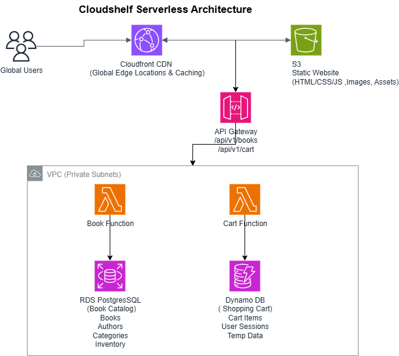

# 📚 CloudShelf Online Bookstore

<div align="center">

\*\*AWS Solutions Architect Tut### 🎯 Learning Prerequisites

- [Business Requirements](docs/requirements/cloudshelf-business-requirements.md) - Tutorial context and objectives
- [Software Requirements](docs/requirements/cloudshelf-srs.md) - Technical specifications
- [Technical Analysis](docs/requirements/cloudshelf-technical-analysis.md) - Architecture decisions
- [Architecture Decision Records](docs/architecture/cloudshelf-architecture-decisions.md) - Detailed ADRs for all major decisions Project - Serverless E-commerce Demo\*\*

[](https://aws.amazon.com/)
[](docs/architecture/)
[](docs/)
[](LICENSE)

</div>

## 🎯 Tutorial Overview

CloudShelf is a **fictional online bookstore** designed as an AWS Solutions Architect learning project that demonstrates serverless architecture best practices:

- 🏗️ **Serverless Architecture** - Lambda, API Gateway, DynamoDB, RDS
- � **Learning Documentation** - Step-by-step implementation guides
- 🔒 **Security Best Practices** - Multi-layer security with IAM and VPC
- 💰 **Cost-Effective Design** - Pay-per-use serverless pricing model

**Learning Objective**: Hands-on experience implementing AWS serverless e-commerce architecture with real-world patterns and security best practices.

---

## 🚀 Quick Start for Learning

| Step | Learning Phase                   | Documentation Link                                                             |
| ---- | -------------------------------- | ------------------------------------------------------------------------------ |
| 1    | **Understand Tutorial Context**  | [Business Requirements](docs/requirements/cloudshelf-business-requirements.md) |
| 2    | **Review Technical Approach**    | [Technical Analysis](docs/requirements/cloudshelf-technical-analysis.md)       |
| 3    | **Follow Implementation Guides** | [Setup Guides](docs/architecture/)                                             |
| 4    | **Study Architecture Patterns**  | [Documentation](#-tutorial-documentation)                                      |

---

## 🏗️ Tutorial Architecture

<div align="center">



_Serverless architecture demonstrating AWS best practices for e-commerce applications_

</div>

### AWS Services for Learning

| Service               | Learning Purpose       | Implementation Status |
| --------------------- | ---------------------- | --------------------- |
| 🚪 **API Gateway**    | REST API management    | ✅ Tutorial Complete  |
| ⚡ **Lambda**         | Serverless compute     | ✅ Tutorial Complete  |
| 🗄️ **RDS PostgreSQL** | Relational database    | ✅ Tutorial Complete  |
| 🗂️ **DynamoDB**       | NoSQL database         | ✅ Tutorial Complete  |
| 🌐 **CloudFront**     | CDN and performance    | ✅ Tutorial Complete  |
| 🪣 **S3**             | Static website hosting | ✅ Tutorial Complete  |
| 🔐 **VPC**            | Network security       | ✅ Tutorial Complete  |
| 🛡️ **IAM**            | Access control         | ✅ Tutorial Complete  |

---

## ✨ Tutorial Implementation Progress

### ✅ Core Tutorial Features Complete

- **VPC Network Foundation** - Security isolation and network setup
- **IAM Security Configuration** - Roles, policies, and access control
- **Book Catalog API** - Browse and search books (RDS PostgreSQL)
- **Shopping Cart Service** - Add/remove items, session management (DynamoDB)
- **API Gateway Setup** - RESTful endpoints with security
- **Static Website Hosting** - S3 + CloudFront CDN integration

### 🔄 Tutorial Extensions (Optional)

- **Performance Optimization** - Advanced caching patterns
- **Enhanced Monitoring** - Custom CloudWatch dashboards
- **Security Hardening** - Additional security layers

### ⏳ Future Learning Phases

- **User Authentication** - AWS Cognito integration patterns
- **Order Processing** - Complete e-commerce workflow
- **Advanced Features** - Microservices patterns

---

## 📋 Tutorial Documentation

### � Learning Prerequisites

- [Business Requirements](docs/requirements/cloudshelf-business-requirements.md) - Tutorial context and objectives
- [Software Requirements](docs/requirements/cloudshelf-srs.md) - Technical specifications
- [Technical Analysis](docs/requirements/cloudshelf-technical-analysis.md) - Architecture decisions

### �️ Implementation Guides (Follow in Order)

1. [VPC Setup](docs/architecture/vpc/cloudshelf-vpc-setup.md) - Network foundation
2. [IAM Security Setup](docs/architecture/security/cloudshelf-iam-security-setup.md) - Access control
3. [RDS Database Setup](docs/architecture/rds/cloudshelf-rds-setup.md) - PostgreSQL configuration
4. [DynamoDB Setup](docs/architecture/dynamodb/cloudshelf-dynamodb-setup.md) - NoSQL database
5. [Lambda Functions](docs/architecture/lambda/cloudshelf-lambda-setup.md) - Serverless compute
6. [API Gateway](docs/architecture/apigateway/cloudshelf-apigateway-setup.md) - API management
7. [S3 Storage](docs/architecture/s3/cloudshelf-s3-setup.md) - Static website hosting
8. [CloudFront CDN](docs/architecture/cloudfront/cloudshelf-cloudfront-setup.md) - Content delivery

### 📚 Learning Resources

- [Architecture Decision Records](docs/architecture/cloudshelf-architecture-decisions.md) - Complete ADR documentation
- [Use Cases](docs/requirements/cloudshelf-use-cases.md) - User interaction patterns
- [User Stories](docs/requirements/cloudshelf-user-stories.md) - Feature descriptions

---

## 🛠️ Getting Started with Tutorial

### Prerequisites for Learning

- AWS Account with appropriate permissions (free tier friendly)
- AWS CLI configured
- Java 21 JDK and Maven 3.8+ (for Lambda development)
- Basic understanding of cloud computing concepts

### Tutorial Setup Instructions

1. **Clone Tutorial Repository**

   ```bash
   git clone https://github.com/msjackiebrown/cloudshelf-online-bookstore.git
   cd cloudshelf-online-bookstore
   ```

2. **Study Tutorial Context**

   - Start with [Business Requirements](docs/requirements/cloudshelf-business-requirements.md)
   - Review [Technical Analysis](docs/requirements/cloudshelf-technical-analysis.md)

3. **Follow Implementation Guides in Order**
   - Complete setup guides in [docs/architecture/](docs/architecture/)
   - Recommended sequence: VPC → IAM → RDS → DynamoDB → Lambda → API Gateway → S3 → CloudFront

---

## � Learning Outcomes

This tutorial project demonstrates **AWS Solutions Architect skills** through:

- **Serverless Patterns** - Event-driven architecture with AWS Lambda
- **Data Architecture** - Hybrid RDS/DynamoDB approach for different use cases
- **Security Implementation** - Multi-layer security with VPC and IAM best practices
- **Documentation Skills** - Professional technical documentation standards
- **Cost Management** - Pay-per-use serverless pricing optimization

**Learning Evidence**: [Technical Analysis](docs/requirements/cloudshelf-technical-analysis.md) | [Architecture Decision Records](docs/architecture/cloudshelf-architecture-decisions.md) | [Implementation Guides](docs/architecture/)

---

## 🤝 Using This Tutorial

1. **Study** [Business Requirements](docs/requirements/cloudshelf-business-requirements.md) for context
2. **Review** [Technical Analysis](docs/requirements/cloudshelf-technical-analysis.md) for architecture approach
3. **Implement** following setup guides in [docs/architecture/](docs/architecture/)
4. **Experiment** with modifications and enhancements

**Tutorial Focus**: Hands-on AWS implementation skills for Solutions Architects

---

## 📄 License

This tutorial project is licensed under the MIT License - see the [LICENSE](LICENSE) file for details.

---

<div align="center">

**🎯 Ready to learn AWS Solutions Architecture?**

[Tutorial Context](docs/requirements/cloudshelf-business-requirements.md) → [Technical Approach](docs/requirements/cloudshelf-technical-analysis.md) → [Implementation Guides](docs/architecture/)

[](https://github.com/msjackiebrown/cloudshelf-online-bookstore)

</div>
