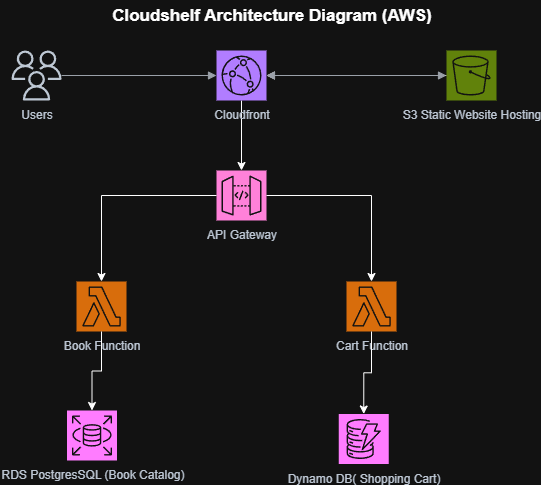

# 📚 CloudShelf Online Bookstore

<div align="center">

**A modern, cloud-native online bookstore built with AWS serverless architecture**

[](https://aws.amazon.com/)
[](docs/architecture/)
[](docs/)
[](LICENSE)

</div>

## 🎯 Overview

CloudShelf is a **scalable e-commerce platform** that demonstrates AWS Solutions Architect best practices through:

- 🏗️ **Serverless Architecture** - Lambda, API Gateway, DynamoDB, RDS
- 📊 **Enterprise Documentation** - Comprehensive technical specifications
- 🔒 **Security by Design** - Multi-layer security with IAM and VPC isolation
- 💰 **Cost Optimization** - Pay-per-use serverless pricing model

**Current Status**: Book catalog and shopping cart services implemented. Frontend hosting and authentication planned for Phase 2.

---

## 🚀 Quick Start

| Step | Action                            | Link                                                                           |
| ---- | --------------------------------- | ------------------------------------------------------------------------------ |
| 1    | **Understand Business Context**   | [Business Requirements](docs/requirements/cloudshelf-business-requirements.md) |
| 2    | **Review Technical Architecture** | [System Architecture](docs/architecture/cloudshelf-system-architecture.md)     |
| 3    | **Explore Implementation**        | [Setup Guides](docs/architecture/)                                             |
| 4    | **Browse Documentation**          | [Requirements & Planning](#-documentation)                                     |

---

## 🏗️ Architecture Overview

<div align="center">



</div>

### Core AWS Services

| Service               | Purpose            | Status      |
| --------------------- | ------------------ | ----------- |
| 🚪 **API Gateway**    | RESTful APIs       | ✅ Deployed |
| ⚡ **Lambda**         | Serverless compute | ✅ Deployed |
| 🗄️ **RDS PostgreSQL** | Book catalog       | ✅ Deployed |
| 🗂️ **DynamoDB**       | Shopping carts     | ✅ Deployed |
| 🌐 **CloudFront**     | Global CDN         | 🔄 Planned  |
| 🪣 **S3**             | Static hosting     | 🔄 Planned  |
| 🔐 **Cognito**        | Authentication     | ⏳ Phase 2  |

---

## ✨ Current Implementation

### ✅ Completed Features

- **Book Catalog API** - Browse and search books (RDS PostgreSQL)
- **Shopping Cart Service** - Add/remove items, session management (DynamoDB)
- **API Gateway** - RESTful endpoints with CORS
- **VPC Infrastructure** - Network isolation and security

### � In Progress

- **Static Website Hosting** - S3 + CloudFront integration
- **Monitoring Setup** - CloudWatch dashboards and alerts

### ⏳ Planned (Phase 2)

- **User Authentication** - AWS Cognito integration
- **Order Processing** - Complete checkout workflow
- **Admin Portal** - Inventory and user management

---

## 📋 Documentation

### 🏛️ Architecture & Design

- [System Architecture](docs/architecture/cloudshelf-system-architecture.md) - Complete technical design
- [Security Architecture](docs/architecture/cloudshelf-security-architecture.md) - Security patterns and IAM
- [Data Architecture](docs/architecture/cloudshelf-data-architecture.md) - Database design strategy
- [Technical Analysis](docs/requirements/cloudshelf-technical-analysis.md) - Solutions architect overview

### 🔧 Implementation Guides

- [VPC Setup](docs/architecture/vpc/cloudshelf-vpc-setup.md) - Network foundation
- [Security Setup](docs/architecture/security/cloudshelf-iam-security-setup.md) - IAM roles and policies
- [Database Setup](docs/architecture/rds/cloudshelf-rds-setup.md) - PostgreSQL configuration
- [DynamoDB Setup](docs/architecture/dynamodb/cloudshelf-dynamodb-setup.md) - NoSQL database configuration
- [Lambda Deployment](docs/architecture/lambda/cloudshelf-lambda-setup.md) - Function deployment
- [API Gateway](docs/architecture/apigateway/cloudshelf-apigateway-setup.md) - API configuration
- [S3 Storage](docs/architecture/s3/cloudshelf-s3-setup.md) - Static website hosting
- [CloudFront CDN](docs/architecture/cloudfront/cloudshelf-cloudfront-setup.md) - Content delivery network
- [Monitoring](docs/architecture/monitoring/cloudshelf-cloudwatch-setup.md) - CloudWatch setup

### 📚 Requirements & Planning

- [Business Requirements](docs/requirements/cloudshelf-business-requirements.md) - Business goals and metrics
- [Software Requirements](docs/requirements/cloudshelf-srs.md) - Technical specifications
- [Use Cases](docs/requirements/cloudshelf-use-cases.md) - User interaction patterns
- [User Stories](docs/requirements/cloudshelf-user-stories.md) - Feature descriptions

---

## 🛠️ Getting Started

### Prerequisites

- AWS Account with appropriate permissions
- AWS CLI configured
- Java 21 JDK and Maven 3.8+ (for Lambda development)
- Git for version control

### Setup Instructions

1. **Clone Repository**

   ```bash
   git clone https://github.com/msjackiebrown/cloudshelf-online-bookstore.git
   cd cloudshelf-online-bookstore
   ```

2. **Review Architecture**

   - Start with [Business Requirements](docs/requirements/cloudshelf-business-requirements.md)
   - Review [System Architecture](docs/architecture/cloudshelf-system-architecture.md)

3. **Follow Setup Guides**
   - Implementation guides available in [docs/architecture/](docs/architecture/)
   - Follow the setup order: VPC → Security → Databases → Lambda → API Gateway

---

## 🏆 Technical Excellence

This project demonstrates **enterprise-grade AWS architecture** through:

- **Serverless Design** - Event-driven architecture with AWS Lambda
- **Database Strategy** - Hybrid RDS/DynamoDB approach for optimal performance
- **Security Implementation** - Multi-layer security with VPC and IAM
- **Documentation Standards** - Enterprise-grade technical documentation
- **Cost Optimization** - Pay-per-use serverless pricing model

**Architecture Evidence**: [Technical Analysis](docs/requirements/cloudshelf-technical-analysis.md) | [Architecture Decisions](docs/architecture/cloudshelf-architecture-decisions.md)

---

## 🤝 Contributing

1. Review [Business Requirements](docs/requirements/cloudshelf-business-requirements.md)
2. Understand [System Architecture](docs/architecture/cloudshelf-system-architecture.md)
3. Follow setup guides in [docs/architecture/](docs/architecture/)
4. Create feature branch and submit pull request

---

## 📄 License

This project is licensed under the MIT License - see the [LICENSE](LICENSE) file for details.

---

<div align="center">

**🎯 Ready to explore AWS Solutions Architecture?**

[Business Requirements](docs/requirements/cloudshelf-business-requirements.md) → [System Architecture](docs/architecture/cloudshelf-system-architecture.md) → [Setup Guides](docs/architecture/)

[](https://github.com/msjackiebrown/cloudshelf-online-bookstore)

</div>
