# 📚 CloudShelf Online Bookstore

<div align="center">

**A modern, cloud-native online bookstore built with AWS serverless architecture**

[](https://aws.amazon.com/)
[](docs/architecture/)
[](docs/)
[](LICENSE)

</div>

## 🎯 Overview

CloudShelf is a **scalable e-commerce platform** that demonstrates AWS Solutions Architect best practices through:

- 🏗️ **Serverless Architecture** - Lambda, API Gateway, DynamoDB
- 📊 **Enterprise Documentation** - Comprehensive technical specifications
- 🔒 **Security by Design** - Multi-layer security with AWS Cognito
- 💰 **Cost Optimization** - Pay-per-use serverless pricing model

---

## � Quick Start

| Step | Action                          | Link                                                                     |
| ---- | ------------------------------- | ------------------------------------------------------------------------ |
| 1    | **Understand Business Context** | [Business Requirements](docs/requirements/cloudshelf-business-requirements.md) |
| 2    | **Review Technical Specs**      | [Software Requirements](docs/requirements/cloudshelf-srs.md)            |
| 3    | **Explore Architecture**        | [System Architecture](docs/architecture/cloudshelf-system-architecture.md) |
| 4    | **Setup Instructions**          | [Getting Started](#-getting-started)                                    |

---

## 📋 Architecture Documentation

<details>
<summary><strong>🏛️ Core Architecture</strong></summary>

| Document                                                                        | Purpose                  | Status      |
| ------------------------------------------------------------------------------- | ------------------------ | ----------- |
| [System Architecture](docs/architecture/cloudshelf-system-architecture.md)     | High-level system design | ✅ Complete |
| [Integration Patterns](docs/architecture/cloudshelf-integration-patterns.md)   | Service integration      | ✅ Complete |
| [Data Architecture](docs/architecture/cloudshelf-data-architecture.md)         | Database design          | ✅ Complete |
| [Security Architecture](docs/architecture/cloudshelf-security-architecture.md) | Security patterns        | ✅ Complete |

</details>

<details>
<summary><strong>⚡ Performance & Operations</strong></summary>

| Document                                                                                        | Purpose             | Status      |
| ----------------------------------------------------------------------------------------------- | ------------------- | ----------- |
| [Performance Strategy](docs/architecture/cloudshelf-performance-scaling-strategy.md)           | Scaling approach    | ✅ Complete |
| [Cost Optimization](docs/architecture/cloudshelf-cost-optimization-strategy.md)                | Cost management     | ✅ Complete |
| [Monitoring](docs/architecture/cloudshelf-monitoring-observability.md)                         | Observability       | ✅ Complete |
| [Disaster Recovery](docs/architecture/cloudshelf-disaster-recovery-business-continuity.md)     | Business continuity | ✅ Complete |

</details>

<details>
<summary><strong>🔧 Setup Guides</strong></summary>

| Service     | Guide                                                                    | Purpose                |
| ----------- | ------------------------------------------------------------------------ | ---------------------- |
| VPC         | [Setup Guide](docs/architecture/vpc/cloudshelf-vpc-setup.md)            | Network infrastructure |
| RDS         | [Setup Guide](docs/architecture/rds/cloudshelf-rds-setup.md)            | PostgreSQL database    |
| DynamoDB    | [Setup Guide](docs/architecture/dynamodb/cloudshelf-dynamodb-setup.md)  | NoSQL shopping cart    |
| Lambda      | [Setup Guide](docs/architecture/lambda/cloudshelf-lambda-setup.md)      | Serverless compute     |
| API Gateway | [Setup Guide](docs/architecture/apigateway/cloudshelf-apigateway-setup.md) | API management         |

</details>

---

## 📚 Requirements & Planning

| Document                                                            | Description                        |
| Document                                                                        | Description                        |
| ------------------------------------------------------------------------------- | ---------------------------------- |
| [Business Requirements](docs/requirements/cloudshelf-business-requirements.md) | Business goals and success metrics |
| [Software Requirements](docs/requirements/cloudshelf-srs.md)                   | Technical specifications and NFRs  |
| [Use Cases](docs/requirements/cloudshelf-use-cases.md)                         | User interaction patterns          |
| [User Stories](docs/requirements/cloudshelf-user-stories.md)                   | Feature descriptions               |
| [Glossary](docs/requirements/cloudshelf-glossary.md)                           | Key terms and definitions          |
| [Role Boundaries](docs/project-roles-deliverables.md)                          | Professional responsibilities      |

---

## ✨ Features & Capabilities

### 🛍️ Customer Experience

- 📖 **Book Catalog** - Advanced filtering and search
- 🛒 **Shopping Cart** - Real-time cart management
- 👤 **User Accounts** - Secure authentication with AWS Cognito
- 📦 **Order Processing** - Streamlined checkout experience

### 🔧 Admin Portal

- 📚 **Inventory Management** - Book catalog administration
- 📊 **Order Dashboard** - Sales and customer analytics
- 👥 **User Management** - Customer account administration

---

## 🏗️ Architecture Highlights

```mermaid
graph TB
    Users[👥 Users] --> CF[☁️ CloudFront CDN]
    CF --> S3[🪣 S3 Static Hosting]
    CF --> API[🚪 API Gateway]
    API --> Lambda[⚡ Lambda Functions]
    Lambda --> RDS[🗄️ RDS PostgreSQL]
    Lambda --> DDB[�️ DynamoDB]
    Lambda --> Cognito[🔐 AWS Cognito]

    style Users fill:#e1f5fe
    style CF fill:#fff3e0
    style API fill:#f3e5f5
    style Lambda fill:#e8f5e8
    style RDS fill:#fff8e1
    style DDB fill:#fce4ec
```

<div align="center">



</div>

### Core AWS Services

| Service               | Purpose            | Benefits                       |
| --------------------- | ------------------ | ------------------------------ |
| 🌐 **CloudFront**     | Global CDN         | Sub-2s page loads worldwide    |
| 🪣 **S3**             | Static hosting     | 99.999999999% durability       |
| 🚪 **API Gateway**    | RESTful APIs       | Automatic scaling & throttling |
| ⚡ **Lambda**         | Serverless compute | Pay-per-execution pricing      |
| 🗄️ **RDS PostgreSQL** | Catalog database   | ACID compliance & performance  |
| 🗂️ **DynamoDB**       | Shopping carts     | Single-digit ms latency        |
| 🔐 **Cognito**        | Authentication     | Enterprise-grade security      |

### Design Principles

- ✅ **Serverless-First** → Reduced operational overhead
- ✅ **Security by Design** → Defense-in-depth approach
- ✅ **Cost Optimization** → Pay-per-use pricing model
- ✅ **High Availability** → Multi-AZ deployment strategy

---

## �️ Getting Started

### Prerequisites

```bash
# Required tools
- AWS Account with appropriate permissions
- AWS CLI configured
- Git for version control
```

### Quick Setup

1. **� Clone Repository**

   ```bash
   git clone https://github.com/msjackiebrown/cloudshelf-online-bookstore.git
   cd cloudshelf-online-bookstore
   ```

2. **� Review Documentation**

   ```bash
   # Start with business context
   open docs/requirements/business-requirements.md

   # Then review technical architecture
   open docs/architecture/system-architecture.md
   ```

3. **🏗️ Deploy Infrastructure**

   ```bash
   # Follow setup guides in order:
   # 1. VPC Setup
   open docs/architecture/vpc/setup-vpc-reference.md

   # 2. Database Setup
   open docs/architecture/rds/setup-rds.md

   # 3. Lambda Functions
   open docs/architecture/lambda/setup-lambda.md
   ```

---

## � Project Metrics

<div align="center">

| Metric                     | Target (Year 1) | Target (Year 3) |
| -------------------------- | --------------- | --------------- |
| 💰 **Revenue**             | $2M             | $46M            |
| 👥 **Active Users**        | 10,000          | 85,000          |
| ⚡ **Page Load Time**      | <2 seconds      | <2 seconds      |
| 📈 **Uptime**              | 99.9%           | 99.95%          |
| 💵 **Infrastructure Cost** | <0.5% revenue   | <0.3% revenue   |

</div>

---

## 👥 Professional Roles & Responsibilities

<details>
<summary><strong>View Team Structure</strong></summary>

### 🏛️ Solutions Architect

- **Architecture Decisions** → Technology selection and design patterns
- **System Design** → High-level component integration
- **Documentation** → Technical specifications and ADRs
- **Standards** → Development guidelines and best practices

### 👨‍💻 Developer

- **Implementation** → Business logic and API development
- **Testing** → Unit tests and quality assurance
- **Code Quality** → Following architectural patterns

### 🚀 DevOps Engineer

- **Infrastructure** → AWS resource provisioning
- **CI/CD** → Automated deployment pipelines
- **Monitoring** → Production observability and alerting

</details>

---

## � AWS Solutions Architect Portfolio

This project demonstrates key **Solutions Architect competencies**:

### 🎯 Technical Excellence

| Competency                  | Implementation        | Evidence                                                                  |
| --------------------------- | --------------------- | ------------------------------------------------------------------------- |
| **Serverless Design**       | Lambda + API Gateway  | [Integration Patterns](docs/architecture/integration-patterns.md)         |
| **Database Architecture**   | RDS + DynamoDB hybrid | [Data Architecture](docs/architecture/data-architecture.md)               |
| **Security Implementation** | Multi-layer security  | [Security Architecture](docs/architecture/security-architecture.md)       |
| **Cost Optimization**       | Right-sizing strategy | [Cost Strategy](docs/architecture/cost-optimization-strategy.md)          |
| **Performance Design**      | Global CDN + caching  | [Performance Strategy](docs/architecture/performance-scaling-strategy.md) |

### 📋 Documentation Standards

- **Business Translation** → Requirements to technical specs
- **Architecture Decisions** → Documented rationale and trade-offs
- **Implementation Guides** → Step-by-step technical procedures
- **Professional Communication** → Multi-stakeholder documentation

---

## �️ Project Structure

```
cloudshelf-online-bookstore/
├── 📄 README.md                                    # Project overview
├── 📄 .gitignore                                   # Version control config
├── 📁 docs/                                        # Documentation
│   ├── 📁 requirements/                            # Business & technical requirements
│   │   ├── 📄 cloudshelf-business-requirements.md  # Business context & goals
│   │   ├── 📄 cloudshelf-srs.md                   # Software requirements spec
│   │   ├── 📄 cloudshelf-use-cases.md             # User interaction patterns
│   │   ├── 📄 cloudshelf-user-stories.md          # Feature descriptions
│   │   └── 📄 cloudshelf-glossary.md              # Key terms & definitions
│   ├── 📁 architecture/                            # Technical architecture
│   │   ├── 📄 cloudshelf-system-architecture.md               # High-level system design
│   │   ├── 📄 cloudshelf-integration-patterns.md              # Service integration
│   │   ├── 📄 cloudshelf-data-architecture.md                 # Database design
│   │   ├── 📄 cloudshelf-security-architecture.md             # Security patterns
│   │   ├── 📄 cloudshelf-performance-scaling-strategy.md      # Performance optimization
│   │   ├── 📄 cloudshelf-cost-optimization-strategy.md        # Cost management
│   │   ├── 📄 cloudshelf-monitoring-observability.md          # Monitoring strategy
│   │   ├── 📄 cloudshelf-environment-deployment-strategy.md   # Deployment approach
│   │   ├── 📄 cloudshelf-disaster-recovery-business-continuity.md # DR planning
│   │   ├── 📄 cloudshelf-api-documentation.md                 # API specifications
│   │   ├── 📁 vpc/                                 # Network setup guides
│   │   ├── 📁 rds/                                 # Database configuration
│   │   ├── 📁 dynamodb/                            # NoSQL setup
│   │   ├── 📁 lambda/                              # Serverless functions
│   │   ├── 📁 apigateway/                          # API configuration
│   │   ├── � cloudfront/                          # CDN setup
│   │   └── � s3/                                  # Storage configuration
│   ├── � project-roles-deliverables.md            # Professional boundaries
│   └── 📄 solutions-architect-best-practices.md    # Architecture guidance
└── 📁 src/                                         # Source code
    └── 📁 lambda/                                  # Lambda functions
        ├── 📁 book-catalog/                        # Catalog service
        └── � shopping-cart/                       # Cart service
```

---

## 🤝 Contributing

### Development Workflow

1. 📖 **Review Requirements** → [Business Context](docs/requirements/business-requirements.md)
2. 🏗️ **Understand Architecture** → [System Design](docs/architecture/system-architecture.md)
3. 🌿 **Create Feature Branch** → Follow GitFlow conventions
4. ✅ **Follow Standards** → Reference architecture guidelines
5. 📝 **Update Documentation** → Keep specs current

### Issue Management

- 🎯 [Current Issues](https://github.com/msjackiebrown/cloudshelf-online-bookstore/issues)
- 💬 [Discussions](https://github.com/msjackiebrown/cloudshelf-online-bookstore/discussions)

---

## 📄 License

This project is licensed under the MIT License - see the [LICENSE](LICENSE) file for details.

---

<div align="center">

**🎯 Ready to explore AWS Solutions Architecture?**

Start with [Business Requirements](docs/requirements/cloudshelf-business-requirements.md) → [System Architecture](docs/architecture/cloudshelf-system-architecture.md) → [Setup Guides](docs/architecture/)

[](https://github.com/msjackiebrown/cloudshelf-online-bookstore)
[](https://github.com/msjackiebrown/cloudshelf-online-bookstore)

</div>
