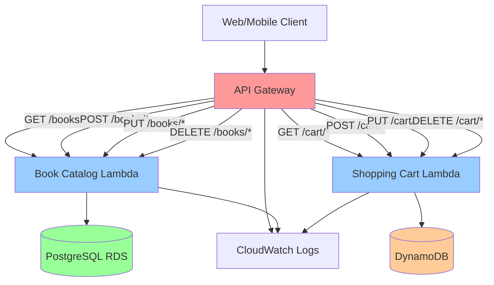

# API Gateway Setup - CloudShelf Architecture

This guide provides step-by-step instructions for setting up API Gateway for the CloudShelf online bookstore backend services.

## Architecture Overview

API Gateway serves as the single entry point for all client requests, routing them to the appropriate Lambda functions:

- **Book Catalog Service**: Handles book inventory and search operations
- **Shopping Cart Service**: Manages user shopping cart operations

## Manual Setup Steps

### Step 1: Create REST API

1. **Open API Gateway Console**

   - Sign in to AWS Management Console
   - Navigate to API Gateway service
   - Choose "Create API"

   

2. **Configure API**

   - Select **REST API** (not HTTP API for full feature support)
   - Choose **New API**
   - API Name: `cloudshelf-api`
   - Description: `CloudShelf Online Bookstore API`
   - Endpoint Type: **Regional**

   

### Step 2: Create Resources and Methods

#### Book Catalog Resource (`/books`)

1. **Create Resource**

   - Select root resource `/`
   - Actions → Create Resource
   - Resource Name: `books`
   - Resource Path: `/books`
   - Enable CORS: ✓

   

2. **Create Methods**

   - Select `/books` resource
   - Actions → Create Method → GET
   - Integration Type: **Lambda Function**
   - Lambda Region: `us-east-1` (your region)
   - Lambda Function: `cloudshelf-book-catalog`
   - Use Lambda Proxy integration: ✓

   

3. **Repeat for Additional Methods**

   - POST, PUT, DELETE methods
   - All pointing to same Lambda function

   

4. **Create Path Parameter Resource**

   - Select `/books` resource
   - Actions → Create Resource
   - Resource Name: `book`
   - Resource Path: `{id}`
   - Create GET, PUT, DELETE methods

   

#### Shopping Cart Resource (`/cart`)

1. **Create Resource**

   - Select root resource `/`
   - Actions → Create Resource
   - Resource Name: `cart`
   - Resource Path: `/cart`

   

2. **Create User Path Parameter**

   - Select `/cart` resource
   - Actions → Create Resource
   - Resource Path: `{userId}`
   - Create GET, POST, DELETE methods
   - Integration: `cloudshelf-shopping-cart` Lambda

   

3. **Create Items Sub-resource**

   - Select `/cart/{userId}` resource
   - Actions → Create Resource
   - Resource Name: `items`
   - Create POST method for adding items

   

### Step 3: Configure CORS

1. **Enable CORS for Each Resource**

   - Select resource
   - Actions → Enable CORS
   - Access-Control-Allow-Origin: `*`
   - Access-Control-Allow-Headers: `Content-Type,X-Amz-Date,Authorization,X-Api-Key,X-Amz-Security-Token`
   - Access-Control-Allow-Methods: Select all needed methods

   

### Step 4: Deploy API

1. **Create Deployment**

   - Actions → Deploy API
   - Deployment stage: `dev` (create new stage)
   - Stage description: `Development environment`

   

2. **Get Invoke URL**

   - Note the Invoke URL from the stage (e.g., `https://abc123.execute-api.us-east-1.amazonaws.com/dev`)

   

### Step 5: Test API Endpoints

1. **Test Book Catalog**

   ```bash
   # List books
   curl https://your-api-id.execute-api.region.amazonaws.com/dev/books

   # Get specific book
   curl https://your-api-id.execute-api.region.amazonaws.com/dev/books/123
   ```

2. **Test Shopping Cart**

   ```bash
   # Get user cart
   curl https://your-api-id.execute-api.region.amazonaws.com/dev/cart/user123

   # Add item to cart
   curl -X POST https://your-api-id.execute-api.region.amazonaws.com/dev/cart/user123/items \
        -H "Content-Type: application/json" \
        -d '{"bookId":"123","quantity":1}'
   ```

   

---

## Complete API Structure Overview


---

## Diagram



### API Gateway Endpoints

#### Book Catalog Service (`/books`)

- `GET /books` - List all books with pagination
- `GET /books/{id}` - Get specific book details
- `GET /books/search?q={query}` - Search books
- `GET /books/category/{category}` - Get books by category
- `POST /books` - Create new book (admin)
- `PUT /books/{id}` - Update book (admin)
- `DELETE /books/{id}` - Delete book (admin)

#### Shopping Cart Service (`/cart`)

- `GET /cart/{userId}` - Get user's shopping cart
- `POST /cart/{userId}/items` - Add item to cart
- `PUT /cart/{userId}/items/{itemId}` - Update item quantity
- `DELETE /cart/{userId}/items/{itemId}` - Remove item
- `DELETE /cart/{userId}` - Clear cart

## DevOps Implementation Notes

The **DevOps Engineer** will handle:

- Infrastructure as Code (CloudFormation/CDK) templates
- Automated deployment pipelines
- Environment-specific configurations
- Monitoring and alerting setup

## Related Documentation

- [Lambda Deployment JARs](../../../src/lambda/README.md) - Ready-to-deploy Lambda functions
- [Integration Patterns](../integration-patterns.md) - API design patterns and standards
- [Development Guidelines](../development-guidelines.md) - Team responsibilities and workflows
