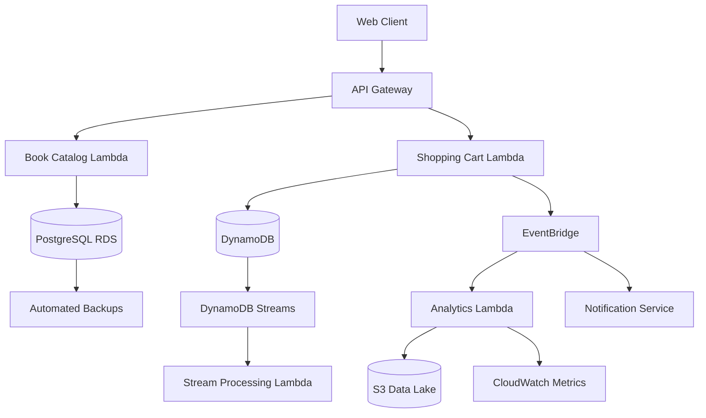

# 🏗️ Data Architecture Documentation

> Comprehensive data architecture strategy for CloudShelf online bookstore ensuring scalable, secure, and efficient data management across all systems

This document defines the data architecture, flow patterns, governance, and management strategies for CloudShelf, covering data modeling, storage patterns, and integration approaches across relational and NoSQL systems.

---

## 🏛️ Data Architecture Overview

CloudShelf implements a polyglot persistence architecture with strategic data distribution:

- **📊 Data Modeling Strategy** - Domain-driven design with service-specific data models
- **🔄 Data Flow Patterns** - Event-driven data synchronization and integration
- **🗃️ Storage Architecture** - PostgreSQL for complex queries, DynamoDB for high-performance operations
- **🔒 Data Governance** - Privacy, retention, and compliance management
- **📈 Analytics Pipeline** - Real-time and batch data processing for insights

---

## 📷 Setup Screenshots

### **🗃️ Database Schema Overview**


### **🔄 Data Flow Architecture**


### **📊 Data Modeling Relationships**


### **🔍 Data Query Performance**


### **🔒 Data Security Configuration**


### **📈 Data Analytics Pipeline**


---

## 🗃️ Database Design Strategy

### **📚 PostgreSQL Schema Design (Book Catalog)**

**Relational Data Model**:

```sql
-- Book Catalog Database Schema
CREATE SCHEMA IF NOT EXISTS book_catalog;

-- Categories table for book organization
CREATE TABLE book_catalog.categories (
    id SERIAL PRIMARY KEY,
    name VARCHAR(100) NOT NULL UNIQUE,
    description TEXT,
    parent_category_id INTEGER REFERENCES book_catalog.categories(id),
    slug VARCHAR(100) NOT NULL UNIQUE,
    is_active BOOLEAN DEFAULT true,
    created_at TIMESTAMP WITH TIME ZONE DEFAULT NOW(),
    updated_at TIMESTAMP WITH TIME ZONE DEFAULT NOW()
);

-- Authors table with proper normalization
CREATE TABLE book_catalog.authors (
    id SERIAL PRIMARY KEY,
    first_name VARCHAR(100) NOT NULL,
    last_name VARCHAR(100) NOT NULL,
    bio TEXT,
    birth_date DATE,
    nationality VARCHAR(50),
    website_url VARCHAR(255),
    created_at TIMESTAMP WITH TIME ZONE DEFAULT NOW(),
    updated_at TIMESTAMP WITH TIME ZONE DEFAULT NOW(),

    -- Search optimization
    CONSTRAINT authors_name_check CHECK (length(first_name) > 0 AND length(last_name) > 0)
);

-- Publishers table
CREATE TABLE book_catalog.publishers (
    id SERIAL PRIMARY KEY,
    name VARCHAR(200) NOT NULL UNIQUE,
    description TEXT,
    website_url VARCHAR(255),
    country VARCHAR(50),
    established_year INTEGER,
    created_at TIMESTAMP WITH TIME ZONE DEFAULT NOW(),
    updated_at TIMESTAMP WITH TIME ZONE DEFAULT NOW()
);

-- Books table - core entity
CREATE TABLE book_catalog.books (
    id SERIAL PRIMARY KEY,
    isbn_13 VARCHAR(13) UNIQUE,
    isbn_10 VARCHAR(10) UNIQUE,
    title VARCHAR(500) NOT NULL,
    subtitle VARCHAR(500),
    description TEXT,
    price DECIMAL(10,2) NOT NULL CHECK (price >= 0),
    list_price DECIMAL(10,2) CHECK (list_price >= price),
    page_count INTEGER CHECK (page_count > 0),
    publication_date DATE,
    language_code VARCHAR(10) DEFAULT 'en',
    format VARCHAR(50) CHECK (format IN ('hardcover', 'paperback', 'ebook', 'audiobook')),

    -- Foreign keys
    category_id INTEGER REFERENCES book_catalog.categories(id),
    publisher_id INTEGER REFERENCES book_catalog.publishers(id),

    -- Inventory and status
    stock_quantity INTEGER DEFAULT 0 CHECK (stock_quantity >= 0),
    status VARCHAR(20) DEFAULT 'active' CHECK (status IN ('active', 'inactive', 'discontinued')),

    -- SEO and display
    slug VARCHAR(500) UNIQUE,
    cover_image_url VARCHAR(500),
    thumbnail_url VARCHAR(500),

    -- Analytics and performance
    view_count INTEGER DEFAULT 0,
    purchase_count INTEGER DEFAULT 0,
    rating_average DECIMAL(3,2) DEFAULT 0.0 CHECK (rating_average BETWEEN 0 AND 5),
    rating_count INTEGER DEFAULT 0,

    -- Search optimization
    search_vector tsvector,

    -- Timestamps
    created_at TIMESTAMP WITH TIME ZONE DEFAULT NOW(),
    updated_at TIMESTAMP WITH TIME ZONE DEFAULT NOW(),

    -- Constraints
    CONSTRAINT books_isbn_check CHECK (
        (isbn_13 IS NOT NULL AND length(isbn_13) = 13) OR
        (isbn_10 IS NOT NULL AND length(isbn_10) = 10)
    )
);

-- Book-Author many-to-many relationship
CREATE TABLE book_catalog.book_authors (
    book_id INTEGER REFERENCES book_catalog.books(id) ON DELETE CASCADE,
    author_id INTEGER REFERENCES book_catalog.authors(id) ON DELETE CASCADE,
    role VARCHAR(50) DEFAULT 'author' CHECK (role IN ('author', 'co-author', 'editor', 'translator')),
    order_index INTEGER DEFAULT 1,

    PRIMARY KEY (book_id, author_id, role),
    UNIQUE (book_id, author_id, order_index)
);

-- Book reviews and ratings
CREATE TABLE book_catalog.reviews (
    id SERIAL PRIMARY KEY,
    book_id INTEGER REFERENCES book_catalog.books(id) ON DELETE CASCADE,
    user_id VARCHAR(50) NOT NULL, -- From Cognito
    rating INTEGER CHECK (rating BETWEEN 1 AND 5),
    title VARCHAR(200),
    content TEXT,
    is_verified_purchase BOOLEAN DEFAULT false,
    helpful_votes INTEGER DEFAULT 0,
    total_votes INTEGER DEFAULT 0,
    status VARCHAR(20) DEFAULT 'published' CHECK (status IN ('published', 'pending', 'rejected')),
    created_at TIMESTAMP WITH TIME ZONE DEFAULT NOW(),
    updated_at TIMESTAMP WITH TIME ZONE DEFAULT NOW(),

    UNIQUE (book_id, user_id)
);

-- Search optimization indexes
CREATE INDEX idx_books_search_vector ON book_catalog.books USING gin(search_vector);
CREATE INDEX idx_books_category ON book_catalog.books(category_id) WHERE status = 'active';
CREATE INDEX idx_books_price ON book_catalog.books(price) WHERE status = 'active';
CREATE INDEX idx_books_publication_date ON book_catalog.books(publication_date) WHERE status = 'active';
CREATE INDEX idx_books_rating ON book_catalog.books(rating_average) WHERE status = 'active';

-- Performance indexes
CREATE INDEX idx_authors_name ON book_catalog.authors(last_name, first_name);
CREATE INDEX idx_categories_parent ON book_catalog.categories(parent_category_id);
CREATE INDEX idx_reviews_book_rating ON book_catalog.reviews(book_id, rating) WHERE status = 'published';

-- Update search vector trigger
CREATE OR REPLACE FUNCTION book_catalog.update_book_search_vector()
RETURNS TRIGGER AS $$
BEGIN
    NEW.search_vector :=
        setweight(to_tsvector('english', coalesce(NEW.title, '')), 'A') ||
        setweight(to_tsvector('english', coalesce(NEW.subtitle, '')), 'B') ||
        setweight(to_tsvector('english', coalesce(NEW.description, '')), 'C') ||
        setweight(to_tsvector('english', coalesce(
            (SELECT string_agg(a.first_name || ' ' || a.last_name, ' ')
             FROM book_catalog.authors a
             JOIN book_catalog.book_authors ba ON a.id = ba.author_id
             WHERE ba.book_id = NEW.id), '')), 'B');
    RETURN NEW;
END;
$$ LANGUAGE plpgsql;

CREATE TRIGGER trigger_update_book_search_vector
    BEFORE INSERT OR UPDATE ON book_catalog.books
    FOR EACH ROW EXECUTE FUNCTION book_catalog.update_book_search_vector();
```

### **⚡ DynamoDB Design (Shopping Cart & Sessions)**

**NoSQL Data Models**:

```json
{
  "ShoppingCartTable": {
    "TableName": "CloudShelf-ShoppingCart",
    "KeySchema": [
      { "AttributeName": "userId", "KeyType": "HASH" },
      { "AttributeName": "cartId", "KeyType": "RANGE" }
    ],
    "AttributeDefinitions": [
      { "AttributeName": "userId", "AttributeType": "S" },
      { "AttributeName": "cartId", "AttributeType": "S" },
      { "AttributeName": "sessionId", "AttributeType": "S" }
    ],
    "GlobalSecondaryIndexes": [
      {
        "IndexName": "SessionIndex",
        "KeySchema": [{ "AttributeName": "sessionId", "KeyType": "HASH" }],
        "Projection": { "ProjectionType": "ALL" }
      }
    ],
    "StreamSpecification": {
      "StreamEnabled": true,
      "StreamViewType": "NEW_AND_OLD_IMAGES"
    },
    "ItemStructure": {
      "userId": "string (partition key)",
      "cartId": "string (sort key, typically 'current')",
      "sessionId": "string (for anonymous carts)",
      "items": [
        {
          "bookId": "string",
          "title": "string",
          "price": "number",
          "quantity": "number",
          "addedAt": "string (ISO timestamp)"
        }
      ],
      "totalItems": "number",
      "totalAmount": "number",
      "currency": "string",
      "lastModified": "string (ISO timestamp)",
      "expiresAt": "number (TTL)",
      "metadata": {
        "userAgent": "string",
        "ipAddress": "string",
        "referrer": "string"
      }
    }
  },
  "UserSessionsTable": {
    "TableName": "CloudShelf-UserSessions",
    "KeySchema": [{ "AttributeName": "sessionId", "KeyType": "HASH" }],
    "AttributeDefinitions": [
      { "AttributeName": "sessionId", "AttributeType": "S" },
      { "AttributeName": "userId", "AttributeType": "S" }
    ],
    "GlobalSecondaryIndexes": [
      {
        "IndexName": "UserIndex",
        "KeySchema": [{ "AttributeName": "userId", "KeyType": "HASH" }],
        "Projection": { "ProjectionType": "KEYS_ONLY" }
      }
    ],
    "ItemStructure": {
      "sessionId": "string (partition key)",
      "userId": "string (optional, for authenticated users)",
      "createdAt": "string (ISO timestamp)",
      "lastAccessedAt": "string (ISO timestamp)",
      "ipAddress": "string",
      "userAgent": "string",
      "isAuthenticated": "boolean",
      "preferences": {
        "currency": "string",
        "language": "string",
        "theme": "string"
      },
      "activityLog": [
        {
          "action": "string",
          "timestamp": "string",
          "details": "object"
        }
      ],
      "expiresAt": "number (TTL)"
    }
  }
}
```

---

## 🔄 Data Flow Architecture

### **📊 Data Flow Patterns**

**Inter-Service Data Flow**:



**Event-Driven Data Synchronization**:

```javascript
// Event-driven data synchronization patterns
const dataSynchronization = {
  // Shopping cart events
  async handleCartUpdate(event) {
    const cartEvent = {
      eventType: "cart.item.added",
      timestamp: new Date().toISOString(),
      userId: event.userId,
      sessionId: event.sessionId,
      data: {
        bookId: event.bookId,
        quantity: event.quantity,
        price: event.price,
      },
      metadata: {
        source: "shopping-cart-service",
        version: "1.0",
      },
    };

    // Publish to EventBridge for downstream processing
    await this.publishEvent(cartEvent);

    // Update analytics in real-time
    await this.updateCartAnalytics(cartEvent);

    // Trigger inventory check if needed
    if (event.quantity > 5) {
      await this.checkInventoryLevel(event.bookId);
    }
  },

  // Book catalog events
  async handleBookUpdate(event) {
    const bookEvent = {
      eventType: "book.updated",
      timestamp: new Date().toISOString(),
      bookId: event.bookId,
      changes: event.changes,
      metadata: {
        source: "book-catalog-service",
        version: "1.0",
      },
    };

    // Invalidate cache entries
    await this.invalidateCache(["book:" + event.bookId, "search:*"]);

    // Update search index
    await this.updateSearchIndex(event.bookId, event.changes);

    // Notify customers with this book in cart (if price changed)
    if (event.changes.includes("price")) {
      await this.notifyCartUsers(event.bookId);
    }
  },

  async publishEvent(event) {
    const eventBridge = new AWS.EventBridge();

    await eventBridge
      .putEvents({
        Entries: [
          {
            Source: "cloudshelf.application",
            DetailType: event.eventType,
            Detail: JSON.stringify(event),
            EventBusName: "cloudshelf-event-bus",
          },
        ],
      })
      .promise();
  },
};
```

### **🔍 Data Integration Patterns**

**Cross-Service Data Access**:

```javascript
// Data access patterns across services
class DataAccessLayer {
  constructor() {
    this.bookCatalogService = new BookCatalogService();
    this.cartService = new CartService();
    this.cache = new RedisCache();
  }

  // Aggregate data from multiple sources
  async getCartWithBookDetails(userId) {
    try {
      // Get cart items from DynamoDB
      const cart = await this.cartService.getCart(userId);

      if (!cart || !cart.items.length) {
        return { items: [], totalAmount: 0, totalItems: 0 };
      }

      // Get book details for each cart item
      const bookIds = cart.items.map((item) => item.bookId);
      const books = await this.bookCatalogService.getBooksByIds(bookIds);

      // Create book lookup map
      const bookMap = new Map(books.map((book) => [book.id, book]));

      // Enrich cart items with current book data
      const enrichedItems = cart.items.map((item) => {
        const book = bookMap.get(item.bookId);
        return {
          ...item,
          currentPrice: book?.price || item.price,
          availability: book?.stock_quantity > 0,
          title: book?.title || item.title,
          coverImage: book?.cover_image_url,
          priceChanged: book?.price !== item.price,
        };
      });

      return {
        ...cart,
        items: enrichedItems,
        totalCurrentAmount: enrichedItems.reduce(
          (sum, item) => sum + item.currentPrice * item.quantity,
          0
        ),
      };
    } catch (error) {
      console.error("Error getting cart with book details:", error);
      throw new Error("Failed to retrieve cart information");
    }
  }

  // Cached data access pattern
  async getBookWithCache(bookId) {
    const cacheKey = `book:${bookId}`;

    // Try cache first
    let book = await this.cache.get(cacheKey);

    if (!book) {
      // Cache miss - fetch from database
      book = await this.bookCatalogService.getBook(bookId);

      if (book) {
        // Cache for 1 hour
        await this.cache.set(cacheKey, book, 3600);
      }
    }

    return book;
  }

  // Bulk data operation pattern
  async updateBookInventoryFromOrders(orders) {
    const inventoryUpdates = new Map();

    // Aggregate inventory changes
    for (const order of orders) {
      for (const item of order.items) {
        const current = inventoryUpdates.get(item.bookId) || 0;
        inventoryUpdates.set(item.bookId, current + item.quantity);
      }
    }

    // Batch update inventory
    const updatePromises = Array.from(inventoryUpdates.entries()).map(
      ([bookId, quantity]) =>
        this.bookCatalogService.updateInventory(bookId, -quantity)
    );

    await Promise.all(updatePromises);
  }
}
```

---

## 📈 Data Analytics Architecture

### **🔍 Real-Time Analytics Pipeline**

**Analytics Data Flow**:

```javascript
// Real-time analytics processing
class AnalyticsProcessor {
  constructor() {
    this.kinesis = new AWS.Kinesis();
    this.s3 = new AWS.S3();
    this.timestream = new AWS.TimestreamWrite();
  }

  async processCartEvent(event) {
    const analyticsRecord = {
      timestamp: new Date().toISOString(),
      eventType: event.eventType,
      userId: event.userId,
      sessionId: event.sessionId,
      metrics: {
        cartValue: event.data.totalAmount,
        itemCount: event.data.totalItems,
        bookCategory: event.data.bookCategory,
        deviceType: event.metadata.deviceType,
        location: event.metadata.location,
      },
    };

    // Send to Kinesis for real-time processing
    await this.kinesis
      .putRecord({
        StreamName: "cloudshelf-analytics-stream",
        Data: JSON.stringify(analyticsRecord),
        PartitionKey: event.userId || event.sessionId,
      })
      .promise();

    // Store in TimeStream for time-series analysis
    await this.timestream
      .writeRecords({
        DatabaseName: "CloudShelfAnalytics",
        TableName: "CartEvents",
        Records: [
          {
            Time: Date.now().toString(),
            TimeUnit: "MILLISECONDS",
            Dimensions: [
              { Name: "EventType", Value: event.eventType },
              {
                Name: "BookCategory",
                Value: event.data.bookCategory || "unknown",
              },
            ],
            MeasureName: "CartValue",
            MeasureValue: event.data.totalAmount?.toString() || "0",
            MeasureValueType: "DOUBLE",
          },
        ],
      })
      .promise();
  }

  // Aggregate analytics for business intelligence
  async generateHourlyMetrics() {
    const hourStart = new Date();
    hourStart.setMinutes(0, 0, 0);
    hourStart.setHours(hourStart.getHours() - 1);

    const metrics = {
      timestamp: hourStart.toISOString(),
      totalOrders: await this.countOrdersInHour(hourStart),
      totalRevenue: await this.sumRevenueInHour(hourStart),
      topCategories: await this.getTopCategoriesInHour(hourStart),
      conversionRate: await this.calculateConversionRate(hourStart),
      averageOrderValue: await this.calculateAverageOrderValue(hourStart),
    };

    // Store aggregated metrics
    await this.s3
      .putObject({
        Bucket: "cloudshelf-analytics-data",
        Key: `hourly-metrics/${hourStart.getFullYear()}/${
          hourStart.getMonth() + 1
        }/${hourStart.getDate()}/${hourStart.getHours()}.json`,
        Body: JSON.stringify(metrics),
        ContentType: "application/json",
      })
      .promise();

    return metrics;
  }
}
```

### **📊 Business Intelligence Data Model**

**Data Warehouse Schema**:

```sql
-- Analytics data warehouse schema
CREATE SCHEMA IF NOT EXISTS analytics;

-- Fact table for order events
CREATE TABLE analytics.fact_orders (
    order_id VARCHAR(50) PRIMARY KEY,
    user_id VARCHAR(50),
    session_id VARCHAR(50),
    order_date DATE,
    order_timestamp TIMESTAMP WITH TIME ZONE,
    total_amount DECIMAL(10,2),
    total_items INTEGER,
    payment_method VARCHAR(50),
    currency VARCHAR(3),
    discount_amount DECIMAL(10,2),
    tax_amount DECIMAL(10,2),
    shipping_cost DECIMAL(10,2),
    order_status VARCHAR(50),
    device_type VARCHAR(50),
    user_location VARCHAR(100),
    referrer_source VARCHAR(100)
);

-- Fact table for book interactions
CREATE TABLE analytics.fact_book_interactions (
    interaction_id SERIAL PRIMARY KEY,
    book_id INTEGER,
    user_id VARCHAR(50),
    session_id VARCHAR(50),
    interaction_type VARCHAR(50), -- view, add_to_cart, purchase, review
    interaction_timestamp TIMESTAMP WITH TIME ZONE,
    interaction_value DECIMAL(10,2), -- price for purchases, rating for reviews
    page_view_duration INTEGER, -- seconds
    came_from VARCHAR(200), -- search, category, recommendation
    device_type VARCHAR(50),
    user_location VARCHAR(100)
);

-- Dimension table for time
CREATE TABLE analytics.dim_time (
    date_key DATE PRIMARY KEY,
    year INTEGER,
    quarter INTEGER,
    month INTEGER,
    week INTEGER,
    day_of_year INTEGER,
    day_of_month INTEGER,
    day_of_week INTEGER,
    is_weekend BOOLEAN,
    is_holiday BOOLEAN,
    season VARCHAR(20)
);

-- Dimension table for books (cached from main database)
CREATE TABLE analytics.dim_books (
    book_id INTEGER PRIMARY KEY,
    title VARCHAR(500),
    category_name VARCHAR(100),
    author_names TEXT,
    publisher_name VARCHAR(200),
    price_range VARCHAR(50), -- low, medium, high
    publication_year INTEGER,
    format VARCHAR(50),
    language_code VARCHAR(10),
    last_updated TIMESTAMP WITH TIME ZONE
);

-- Performance optimization indexes
CREATE INDEX idx_fact_orders_date ON analytics.fact_orders(order_date);
CREATE INDEX idx_fact_orders_user ON analytics.fact_orders(user_id);
CREATE INDEX idx_fact_book_interactions_book ON analytics.fact_book_interactions(book_id);
CREATE INDEX idx_fact_book_interactions_timestamp ON analytics.fact_book_interactions(interaction_timestamp);
```

---

## 🔒 Data Governance & Security

### **🛡️ Data Privacy & Protection**

**Data Classification Framework**:

```json
{
  "DataClassification": {
    "PublicData": {
      "examples": ["Book titles", "Categories", "Public reviews"],
      "accessLevel": "Public",
      "encryptionRequired": false,
      "retentionPeriod": "Indefinite",
      "backupFrequency": "Daily"
    },
    "InternalData": {
      "examples": ["Analytics data", "System logs", "Performance metrics"],
      "accessLevel": "Internal",
      "encryptionRequired": true,
      "retentionPeriod": "7 years",
      "backupFrequency": "Daily"
    },
    "ConfidentialData": {
      "examples": ["User profiles", "Purchase history", "Cart contents"],
      "accessLevel": "Confidential",
      "encryptionRequired": true,
      "retentionPeriod": "3 years after last activity",
      "backupFrequency": "Real-time"
    },
    "RestrictedData": {
      "examples": ["Payment information", "Authentication tokens", "PII"],
      "accessLevel": "Restricted",
      "encryptionRequired": true,
      "retentionPeriod": "As required by law",
      "backupFrequency": "Real-time"
    }
  }
}
```

**Data Retention Policies**:

```javascript
// Automated data retention management
class DataRetentionManager {
  constructor() {
    this.policies = {
      cart_data: { retentionDays: 90, action: "delete" },
      session_data: { retentionDays: 30, action: "delete" },
      analytics_raw: { retentionDays: 365, action: "archive" },
      user_activity: { retentionDays: 1095, action: "anonymize" }, // 3 years
      order_data: { retentionDays: 2555, action: "archive" }, // 7 years
    };
  }

  async enforceRetentionPolicies() {
    for (const [dataType, policy] of Object.entries(this.policies)) {
      const cutoffDate = new Date();
      cutoffDate.setDate(cutoffDate.getDate() - policy.retentionDays);

      switch (dataType) {
        case "cart_data":
          await this.cleanupExpiredCarts(cutoffDate);
          break;
        case "session_data":
          await this.cleanupExpiredSessions(cutoffDate);
          break;
        case "analytics_raw":
          await this.archiveAnalyticsData(cutoffDate);
          break;
        case "user_activity":
          await this.anonymizeUserActivity(cutoffDate);
          break;
        case "order_data":
          await this.archiveOrderData(cutoffDate);
          break;
      }
    }
  }

  async anonymizeUserActivity(cutoffDate) {
    // Remove personally identifiable information while preserving analytics value
    const anonymizeQuery = `
            UPDATE analytics.fact_book_interactions 
            SET 
                user_id = 'anonymized_' || substr(md5(user_id), 1, 8),
                session_id = 'anonymized_' || substr(md5(session_id), 1, 8),
                user_location = regexp_replace(user_location, '^([^,]+)', 'anonymized')
            WHERE interaction_timestamp < $1
            AND user_id NOT LIKE 'anonymized_%'
        `;

    await this.executeQuery(anonymizeQuery, [cutoffDate]);
  }
}
```

### **🔍 Data Quality Management**

**Data Validation Framework**:

```javascript
// Data quality validation and monitoring
class DataQualityManager {
  constructor() {
    this.validationRules = {
      books: [
        {
          field: "price",
          rule: "price > 0 AND price < 10000",
          severity: "error",
        },
        {
          field: "isbn",
          rule: "isbn_13 ~ '^[0-9]{13}$' OR isbn_10 ~ '^[0-9]{10}$'",
          severity: "error",
        },
        {
          field: "stock_quantity",
          rule: "stock_quantity >= 0",
          severity: "error",
        },
        {
          field: "rating_average",
          rule: "rating_average BETWEEN 0 AND 5",
          severity: "error",
        },
        {
          field: "title",
          rule: "length(title) > 0 AND length(title) <= 500",
          severity: "error",
        },
      ],
      cart_items: [
        {
          field: "quantity",
          rule: "quantity > 0 AND quantity <= 100",
          severity: "error",
        },
        { field: "price", rule: "price > 0", severity: "error" },
        { field: "book_id", rule: "book_id IS NOT NULL", severity: "error" },
      ],
    };
  }

  async validateDataQuality(tableName) {
    const rules = this.validationRules[tableName];
    if (!rules) return { valid: true, violations: [] };

    const violations = [];

    for (const rule of rules) {
      const violationCount = await this.countViolations(tableName, rule);

      if (violationCount > 0) {
        violations.push({
          field: rule.field,
          rule: rule.rule,
          severity: rule.severity,
          violationCount,
          percentage: await this.calculateViolationPercentage(tableName, rule),
        });
      }
    }

    return {
      valid: violations.length === 0,
      violations,
      overallScore: this.calculateQualityScore(violations),
    };
  }

  async generateDataQualityReport() {
    const tables = ["books", "cart_items"];
    const report = {
      timestamp: new Date().toISOString(),
      overall_score: 0,
      table_scores: {},
    };

    for (const table of tables) {
      const quality = await this.validateDataQuality(table);
      report.table_scores[table] = quality;
    }

    // Calculate overall score
    const scores = Object.values(report.table_scores).map(
      (t) => t.overallScore
    );
    report.overall_score =
      scores.reduce((sum, score) => sum + score, 0) / scores.length;

    // Store report for trending
    await this.storeQualityReport(report);

    return report;
  }
}
```

---

## 🔄 Data Migration & Evolution

### **📈 Schema Evolution Strategy**

**Database Migration Framework**:

```javascript
// Database schema migration management
class DatabaseMigrationManager {
  constructor() {
    this.migrations = [];
    this.currentVersion = 0;
  }

  async addMigration(version, description, upScript, downScript) {
    this.migrations.push({
      version,
      description,
      upScript,
      downScript,
      timestamp: new Date().toISOString(),
    });
  }

  async migrate(targetVersion = null) {
    const currentVersion = await this.getCurrentSchemaVersion();
    const migrations = this.getMigrationsToRun(currentVersion, targetVersion);

    for (const migration of migrations) {
      try {
        console.log(
          `Running migration ${migration.version}: ${migration.description}`
        );

        // Begin transaction
        await this.beginTransaction();

        // Execute migration
        await this.executeSQL(migration.upScript);

        // Update schema version
        await this.updateSchemaVersion(migration.version);

        // Commit transaction
        await this.commitTransaction();

        console.log(`Migration ${migration.version} completed successfully`);
      } catch (error) {
        console.error(`Migration ${migration.version} failed:`, error);
        await this.rollbackTransaction();
        throw error;
      }
    }
  }

  // Example migration: Adding book series support
  async addBookSeriesMigration() {
    const upScript = `
            -- Add series table
            CREATE TABLE book_catalog.series (
                id SERIAL PRIMARY KEY,
                name VARCHAR(200) NOT NULL,
                description TEXT,
                total_books INTEGER DEFAULT 0,
                is_completed BOOLEAN DEFAULT false,
                created_at TIMESTAMP WITH TIME ZONE DEFAULT NOW(),
                updated_at TIMESTAMP WITH TIME ZONE DEFAULT NOW()
            );

            -- Add series reference to books
            ALTER TABLE book_catalog.books 
            ADD COLUMN series_id INTEGER REFERENCES book_catalog.series(id),
            ADD COLUMN series_number INTEGER;

            -- Create index for series queries
            CREATE INDEX idx_books_series ON book_catalog.books(series_id, series_number);
        `;

    const downScript = `
            -- Remove series reference from books
            ALTER TABLE book_catalog.books 
            DROP COLUMN IF EXISTS series_id,
            DROP COLUMN IF EXISTS series_number;

            -- Drop series table
            DROP TABLE IF EXISTS book_catalog.series;
        `;

    await this.addMigration(
      202509001,
      "Add book series support",
      upScript,
      downScript
    );
  }
}
```

### **🔄 Data Synchronization**

**Cross-Region Data Sync**:

```javascript
// Data synchronization between regions
class DataSynchronizationManager {
  constructor() {
    this.primaryRegion = "us-east-1";
    this.secondaryRegions = ["us-west-2"];
  }

  async syncCriticalData() {
    // Sync book catalog changes
    await this.syncBookCatalogChanges();

    // Sync user preferences and settings
    await this.syncUserPreferences();

    // Validate data consistency
    await this.validateDataConsistency();
  }

  async syncBookCatalogChanges() {
    const lastSyncTimestamp = await this.getLastSyncTimestamp("book_catalog");

    // Get changes since last sync
    const changes = await this.getBookCatalogChanges(lastSyncTimestamp);

    for (const region of this.secondaryRegions) {
      await this.replicateChangesToRegion(region, changes);
    }

    // Update sync timestamp
    await this.updateLastSyncTimestamp("book_catalog", new Date());
  }

  async validateDataConsistency() {
    const primaryData = await this.getDataChecksums(this.primaryRegion);

    for (const region of this.secondaryRegions) {
      const regionData = await this.getDataChecksums(region);

      const inconsistencies = this.compareChecksums(primaryData, regionData);

      if (inconsistencies.length > 0) {
        await this.reportDataInconsistency(region, inconsistencies);
        await this.scheduleDataResync(region, inconsistencies);
      }
    }
  }
}
```

---

## 📊 Performance Optimization

### **⚡ Query Optimization**

**Database Performance Tuning**:

```sql
-- Performance optimization queries and indexes

-- Optimized book search query
CREATE OR REPLACE FUNCTION book_catalog.search_books(
    search_term TEXT,
    category_filter INTEGER DEFAULT NULL,
    price_min DECIMAL DEFAULT NULL,
    price_max DECIMAL DEFAULT NULL,
    sort_by VARCHAR DEFAULT 'relevance',
    limit_count INTEGER DEFAULT 20,
    offset_count INTEGER DEFAULT 0
)
RETURNS TABLE (
    id INTEGER,
    title VARCHAR,
    author_names TEXT,
    price DECIMAL,
    rating_average DECIMAL,
    cover_image_url VARCHAR,
    relevance_score REAL
) AS $$
BEGIN
    RETURN QUERY
    WITH search_results AS (
        SELECT
            b.id,
            b.title,
            string_agg(a.first_name || ' ' || a.last_name, ', ' ORDER BY ba.order_index) as author_names,
            b.price,
            b.rating_average,
            b.cover_image_url,
            ts_rank(b.search_vector, plainto_tsquery('english', search_term)) as relevance_score
        FROM book_catalog.books b
        LEFT JOIN book_catalog.book_authors ba ON b.id = ba.book_id
        LEFT JOIN book_catalog.authors a ON ba.author_id = a.id
        WHERE
            b.status = 'active'
            AND (search_term IS NULL OR b.search_vector @@ plainto_tsquery('english', search_term))
            AND (category_filter IS NULL OR b.category_id = category_filter)
            AND (price_min IS NULL OR b.price >= price_min)
            AND (price_max IS NULL OR b.price <= price_max)
        GROUP BY b.id, b.title, b.price, b.rating_average, b.cover_image_url, b.search_vector
    )
    SELECT *
    FROM search_results
    ORDER BY
        CASE
            WHEN sort_by = 'relevance' THEN relevance_score
            WHEN sort_by = 'price_asc' THEN price::REAL
            WHEN sort_by = 'price_desc' THEN -price::REAL
            WHEN sort_by = 'rating' THEN rating_average::REAL
            ELSE relevance_score
        END DESC
    LIMIT limit_count
    OFFSET offset_count;
END;
$$ LANGUAGE plpgsql;

-- Materialized view for popular books
CREATE MATERIALIZED VIEW book_catalog.popular_books AS
SELECT
    b.id,
    b.title,
    b.price,
    b.cover_image_url,
    b.rating_average,
    b.purchase_count,
    c.name as category_name,
    ROW_NUMBER() OVER (PARTITION BY b.category_id ORDER BY b.purchase_count DESC, b.rating_average DESC) as rank_in_category
FROM book_catalog.books b
JOIN book_catalog.categories c ON b.category_id = c.id
WHERE b.status = 'active'
AND b.purchase_count > 0;

-- Index for materialized view
CREATE INDEX idx_popular_books_category_rank ON book_catalog.popular_books(category_name, rank_in_category);

-- Refresh materialized view daily
CREATE OR REPLACE FUNCTION book_catalog.refresh_popular_books()
RETURNS void AS $$
BEGIN
    REFRESH MATERIALIZED VIEW CONCURRENTLY book_catalog.popular_books;
END;
$$ LANGUAGE plpgsql;
```

### **📊 Caching Strategy**

**Multi-Layer Caching Architecture**:

```javascript
// Advanced caching strategy implementation
class CacheManager {
  constructor() {
    this.redis = new Redis(process.env.REDIS_URL);
    this.localCache = new Map();
    this.cacheHierarchy = {
      "book:": { ttl: 3600, layer: "redis" }, // 1 hour
      "search:": { ttl: 900, layer: "redis" }, // 15 minutes
      "category:": { ttl: 7200, layer: "redis" }, // 2 hours
      "cart:": { ttl: 1800, layer: "redis" }, // 30 minutes
      "popular:": { ttl: 300, layer: "local" }, // 5 minutes local cache
    };
  }

  async get(key) {
    const config = this.getCacheConfig(key);

    // Try local cache first for local cache items
    if (config.layer === "local") {
      const cached = this.localCache.get(key);
      if (cached && !this.isExpired(cached)) {
        return cached.value;
      }
    }

    // Try Redis cache
    const redisValue = await this.redis.get(key);
    if (redisValue) {
      const parsed = JSON.parse(redisValue);

      // Populate local cache if configured
      if (config.layer === "local") {
        this.localCache.set(key, {
          value: parsed,
          expires: Date.now() + config.ttl * 1000,
        });
      }

      return parsed;
    }

    return null;
  }

  async set(key, value, customTTL = null) {
    const config = this.getCacheConfig(key);
    const ttl = customTTL || config.ttl;

    // Set in Redis
    await this.redis.setex(key, ttl, JSON.stringify(value));

    // Set in local cache if configured
    if (config.layer === "local") {
      this.localCache.set(key, {
        value,
        expires: Date.now() + ttl * 1000,
      });
    }
  }

  async invalidatePattern(pattern) {
    // Invalidate Redis keys
    const keys = await this.redis.keys(pattern);
    if (keys.length > 0) {
      await this.redis.del(...keys);
    }

    // Invalidate local cache
    for (const key of this.localCache.keys()) {
      if (key.match(pattern.replace("*", ".*"))) {
        this.localCache.delete(key);
      }
    }
  }

  // Implement cache warming for frequently accessed data
  async warmCache() {
    // Warm popular books cache
    const popularBooks = await this.getPopularBooks();
    await this.set("popular:books:all", popularBooks);

    // Warm category cache
    const categories = await this.getCategories();
    await this.set("category:all", categories);

    // Warm best-selling books by category
    for (const category of categories) {
      const books = await this.getBooksByCategory(category.id, 10);
      await this.set(`category:${category.id}:bestsellers`, books);
    }
  }
}
```

---

_This data architecture documentation ensures CloudShelf maintains scalable, secure, and high-performance data management across all services while supporting complex business requirements and analytical insights._
