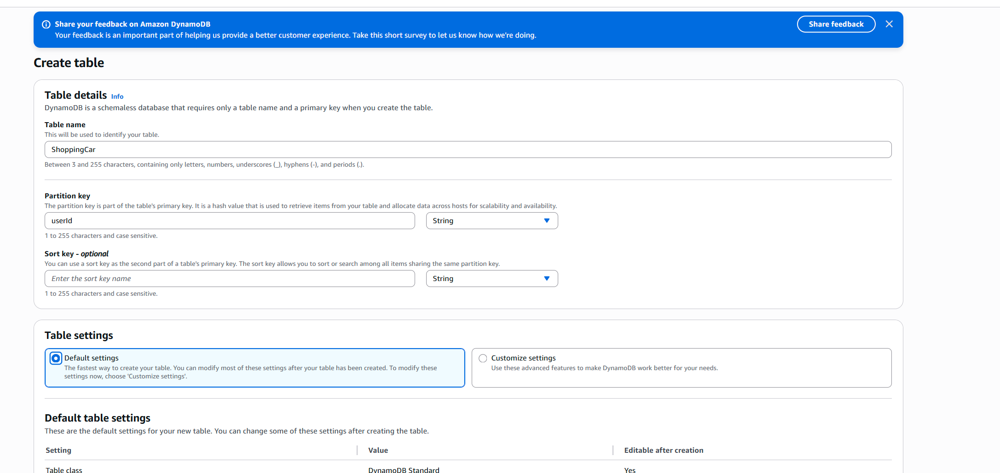

# 🗂️ DynamoDB Tables Setup

> Implementation guide for DynamoDB shopping cart storage following ADR-003 architecture strategy

This guide provides setup instructions for DynamoDB tables, implementing the NoSQL storage decisions documented in [ADR-003: DynamoDB for Shopping Cart Storage](../cloudshelf-architecture-decisions.md#adr-003-dynamodb-for-shopping-cart-storage).

---

## 🏛️ Architecture Overview

Based on **ADR-003**, DynamoDB provides the shopping cart storage layer for CloudShelf with:

- **🛒 Shopping Cart Storage** - High-performance NoSQL operations for cart data
- **⚡ Fast Access Patterns** - Single-digit millisecond latency for cart operations
- **📈 Serverless Scaling** - Automatic scaling based on demand
- **💰 Cost Efficiency** - Pay-per-request pricing model

**Architecture Decision Reference**: See [ADR-003](../cloudshelf-architecture-decisions.md#adr-003) for the complete rationale behind this NoSQL approach.

### **🗂️ DynamoDB Architecture Design**


_NoSQL storage architecture showing table design, access patterns, and Lambda integration_

### **📋 Table Design Strategy**

Following ADR-003 polyglot persistence approach:

| Data Pattern      | Storage Solution | Rationale                                             |
| ----------------- | ---------------- | ----------------------------------------------------- |
| **Shopping Cart** | DynamoDB         | High performance, flexible schema, serverless scaling |
| **Book Catalog**  | PostgreSQL RDS   | Complex relationships, ACID transactions              |

### **🗂️ DynamoDB Table Specifications**

| Configuration     | Value                      | Purpose                              |
| ----------------- | -------------------------- | ------------------------------------ |
| **Table Name**    | `cloudshelf-shopping-cart` | Clear naming convention              |
| **Partition Key** | `userId` (String)          | User-centric data organization       |
| **Capacity Mode** | On-demand                  | Variable e-commerce traffic patterns |
| **Encryption**    | AWS Managed                | Security by default                  |

---

## 🚀 Implementation Steps

### **Step 1: Create DynamoDB Table**

1. **🖥️ Access DynamoDB Console**

---

## 📊 Architecture Configuration

### **Table Design Strategy**

Following ADR-003 NoSQL optimization approach:

| Design Aspect      | Implementation             | Rationale                             |
| ------------------ | -------------------------- | ------------------------------------- |
| **Partition Key**  | `userId` (String)          | Even distribution, user-based access  |
| **Table Name**     | `cloudshelf-shopping-cart` | Descriptive, project-prefixed         |
| **Capacity Mode**  | On-demand                  | Cost-effective for variable workloads |
| **Item Structure** | Nested JSON                | Flexible schema for cart complexity   |

### **Access Patterns**

| Operation         | Key Pattern          | Performance Target      |
| ----------------- | -------------------- | ----------------------- |
| **Get User Cart** | `userId`             | < 10ms single-digit     |
| **Update Cart**   | `userId` + item data | < 20ms write latency    |
| **Clear Cart**    | `userId`             | < 10ms delete operation |

---

## 🚀 Implementation Guide

### **Step 1: Create Shopping Cart Table**

Create the DynamoDB table for cart storage.

**Configuration:**

- **Table Name**: `cloudshelf-shopping-cart`
- **Partition Key**: `userId` (String)
- **Capacity Mode**: On-demand
- **Encryption**: AWS managed key



---

### **Step 2: Configure Table Settings**

Set up table-level configurations for production readiness.

**Configuration:**

- **Point-in-time Recovery**: Enabled (production)
- **Deletion Protection**: Enabled (production)
- **CloudWatch Alarms**: Enabled for monitoring
- **Tags**: Environment, Project, Owner


---

### **Step 3: Verify Table Creation**

Confirm table is active and properly configured.

**Verification:**

- **Table Status**: Active
- **Partition Key**: Correctly configured
- **Capacity Settings**: On-demand enabled
- **Security Settings**: Encryption at rest enabled


---

### **Step 4: Test Data Operations**

Validate table functionality with sample operations.

**Test Operations:**

- **Put Item**: Add sample cart data
- **Get Item**: Retrieve cart by userId
- **Update Item**: Modify cart contents
- **Delete Item**: Clear user cart


---

## 📚 Best Practices & Troubleshooting

<details>
<summary><strong>🗂️ DynamoDB Best Practices</strong></summary>

### **Table Design**

- ✅ **Use meaningful partition keys** - Ensure even data distribution
- ✅ **On-demand billing** - Cost-effective for variable workloads
- ✅ **Enable encryption** - Use AWS managed keys for data at rest
- ✅ **Point-in-time recovery** - Enable for production environments

### **Performance Optimization**

- ✅ **Hot partition avoidance** - Distribute writes evenly across partitions
- ✅ **Item size limits** - Keep items under 400KB for optimal performance
- ✅ **Batch operations** - Use batch get/put for multiple items
- ✅ **Connection pooling** - Reuse connections in Lambda functions

</details>

<details>
<summary><strong>🔧 Troubleshooting Common Issues</strong></summary>

### **1. Throttling errors**

- ✅ Check: Use on-demand billing mode
- ✅ Check: Implement exponential backoff in application code
- ✅ Check: Review access patterns for hot partitions

### **2. Item not found errors**

- ✅ Check: Verify partition key format and casing
- ✅ Check: Ensure consistent read operations when needed
- ✅ Check: Review item TTL settings if configured

### **3. Access denied errors**

- ✅ Check: Lambda execution role has DynamoDB permissions
- ✅ Check: Table resource ARN in IAM policies
- ✅ Check: VPC endpoints if Lambda is in VPC

### **Testing DynamoDB Operations**

```bash
# AWS CLI commands for testing
aws dynamodb put-item --table-name cloudshelf-shopping-cart --item '{"userId":{"S":"test123"},"cartItems":{"L":[]}}'

aws dynamodb get-item --table-name cloudshelf-shopping-cart --key '{"userId":{"S":"test123"}}'
```

</details>

---

## 📚 Related Documentation

- 🏛️ [**ADR-003: DynamoDB Strategy**](../cloudshelf-architecture-decisions.md#adr-003) - Complete NoSQL architecture rationale
- 🏛️ [**All Architecture Decisions**](../cloudshelf-architecture-decisions.md) - Context for data storage choices
- ⚡ [**Lambda Setup**](../lambda/cloudshelf-lambda-setup.md) - Function integration with DynamoDB
- 🗃️ [**RDS Setup**](../rds/cloudshelf-rds-setup.md) - Complementary relational storage
- 🌐 [**API Gateway Setup**](../apigateway/cloudshelf-apigateway-setup.md) - API endpoints for cart operations

---

## �️ Shopping Cart Table Structure

### **Table Schema Design**

**Primary Key Structure:**

- **Partition Key**: `userId` (String) - Enables user-specific cart retrieval
- **No Sort Key**: Single cart per user design pattern

**Attribute Design:**

```json
{
  "userId": "string", // Partition key - unique user identifier
  "cartItems": [
    // List of cart items
    {
      "bookId": "string", // Reference to book catalog
      "title": "string", // Book title for display
      "author": "string", // Book author
      "price": "number", // Current price
      "quantity": "number", // Quantity in cart
      "addedAt": "string" // ISO timestamp
    }
  ],
  "totalItems": "number", // Total quantity of all items
  "totalPrice": "number", // Total cart value
  "lastUpdated": "string", // Last modification timestamp
  "ttl": "number" // Time-to-live for automatic cleanup
}
```

### **Access Patterns**

**Primary Operations:**

1. **Get Cart**: `GetItem` by `userId`
2. **Add Item**: `UpdateItem` to append to `cartItems`
3. **Update Quantity**: `UpdateItem` specific cart item
4. **Remove Item**: `UpdateItem` to remove from `cartItems`
5. **Clear Cart**: `DeleteItem` by `userId`

### **Lambda Integration Example**

```python
import boto3
import json
from decimal import Decimal

dynamodb = boto3.resource('dynamodb')
table = dynamodb.Table('cloudshelf-shopping-cart')

def add_to_cart(user_id, book_item):
    """Add item to user's shopping cart"""
    response = table.update_item(
        Key={'userId': user_id},
        UpdateExpression='SET cartItems = list_append(if_not_exists(cartItems, :empty_list), :item), totalItems = totalItems + :qty, totalPrice = totalPrice + :price',
        ExpressionAttributeValues={
            ':empty_list': [],
            ':item': [book_item],
            ':qty': book_item['quantity'],
            ':price': Decimal(str(book_item['price'] * book_item['quantity']))
        }
    )
    return response

def get_cart(user_id):
    """Retrieve user's shopping cart"""
    response = table.get_item(Key={'userId': user_id})
    return response.get('Item', {})
```

---

## �📋 Quick Reference

<details>
<summary><strong>📊 Configuration Values</strong></summary>

### **Table Configuration**

- **Table Name**: `cloudshelf-shopping-cart`
- **Partition Key**: `userId` (String)
- **Capacity Mode**: On-demand
- **Encryption**: AWS managed key

### **Data Model Example**

```json
{
  "userId": "user123",
  "cartItems": [
    {
      "bookId": "book001",
      "title": "The Great Gatsby",
      "quantity": 2,
      "price": 15.99,
      "addedAt": "2025-09-03T10:30:00Z"
    }
  ],
  "totalItems": 2,
  "totalPrice": 31.98,
  "lastUpdated": "2025-09-03T10:30:00Z",
  "ttl": 1725552600
}
```

### **Required IAM Permissions**

```json
{
  "Version": "2012-10-17",
  "Statement": [
    {
      "Effect": "Allow",
      "Action": [
        "dynamodb:GetItem",
        "dynamodb:PutItem",
        "dynamodb:UpdateItem",
        "dynamodb:DeleteItem"
      ],
      "Resource": "arn:aws:dynamodb:region:account:table/cloudshelf-shopping-cart"
    }
  ]
}
```

</details>

---

**External Reference**: [AWS DynamoDB Documentation](https://docs.aws.amazon.com/dynamodb/)

_Part of the CloudShelf Solutions Architecture documentation_  
_Last updated: September 3, 2025_
"addedAt": "2025-09-01T10:00:00Z"
}
],
"lastUpdated": "2025-09-01T10:05:00Z"
}

```

### **Schema Evolution Strategy**

- New attributes can be added without migrations
- Flexible JSON-like document structure
- No downtime for schema changes

### **Performance Optimization**

- User-centric partition key for data locality
- On-demand scaling for variable traffic
- Single-table design for optimal performance

---

## 📚 Related Architecture Documentation

- 🏛️ [**ADR-003: DynamoDB Strategy**](../cloudshelf-architecture-decisions.md#adr-003) - Complete NoSQL architecture rationale
- 🏛️ [**All Architecture Decisions**](../cloudshelf-architecture-decisions.md) - Context for data storage choices
- 🗃️ [**RDS Setup**](../setup-rds.md) - Relational database for catalog operations
- ⚡ [**Lambda Setup**](../lambda/setup-lambda.md) - Compute layer integration

---

_Part of the CloudShelf Solutions Architecture documentation_
```
