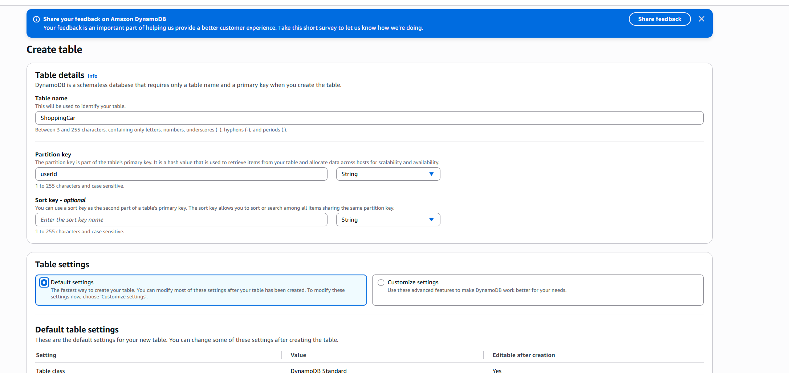

# DynamoDB Tables Setup

This guide provides step-by-step instructions for setting up DynamoDB tables for your shopping cart, both manually and with CloudFormation.

## Manual Steps

### Step 1: Create a DynamoDB table

1. Sign in to the AWS Management Console and open the DynamoDB console.
2. Choose "Create table".
3. Enter a table name (e.g., `ShoppingCart`).
4. Set the primary key (e.g., `userId` for shopping cart).
5. Configure settings (provisioned or on-demand capacity, encryption, etc.).
6. Click "Create table".

### Step 2: (Optional) Add items to your table

1. Select your table in the console.
2. Choose "Explore table items" and click "Create item" if you want to add test data for development or demos.

_Note: In production, shopping cart items are created naturally as users interact with the application. You do not need to add sample data manually._

---
