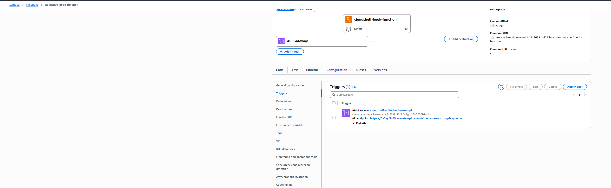
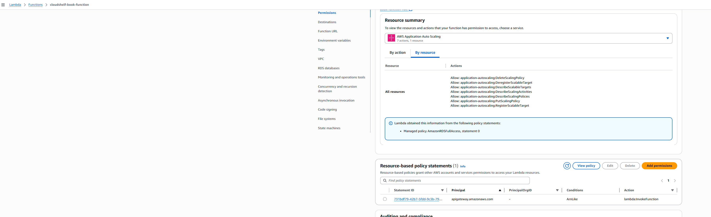

# ⚡ Lambda Functions Setup

> Implementation guide for AWS Lambda functions following ADR-004 serverless architecture strategy

This guide provides setup instructions for AWS Lambda functions, implementing the serverless architecture decisions documented in [ADR-004: Lambda Serverless Architecture Strategy](../cloudshelf-architecture-decisions.md#adr-004-lambda-serverless-architecture-strategy).

---

## 🔒 Lambda Security Best Practices

### **🛡️ Serverless Security Principles**

**Key Security Considerations**:

- **IAM Roles**: Each Lambda function gets minimal required permissions
- **VPC Configuration**: Lambda functions in VPC for database access
- **Environment Variables**: Secure configuration without hardcoded secrets
- **Resource Policies**: Control which services can invoke Lambda functions

**Security Checklist**:

- [ ] Use least privilege IAM roles
- [ ] Enable VPC for database connectivity
- [ ] Never hardcode database credentials
- [ ] Use AWS Secrets Manager for sensitive data
- [ ] Configure security groups for network access

---

## 🏛️ Architecture Overview

Based on **ADR-004**, Lambda functions provide the compute layer for CloudShelf with:

- **📚 Book Catalog Operations** - PostgreSQL RDS integration for complex queries
- **🛒 Shopping Cart Management** - DynamoDB integration for high-performance operations
- **👤 User Authentication** - Cognito integration for secure user management
- **🌐 API Integration** - API Gateway for RESTful endpoints

**Architecture Decision Reference**: See [ADR-004](../cloudshelf-architecture-decisions.md#adr-004) for the complete rationale behind this serverless approach.

### **⚡ Lambda Architecture Design**


_Serverless compute architecture showing Lambda functions, VPC integration, and service connections_

### **🔌 API Gateway Integration**



### **🔒 Permissions Management**



---

## 🔐 Prerequisites: IAM Execution Role

Before creating Lambda functions, establish proper IAM roles that grant necessary permissions for accessing AWS services.

### **📋 Required Permissions**

| Service             | Permission                             | Purpose                                      |
| ------------------- | -------------------------------------- | -------------------------------------------- |
| **CloudWatch Logs** | `AWSLambdaBasicExecutionRole`          | Function logging and monitoring              |
| **RDS**             | `rds-db:connect`                       | Database connectivity for catalog operations |
| **DynamoDB**        | `dynamodb:GetItem`, `dynamodb:PutItem` | Shopping cart data operations                |
| **VPC**             | `ec2:CreateNetworkInterface`           | VPC connectivity for secure networking       |

### **🛠️ IAM Role Setup Steps**

---

## 📊 Architecture Configuration

### **Function Strategy**

Following ADR-004 serverless-first approach:

| Function Purpose        | Runtime | Memory | Timeout | VPC Required  |
| ----------------------- | ------- | ------ | ------- | ------------- |
| **Book Catalog API**    | Java 21 | 512 MB | 30s     | Yes (RDS)     |
| **Shopping Cart API**   | Java 21 | 256 MB | 15s     | No (DynamoDB) |
| **User Authentication** | Java 21 | 256 MB | 10s     | No (Cognito)  |

### **Configuration Specifications**

| Component           | Development | Production  | Rationale                           |
| ------------------- | ----------- | ----------- | ----------------------------------- |
| **Runtime**         | Java 21     | Java 21     | LTS version, enterprise readiness   |
| **Memory**          | 256-512 MB  | 512-1024 MB | Cost-effective, performance scaling |
| **Timeout**         | 15-30s      | 30-60s      | API Gateway limits consideration    |
| **VPC Integration** | Optional    | Required    | Security isolation for production   |

---

## 🚀 Implementation Guide

### **Step 1: Verify IAM Execution Role**

Ensure you have completed the IAM setup from the previous guide.

**Prerequisites:**

- ✅ **IAM Role**: `CloudShelf-Lambda-ExecutionRole-Phase1` (created in [IAM Setup Guide](cloudshelf-basic-iam-setup.md))
- ✅ **Policies Attached**: `AWSLambdaBasicExecutionRole`, `AmazonDynamoDBFullAccess`
- ✅ **Trust Policy**: Lambda service can assume the role

> **📋 Reference**: See [CloudShelf Basic IAM Setup](cloudshelf-basic-iam-setup.md) for complete role creation steps

---

### **Step 2: Configure Function Settings**

Create Lambda function with proper configuration.

**Configuration:**

- **Function Name**: `cloudshelf-[function-purpose]`
- **Runtime**: Java 21 (corretto)
- **Architecture**: x86_64
- **Handler**: `com.cloudshelf.[module].Handler`


---

### **Step 3: Upload Function Code**

Deploy the compiled JAR file with all dependencies.

**Configuration:**

- **Deployment Package**: JAR file with dependencies
- **Handler Configuration**: Specify entry point class and method
- **Environment Variables**: Database connections, API keys


---

### **Step 4: Configure VPC Integration**

Set up VPC networking for database access (if required).

**Network Configuration:**

- **VPC**: CloudShelf VPC
- **Subnets**: Private subnets only
- **Security Groups**: `cloudshelf-lambda-sg`


---

### **Step 5: Set Environment Variables**

Configure function-specific environment variables.

**Configuration:**

- **Database Connection**: RDS endpoint, credentials
- **DynamoDB Tables**: Table names and region
- **Security Settings**: API keys, authentication settings


---

## 📚 Best Practices & Troubleshooting

<details>
<summary><strong>⚡ Lambda Best Practices</strong></summary>

### **Performance Optimization**

- ✅ **Right-size memory allocation** - Start with 256MB, scale based on monitoring
- ✅ **Optimize cold starts** - Keep deployment packages small, minimize initialization code
- ✅ **Connection pooling** - Reuse database connections across invocations
- ✅ **Environment variables** - Use for configuration, avoid hardcoded values

### **Security Best Practices**

- ✅ **Least privilege IAM** - Grant only necessary permissions
- ✅ **VPC deployment** - Use private subnets for database access
- ✅ **Secrets management** - Use AWS Secrets Manager for sensitive data
- ✅ **Environment isolation** - Separate dev/staging/prod functions

</details>

<details>
<summary><strong>🔧 Troubleshooting Common Issues</strong></summary>

### **1. Function timeout errors**

- ✅ Check: Increase timeout setting (max 15 minutes)
- ✅ Check: Optimize code performance and database queries
- ✅ Check: VPC configuration causing connection delays

### **2. Memory limit exceeded**

- ✅ Check: Increase memory allocation
- ✅ Check: Code for memory leaks or excessive object creation
- ✅ Check: CloudWatch metrics for actual memory usage

### **3. VPC connectivity issues**

- ✅ Check: Lambda security group allows outbound traffic
- ✅ Check: NAT Gateway or VPC endpoints for internet access
- ✅ Check: Database security group allows Lambda access

### **Testing Lambda Functions**

```bash
# Test function locally with SAM CLI
sam local invoke "FunctionName" -e test-event.json

# Test API Gateway integration
curl -X POST https://api-id.execute-api.region.amazonaws.com/stage/endpoint
```

</details>

---

## 📚 Related Documentation

- 🏛️ [**ADR-004: Lambda Architecture Strategy**](../cloudshelf-architecture-decisions.md#adr-004) - Complete serverless architecture rationale
- 🏛️ [**All Architecture Decisions**](../cloudshelf-architecture-decisions.md) - Context for Lambda integration choices
- 🌐 [**VPC Setup**](../vpc/cloudshelf-vpc-setup.md) - Network foundation for VPC-enabled functions
- 🗃️ [**RDS Setup**](../rds/cloudshelf-rds-setup.md) - Database integration patterns
- 🗂️ [**DynamoDB Setup**](../dynamodb/cloudshelf-dynamodb-setup.md) - NoSQL integration
- 🌐 [**API Gateway Setup**](../apigateway/cloudshelf-apigateway-setup.md) - Function triggers and integration

---

## 📋 Quick Reference

<details>
<summary><strong>📊 Configuration Values</strong></summary>

### **Function Configuration**

- **Runtime**: Java 21 (corretto)
- **Architecture**: x86_64
- **Execution Role**: `cloudshelf-lambda-execution-role`
- **VPC**: CloudShelf VPC (private subnets)
- **Security Group**: `cloudshelf-lambda-sg`

### **Memory and Timeout Settings**

| Function Type      | Memory | Timeout | VPC Required |
| ------------------ | ------ | ------- | ------------ |
| **Book Catalog**   | 512 MB | 30s     | Yes          |
| **Shopping Cart**  | 256 MB | 15s     | No           |
| **Authentication** | 256 MB | 10s     | No           |

### **Environment Variables Template**

```
DB_HOST=cloudshelf-book-catalog-db.cluster-xyz.region.rds.amazonaws.com
DB_PORT=5432
DB_NAME=cloudshelf
DYNAMODB_TABLE_CART=cloudshelf-shopping-cart
AWS_REGION=us-east-1
```

</details>

---

**External Reference**: [AWS Lambda Documentation](https://docs.aws.amazon.com/lambda/)

_Part of the CloudShelf Solutions Architecture documentation_  
_Last updated: September 3, 2025_

## 🏗️ Implementation Notes

### **Function Organization Pattern**

Following ADR-004 architecture strategy:

| Function Purpose  | Integration                      | Data Store |
| ----------------- | -------------------------------- | ---------- |
| Book Catalog API  | API Gateway → Lambda → VPC → RDS | PostgreSQL |
| Shopping Cart API | API Gateway → Lambda → DynamoDB  | NoSQL      |
| User Auth         | API Gateway → Lambda → Cognito   | Identity   |

### **Security Architecture**

- Lambda functions deployed in VPC private subnets for database access
- IAM roles with least-privilege permissions per function type
- Security groups controlling network access to RDS and external services

### **Performance Strategy**

- Memory allocation: 256MB baseline (adjust per function requirements)
- Timeout: 30 seconds (API Gateway limit)
- Provisioned concurrency for user-facing functions to mitigate cold starts

---

## � Related Architecture Documentation

- 🏛️ [**ADR-004: Lambda Architecture Strategy**](../cloudshelf-architecture-decisions.md#adr-004) - Complete serverless architecture rationale
- 🏛️ [**All Architecture Decisions**](../cloudshelf-architecture-decisions.md) - Context for Lambda integration choices
- 🌐 [**VPC Setup**](../vpc/cloudshelf-vpc-reference.md) - Network configuration for Lambda VPC access
- 🗃️ [**RDS Setup**](../setup-rds.md) - Database connectivity requirements
- 🗂️ [**DynamoDB Setup**](../dynamodb/setup-dynamodb.md) - NoSQL integration patterns

---

_Part of the CloudShelf Solutions Architecture documentation_
