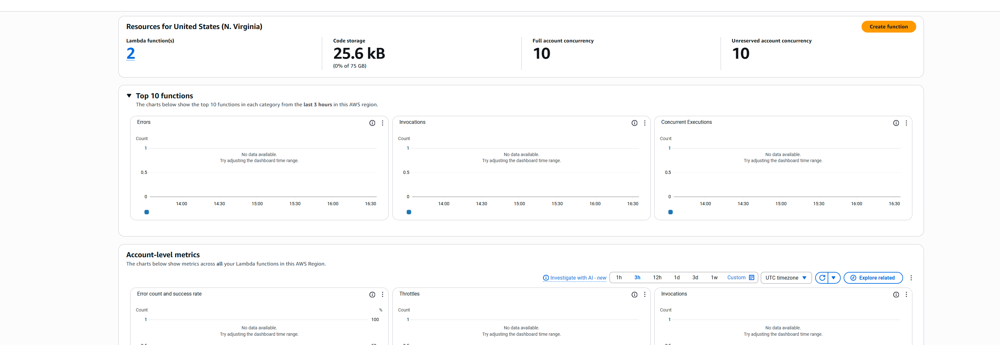
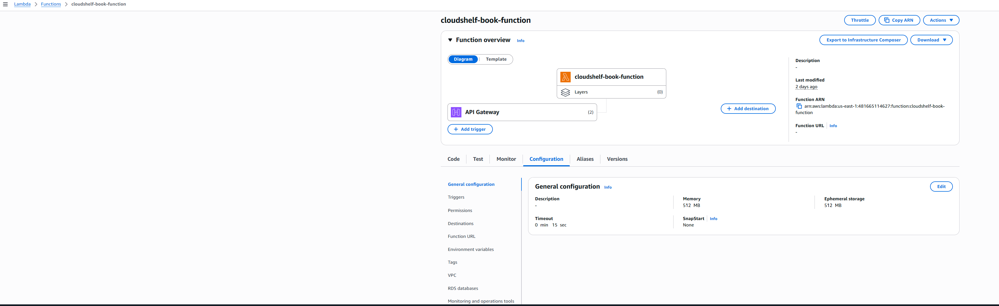
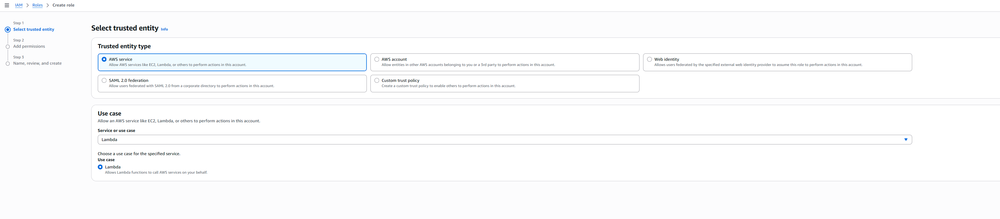

# ⚡ Lambda Functions Setup

> Implementation guide for AWS Lambda functions following ADR-004 serverless architecture strategy

This guide provides setup instructions for AWS Lambda functions, implementing the serverless architecture decisions documented in [ADR-004: Lambda Serverless Architecture Strategy](../architecture-decisions.md#adr-004-lambda-serverless-architecture-strategy).

---

## 🏛️ Architecture Overview

Based on **ADR-004**, Lambda functions provide the compute layer for CloudShelf with:

- **📚 Book Catalog Operations** - PostgreSQL RDS integration for complex queries
- **🛒 Shopping Cart Management** - DynamoDB integration for high-performance operations
- **👤 User Authentication** - Cognito integration for secure user management
- **🌐 API Integration** - API Gateway for RESTful endpoints

**Architecture Decision Reference**: See [ADR-004](../architecture-decisions.md#adr-004) for the complete rationale behind this serverless approach.

---

## 📷 Architecture Screenshots

### **🖥️ Lambda Console Overview**



### **🔧 Create Function Process**


### **⚙️ Function Configuration**



### **🔌 API Gateway Integration**


### **🔒 Permissions Management**


---

## 🔐 Prerequisites: IAM Execution Role

Before creating Lambda functions, establish proper IAM roles that grant necessary permissions for accessing AWS services.

### **📋 Required Permissions**

| Service             | Permission                             | Purpose                                      |
| ------------------- | -------------------------------------- | -------------------------------------------- |
| **CloudWatch Logs** | `AWSLambdaBasicExecutionRole`          | Function logging and monitoring              |
| **RDS**             | `rds-db:connect`                       | Database connectivity for catalog operations |
| **DynamoDB**        | `dynamodb:GetItem`, `dynamodb:PutItem` | Shopping cart data operations                |
| **VPC**             | `ec2:CreateNetworkInterface`           | VPC connectivity for secure networking       |

### **🛠️ IAM Role Setup Steps**


1. **🏛️ Navigate to IAM Console**

   - Go to the IAM console in AWS
   - Choose "Roles" → "Create role"

2. **🎯 Configure Trust Relationship**

   - Select "AWS service" as trusted entity
   - Choose "Lambda" as the service

3. **📜 Attach Policies**
   ```
   Required Policies:
   ✅ AWSLambdaBasicExecutionRole
   ✅ AWSLambdaVPCAccessExecutionRole (if VPC-enabled)
   ✅ Custom policy for RDS/DynamoDB access
   ```



4. **🏷️ Name and Create**
   - Name: `cloudshelf-lambda-execution-role`
   - Description: "Execution role for CloudShelf Lambda functions"
   - Click "Create role"

---

## 🚀 Lambda Function Creation

### **Step 1: Create Function**

1. **🖥️ Access Lambda Console**

   - Sign in to AWS Management Console
   - Navigate to Lambda service

2. **📝 Function Configuration**

   ```
   Function Name: cloudshelf-[function-purpose]
   Runtime: Java 21 (corretto)
   Architecture: x86_64
   Handler: com.cloudshelf.[module].Handler
   ```

3. **🔒 Permissions Setup**

   - Select existing role: `cloudshelf-lambda-execution-role`
   - Configure VPC settings if database access required

4. **⚙️ Advanced Configuration**
   - Memory: 256 MB (adjust based on requirements)
   - Timeout: 30 seconds (API Gateway limit)
   - Environment variables as needed

### **Step 2: Function Testing**

1. **🧪 Test Configuration**

   - Use "Test" feature in Lambda console
   - Create test events matching expected input format
   - Verify function execution and output

2. **📊 Monitor Performance**
   - Check CloudWatch logs for execution details
   - Monitor duration, memory usage, and error rates
   - Validate database connectivity if applicable

---

## 🏗️ Implementation Notes

### **Function Organization Pattern**

Following ADR-004 architecture strategy:

| Function Purpose  | Integration                      | Data Store |
| ----------------- | -------------------------------- | ---------- |
| Book Catalog API  | API Gateway → Lambda → VPC → RDS | PostgreSQL |
| Shopping Cart API | API Gateway → Lambda → DynamoDB  | NoSQL      |
| User Auth         | API Gateway → Lambda → Cognito   | Identity   |

### **Security Architecture**

- Lambda functions deployed in VPC private subnets for database access
- IAM roles with least-privilege permissions per function type
- Security groups controlling network access to RDS and external services

### **Performance Strategy**

- Memory allocation: 256MB baseline (adjust per function requirements)
- Timeout: 30 seconds (API Gateway limit)
- Provisioned concurrency for user-facing functions to mitigate cold starts

---

## � Related Architecture Documentation

- 🏛️ [**ADR-004: Lambda Architecture Strategy**](../architecture-decisions.md#adr-004) - Complete serverless architecture rationale
- 🏛️ [**All Architecture Decisions**](../architecture-decisions.md) - Context for Lambda integration choices
- 🌐 [**VPC Setup**](../vpc/setup-vpc-reference.md) - Network configuration for Lambda VPC access
- 🗃️ [**RDS Setup**](../setup-rds.md) - Database connectivity requirements
- 🗂️ [**DynamoDB Setup**](../dynamodb/setup-dynamodb.md) - NoSQL integration patterns

---

_Part of the CloudShelf Solutions Architecture documentation_
