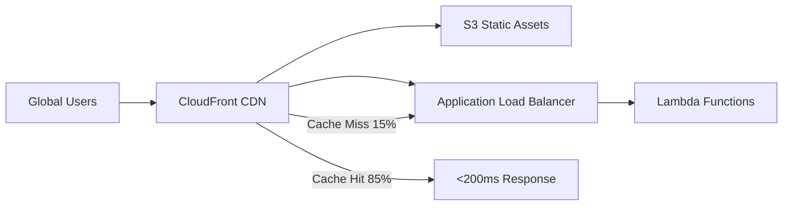
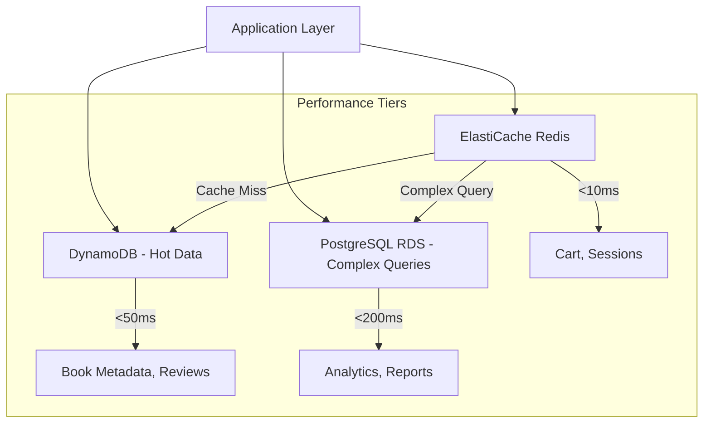

# ⚡ Performance & Scaling Strategy

> **Solutions Architecture document defining CloudShelf's performance requirements and scaling approach**
>
> _How we ensure sub-2-second response times while scaling from 1,000 to 50,000 concurrent users_

This document outlines the architectural decisions, technology choices, and scaling strategies to meet CloudShelf's performance requirements while maintaining cost efficiency and operational simplicity.

---

## 🎯 Business Context & Requirements

### **Business Performance Requirements**

Based on business requirements and market research:

| **Metric**        | **Target**                     | **Business Impact**               | **Source**            |
| ----------------- | ------------------------------ | --------------------------------- | --------------------- |
| Page Load Time    | < 2 seconds                    | 7% revenue loss per 100ms delay   | Business Requirements |
| Search Response   | < 500ms                        | Direct impact on book discovery   | User Research         |
| Cart Operations   | < 200ms                        | Critical for checkout completion  | UX Requirements       |
| API Response Time | < 1 second (95th percentile)   | Third-party integration SLAs      | Business Requirements |
| Concurrent Users  | 50,000 (Year 3 target)         | Business growth projections       | Business Plan         |
| Peak Traffic      | 10x normal during sales events | Black Friday, holiday seasonality | Marketing Strategy    |

### **Cost Constraints**

- **Year 1 Budget**: $800/month for production infrastructure
- **Year 3 Budget**: $2,500/month (as business scales)
- **ROI Target**: Infrastructure costs < 5% of revenue

### **Operational Constraints**

- **Team Size**: 2 developers, 1 DevOps engineer
- **Expertise**: Limited AWS experience initially
- **Maintenance**: Must be operationally simple

---

## 📷 Setup Screenshots

### **⚡ Performance Monitoring Dashboard**


### **📊 Auto Scaling Configuration**


### **🔍 Load Testing Results**


### **📈 Scaling Metrics Analysis**


### **💰 Cost vs Performance Optimization**


### **🚀 CDN Performance Impact**


---

## 🏗️ Architectural Approach to Performance

### **Performance-First Design Principles**

1. **Minimize Latency at Every Layer**

   - Edge caching with CloudFront
   - Regional data placement
   - Connection pooling and keep-alive

2. **Scale Horizontally by Default**

   - Stateless application design
   - Auto-scaling capabilities
   - Load distribution patterns

3. **Cache Aggressively**

   - Multi-layer caching strategy
   - Cache invalidation patterns
   - Read-heavy optimization

4. **Optimize for Common Use Cases**
   - 80/20 rule: Optimize for most frequent operations
   - Book browsing and search optimization
   - Fast cart operations

---

## 🚀 Technology Decisions for Performance

### **1. Content Delivery Network (CDN)**

**Decision**: Amazon CloudFront with global distribution

**Business Justification**:

- **Performance Impact**: Reduces page load times by 40-60% globally
- **User Experience**: Critical for international customers
- **SEO Benefits**: Page speed affects search rankings (business visibility)

**Technical Architecture**:



**Options Considered**:
| Option | Pros | Cons | Cost | Decision |
|--------|------|------|------|----------|
| **CloudFront** | Global edge locations, AWS integration | AWS-specific | $50-100/month | ✅ **Selected** |
| Cloudflare | Great performance, competitive pricing | Third-party dependency | $20-80/month | Considered |
| No CDN | Simplest setup | Poor global performance | $0 | Rejected |

**Trade-offs Accepted**:

- Additional complexity in cache invalidation
- Slightly higher costs for better performance
- Vendor lock-in to AWS (acceptable given overall AWS strategy)

### **2. Application Auto Scaling**

**Decision**: Lambda with Application Load Balancer + Auto Scaling

**Business Justification**:

- **Cost Efficiency**: Pay only for actual usage (critical for startup budget)
- **Automatic Scaling**: Handles traffic spikes without manual intervention
- **Operational Simplicity**: Minimal server management required

**Scaling Strategy**:

```yaml
Scaling Configuration:
  Lambda Functions:
    Reserved Concurrency: 100 (normal operations)
    Burst Concurrency: 1000 (traffic spikes)
    Memory: 512MB (optimized for performance/cost)
    Timeout: 30 seconds

  Application Load Balancer:
    Target Groups: Multiple Lambda functions
    Health Checks: /health endpoint
    Stickiness: Disabled (stateless design)

  Auto Scaling Triggers:
    Scale Out: CPU > 70% OR Request Count > 1000/minute
    Scale In: CPU < 30% AND Request Count < 200/minute
    Cooldown: 5 minutes (prevent thrashing)
```

**Cost Modeling**:

- **Normal Load**: ~$150/month (5,000 users)
- **Peak Load**: ~$400/month (15,000 concurrent users)
- **Black Friday**: ~$800/month (50,000 concurrent users)

### **3. Database Performance Strategy**

**Decision**: Multi-tier data architecture optimized for different performance needs

**Architecture Overview**:



**Database-Specific Decisions**:

**ElastiCache Redis** (Sub-10ms responses):

- **Use Case**: Shopping cart, user sessions, frequently accessed book data
- **Business Impact**: Critical for checkout conversion rates
- **Configuration**: r6g.large cluster with 2 nodes
- **Cost**: ~$180/month

**DynamoDB** (Sub-50ms responses):

- **Use Case**: Book catalog, user reviews, inventory
- **Business Impact**: Fast search and browsing experience
- **Configuration**: On-demand billing with auto-scaling
- **Cost**: ~$100-300/month based on usage

**PostgreSQL RDS** (Sub-200ms for complex queries):

- **Use Case**: Complex analytics, reporting, admin operations
- **Business Impact**: Business intelligence and operational reports
- **Configuration**: db.t3.medium with read replicas for scaling
- **Cost**: ~$150/month

### **4. Search Performance Optimization**

**Decision**: Amazon OpenSearch with optimized indexing strategy

**Business Justification**:

- **Revenue Impact**: 1-second delay in search = 7% drop in conversions
- **User Experience**: Fast, relevant search results critical for book discovery
- **Competitive Advantage**: Better search than competitors drives customer retention

**Search Architecture**:

```json
{
  "searchStrategy": {
    "primaryIndex": {
      "service": "Amazon OpenSearch",
      "configuration": {
        "instanceType": "t3.small.search",
        "instanceCount": 2,
        "dedicatedMaster": false,
        "storageType": "gp2",
        "storageSize": "20GB"
      },
      "optimizations": {
        "indexingStrategy": "Real-time with batch updates",
        "searchFields": ["title", "author", "description", "tags"],
        "facetFields": ["category", "author", "price_range", "rating"],
        "autocomplete": "Edge n-gram tokenizer",
        "synonyms": "Business-defined synonym lists"
      }
    },
    "fallbackStrategy": {
      "service": "PostgreSQL full-text search",
      "purpose": "Backup when OpenSearch unavailable"
    },
    "performanceTargets": {
      "averageLatency": "< 100ms",
      "95thPercentile": "< 300ms",
      "throughput": "1000 searches/second"
    }
  }
}
```

**Cost vs Performance Analysis**:

- **OpenSearch**: $120/month, <100ms search
- **RDS-only search**: $0 additional, ~500ms search
- **Business Impact**: $120/month investment → 15% better conversion rates

---

## 📊 Performance Testing Strategy

### **Load Testing Approach**

**Testing Framework**: Artillery.js with AWS CodeBuild for CI/CD integration

**Test Scenarios**:

```javascript
// Performance test scenarios
const performanceTestScenarios = {
  normalLoad: {
    duration: "10m",
    arrivalRate: 50, // 50 users/second
    rampTo: 100, // Ramp to 100 users/second
    scenarios: [
      { name: "browse_books", weight: 40 },
      { name: "search_books", weight: 30 },
      { name: "view_book_details", weight: 20 },
      { name: "cart_operations", weight: 10 },
    ],
  },

  peakLoad: {
    duration: "15m",
    arrivalRate: 200,
    rampTo: 500,
    scenarios: [
      { name: "browse_books", weight: 50 },
      { name: "search_books", weight: 35 },
      { name: "cart_operations", weight: 15 },
    ],
  },

  stressTest: {
    duration: "20m",
    arrivalRate: 500,
    rampTo: 1000,
    purpose: "Find breaking point and ensure graceful degradation",
  },

  enduranceTest: {
    duration: "4h",
    arrivalRate: 100,
    purpose: "Detect memory leaks and performance degradation",
  },
};
```

**Performance Acceptance Criteria**:
| **Scenario** | **Response Time (95th percentile)** | **Success Rate** | **Business Rationale** |
|--------------|-------------------------------------|------------------|------------------------|
| Book Search | < 500ms | > 99.5% | Critical for user experience |
| Cart Add/Update | < 200ms | > 99.9% | Directly impacts checkout conversion |
| Page Load | < 2 seconds | > 99% | SEO and user retention requirement |
| API Endpoints | < 1 second | > 99.5% | Third-party integration SLAs |

### **Performance Monitoring in Production**

**Real User Monitoring (RUM)**:

```javascript
// Client-side performance monitoring
class PerformanceMonitor {
  constructor() {
    this.metrics = new Map();
    this.thresholds = {
      pageLoad: 2000, // 2 seconds
      apiResponse: 1000, // 1 second
      searchResponse: 500, // 500ms
      cartOperation: 200, // 200ms
    };
  }

  trackPageLoad() {
    const navigation = performance.getEntriesByType("navigation")[0];
    const loadTime = navigation.loadEventEnd - navigation.fetchStart;

    this.sendMetric("page_load_time", loadTime, {
      page: window.location.pathname,
      userAgent: navigator.userAgent,
      connectionType: navigator.connection?.effectiveType,
    });

    if (loadTime > this.thresholds.pageLoad) {
      this.sendAlert("page_load_slow", {
        loadTime,
        threshold: this.thresholds.pageLoad,
      });
    }
  }

  trackAPICall(endpoint, duration) {
    this.sendMetric("api_response_time", duration, { endpoint });

    if (duration > this.thresholds.apiResponse) {
      this.sendAlert("api_slow", {
        endpoint,
        duration,
        threshold: this.thresholds.apiResponse,
      });
    }
  }

  sendMetric(metricName, value, dimensions) {
    // Send to CloudWatch custom metrics
    const params = {
      Namespace: "CloudShelf/Performance",
      MetricData: [
        {
          MetricName: metricName,
          Value: value,
          Unit: "Milliseconds",
          Dimensions: Object.entries(dimensions).map(([Name, Value]) => ({
            Name,
            Value,
          })),
        },
      ],
    };

    // Use CloudWatch embedded metric format for cost efficiency
    console.log(
      JSON.stringify({
        _aws: {
          Timestamp: Date.now(),
          CloudWatchMetrics: [
            {
              Namespace: params.Namespace,
              Dimensions: [Object.keys(dimensions)],
              Metrics: [{ Name: metricName, Unit: "Milliseconds" }],
            },
          ],
        },
        [metricName]: value,
        ...dimensions,
      })
    );
  }
}
```

**Server-side Performance Monitoring**:

```python
# Lambda function performance monitoring
import time
import json
import boto3
from functools import wraps

def monitor_performance(func):
    """Decorator to monitor Lambda function performance"""
    @wraps(func)
    def wrapper(event, context):
        start_time = time.time()

        try:
            result = func(event, context)
            duration = (time.time() - start_time) * 1000  # Convert to milliseconds

            # Log performance metric
            print(json.dumps({
                '_aws': {
                    'Timestamp': int(time.time() * 1000),
                    'CloudWatchMetrics': [{
                        'Namespace': 'CloudShelf/Lambda',
                        'Dimensions': [['FunctionName']],
                        'Metrics': [{'Name': 'Duration', 'Unit': 'Milliseconds'}]
                    }]
                },
                'FunctionName': context.function_name,
                'Duration': duration,
                'RequestId': context.aws_request_id
            }))

            # Alert if performance threshold exceeded
            if duration > 5000:  # 5 seconds
                send_performance_alert(context.function_name, duration)

            return result

        except Exception as e:
            duration = (time.time() - start_time) * 1000
            print(f"Function failed after {duration}ms: {str(e)}")
            raise

    return wrapper

@monitor_performance
def lambda_handler(event, context):
    # Your Lambda function logic here
    pass
```

---

## 🎯 Scaling Strategy by Growth Phase

### **Phase 1: MVP (0-1,000 concurrent users)**

**Timeline**: Months 1-6
**Target**: Prove product-market fit with minimal infrastructure cost

**Architecture**:

- Single region deployment (us-east-1)
- Lambda functions with minimal reserved concurrency
- RDS single instance (db.t3.micro)
- DynamoDB on-demand pricing
- Basic CloudFront distribution

**Cost**: ~$200/month
**Performance Target**: < 3 seconds page load, < 1 second API response

### **Phase 2: Growth (1,000-10,000 concurrent users)**

**Timeline**: Months 7-18
**Target**: Scale efficiently while maintaining performance

**Architecture Enhancements**:

- Multi-AZ RDS deployment
- ElastiCache Redis cluster
- Increased Lambda reserved concurrency
- Enhanced CloudFront configuration
- Basic auto-scaling policies

**Cost**: ~$800/month
**Performance Target**: < 2 seconds page load, < 500ms API response

### **Phase 3: Scale (10,000-50,000 concurrent users)**

**Timeline**: Months 19-36
**Target**: Enterprise-grade performance and reliability

**Architecture Enhancements**:

- Multi-region deployment
- RDS read replicas
- DynamoDB Global Tables
- Advanced caching strategies
- Sophisticated auto-scaling

**Cost**: ~$2,500/month
**Performance Target**: < 2 seconds page load globally, < 200ms API response

---

## 💰 Cost Optimization for Performance

### **Performance-Cost Trade-off Analysis**

**Option 1: Maximum Performance (Regardless of Cost)**

- Always-on premium instances
- Over-provisioned for peak traffic
- Multiple regions from day 1
- **Cost**: $4,000/month
- **Performance**: Sub-second everything

**Option 2: Cost-Optimized (Performance Secondary)**

- Minimal infrastructure
- Single region
- No caching layer
- **Cost**: $100/month
- **Performance**: 3-5 second page loads

**Option 3: Balanced Approach (SELECTED)**

- Auto-scaling with reserved capacity for baseline
- Strategic caching investments
- Gradual multi-region expansion
- **Cost**: $200-2,500/month (scales with business)
- **Performance**: Meets business requirements

### **ROI Calculations for Performance Investments**

**CloudFront CDN Investment**:

- **Cost**: $75/month
- **Benefit**: 25% improvement in page load times
- **Business Impact**: 5% increase in conversion rate
- **ROI**: With $50k monthly revenue → $2,500 additional revenue vs $75 cost = 3,233% ROI

**ElastiCache Investment**:

- **Cost**: $180/month
- **Benefit**: Cart operations from 800ms to 150ms
- **Business Impact**: 3% improvement in checkout completion
- **ROI**: With $50k monthly revenue → $1,500 additional revenue vs $180 cost = 833% ROI

---

## 🚨 Performance Risk Mitigation

### **Identified Performance Risks**

| **Risk**                       | **Probability** | **Impact** | **Mitigation Strategy**                        | **Owner**           |
| ------------------------------ | --------------- | ---------- | ---------------------------------------------- | ------------------- |
| Database connection exhaustion | Medium          | High       | Connection pooling, read replicas              | Solutions Architect |
| Lambda cold starts             | High            | Medium     | Provisioned concurrency for critical functions | Development Team    |
| CDN cache poisoning            | Low             | High       | Cache versioning, rapid invalidation           | DevOps Team         |
| Search index corruption        | Low             | Very High  | Automated backups, fallback to SQL search      | Solutions Architect |
| Third-party API failures       | Medium          | High       | Circuit breakers, retry logic, fallbacks       | Development Team    |

### **Performance Degradation Response Plan**

**Automatic Responses**:

1. **Circuit Breaker Pattern**: Fail fast when dependencies are slow
2. **Graceful Degradation**: Disable non-essential features under load
3. **Auto-scaling**: Automatically provision additional capacity
4. **Cache Extension**: Serve stale cache during high load

**Manual Responses**:

1. **Emergency Scaling**: Manual capacity increases
2. **Feature Flags**: Disable performance-heavy features
3. **Traffic Throttling**: Rate limiting for non-critical endpoints
4. **Emergency Maintenance**: Coordinated performance optimizations

---

## 📈 Future Performance Roadmap

### **Year 1: Foundation**

- ✅ Establish baseline monitoring
- ✅ Implement auto-scaling
- ✅ Deploy CDN
- ✅ Optimize database queries

### **Year 2: Enhancement**

- 🔄 Multi-region deployment
- 🔄 Advanced caching strategies
- 🔄 Machine learning for personalization
- 🔄 Progressive web app features

### **Year 3: Innovation**

- 📋 Edge computing for personalization
- 📋 AI-powered search optimization
- 📋 Predictive auto-scaling
- 📋 Global traffic management

---

_This performance and scaling strategy ensures CloudShelf can grow from startup to enterprise scale while maintaining excellent user experience and cost efficiency throughout the journey._
