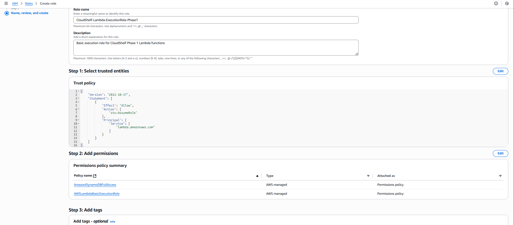
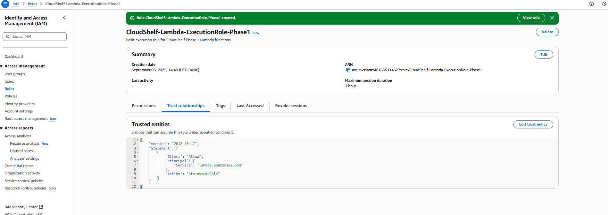

# 🔐 Basic IAM Setup (Phase 1)

> Essential IAM roles and permissions for serverless CloudShelf deployment

This guide provides the minimal IAM configuration needed for Phase 1 serverless deployment, focusing on the essential roles and permissions required to get CloudShelf running quickly and securely.

---

## 🎯 Phase 1 IAM Overview

### **🚀 Why Basic IAM First?**

**Learning Benefits**:

- ✅ **Essential security** - Minimal roles needed for functioning app
- ✅ **AWS managed policies** - Use proven, secure policies where possible
- ✅ **Quick setup** - Get security working in 10-15 minutes
- ✅ **Best practices** - Learn least-privilege principles
- ✅ **Foundation** - Builds understanding for advanced security later

**What You Get**:

- 🔒 **Lambda execution role** - Basic function permissions
- 📊 **CloudWatch access** - Logging and monitoring permissions
- 🗂️ **DynamoDB access** - Database read/write permissions
- 🌐 **API Gateway integration** - Service connectivity

---

## 🏛️ Basic IAM Architecture

### **🔒 Phase 1 Security Model**

```
┌─────────────────────────────────────────────────────────────────────────────────┐
│                        CloudShelf Phase 1 IAM Architecture                     │
├─────────────────────────────────────────────────────────────────────────────────┤
│                                                                                 │
│  ┌─────────────────────────────────────────────────────────────────────────┐   │
│  │                      🔐 IAM Execution Role                              │   │
│  │                    (Lambda Function Permissions)                       │   │
│  └─────────────────────────────────────────────────────────────────────────┘   │
│       │                                                                         │
│       ▼                                                                         │
│  ┌─────────────────────────────────────────────────────────────────────────┐   │
│  │                     📊 CloudWatch Logs                                 │   │
│  │                   (Function Logging & Monitoring)                      │   │
│  └─────────────────────────────────────────────────────────────────────────┘   │
│       │                                                                         │
│       ▼                                                                         │
│  ┌─────────────────────────────────────────────────────────────────────────┐   │
│  │                      🗂️ DynamoDB Access                                │   │
│  │                    (Shopping Cart Operations)                          │   │
│  └─────────────────────────────────────────────────────────────────────────┘   │
│                                                                                 │
└─────────────────────────────────────────────────────────────────────────────────┘
```

### **🔒 Essential Permissions**

| Service         | Permission Level | Purpose                             |
| --------------- | ---------------- | ----------------------------------- |
| **CloudWatch**  | Logs write       | Function logging and error tracking |
| **DynamoDB**    | Table read/write | Shopping cart data operations       |
| **Lambda**      | Basic execution  | Function runtime permissions        |
| **API Gateway** | Service invoke   | Function connectivity               |

---

## 🚀 Implementation Steps

### **Step 1: Create Lambda Execution Role**

1. **🖥️ Access IAM Console**

Navigate to: `AWS Console → IAM → Roles → Create Role`

2. **🎯 Configure Role Basics**

```yaml
Role Type: AWS Service
Use Case: Lambda
```


3. **📋 Attach AWS Managed Policies**

Add these essential managed policies:

```yaml
Required Policies:
  - AWSLambdaBasicExecutionRole # CloudWatch Logs access
  - AmazonDynamoDBFullAccess # DynamoDB operations (Phase 1 only)
```

**⚠️ Phase 1 Note**: We use `DynamoDBFullAccess` for simplicity. Phase 2 will implement least-privilege custom policies.


4. **🏷️ Name and Create Role**

```yaml
Role Name: CloudShelf-Lambda-ExecutionRole-Phase1
Description: Basic execution role for CloudShelf Phase 1 Lambda functions
```



---

### **Step 2: Verify Role Configuration**

1. **✅ Check Attached Policies**

Confirm these policies are attached:

- `AWSLambdaBasicExecutionRole`
- `AmazonDynamoDBFullAccess`

2. **🔍 Review Trust Policy**

Ensure Lambda service can assume the role:

```json
{
  "Version": "2012-10-17",
  "Statement": [
    {
      "Effect": "Allow",
      "Principal": {
        "Service": "lambda.amazonaws.com"
      },
      "Action": "sts:AssumeRole"
    }
  ]
}
```



---

### **Step 3: Configure Lambda Functions**

When creating Lambda functions, use the execution role:

```yaml
Execution Role: CloudShelf-Lambda-ExecutionRole-Phase1
```

This provides:

- ✅ **CloudWatch Logs** - Automatic logging for troubleshooting
- ✅ **DynamoDB Access** - Full read/write to shopping cart table
- ✅ **Error Handling** - Proper error logging and monitoring

---

## 📚 Best Practices & Troubleshooting

<details>
<summary><strong>🔒 Phase 1 Security Best Practices</strong></summary>

### **Essential Security**

- ✅ **Use AWS managed policies** - Proven, maintained policies
- ✅ **Document role usage** - Clear naming and descriptions
- ✅ **Monitor CloudWatch logs** - Watch for permission errors
- ✅ **Test incrementally** - Verify each function works

### **Common Issues**

**Permission Denied Errors**:

```
ERRORLOG: User is not authorized to perform: dynamodb:GetItem
```

- **Solution**: Verify `AmazonDynamoDBFullAccess` is attached

**CloudWatch Logs Missing**:

```
ERRORLOG: Cannot write to CloudWatch Logs
```

- **Solution**: Verify `AWSLambdaBasicExecutionRole` is attached

**Role Assumption Errors**:

```
ERRORLOG: Cannot assume role
```

- **Solution**: Check trust policy allows Lambda service

</details>

<details>
<summary><strong>🚀 Testing Your IAM Setup</strong></summary>

### **Verification Steps**

1. **Create Test Lambda Function**

   - Use the execution role
   - Add simple DynamoDB operation
   - Check CloudWatch logs appear

2. **Test DynamoDB Access**

   - Lambda should read/write to shopping cart table
   - No permission errors in logs

3. **Monitor CloudWatch**
   - Function logs appear automatically
   - Error messages are readable

</details>

---

## 🎓 Learning Outcomes

After completing this guide, you will have:

- ✅ **Working IAM role** for Lambda functions
- ✅ **CloudWatch logging** for troubleshooting
- ✅ **DynamoDB access** for shopping cart operations
- ✅ **Security foundation** for Phase 1 deployment
- ✅ **Understanding** of AWS managed policies

---

## ➡️ Next Steps

### **Phase 1 Continuation**

- Complete Lambda function deployment using this role
- Verify logging and DynamoDB access work correctly
- Monitor CloudWatch for any permission issues

### **Phase 2 Migration Preview**

When you're ready for production security:

- 🔒 **Custom IAM policies** - Least-privilege access
- 🏢 **Cross-account roles** - Multi-environment security
- 📊 **Advanced monitoring** - CloudTrail and GuardDuty integration
- 🔐 **Secrets management** - AWS Secrets Manager integration

---

## 📖 Related Documentation

- 🔗 [Lambda Setup Guide](cloudshelf-lambda-setup.md) - Use this IAM role
- 🔗 [DynamoDB Setup Guide](cloudshelf-dynamodb-setup.md) - Tables this role accesses
- 🔗 [CloudWatch Monitoring](basic-cloudwatch-monitoring.md) - Logging enabled by this role
- 🔗 [Phase 2 IAM Security](../phase2-production-setup/cloudshelf-iam-security-setup.md) - Advanced security setup

---

_📖 This guide is part of the CloudShelf Phase 1 implementation. For production-ready security with custom policies and advanced features, see [Phase 2 IAM Security Setup](../phase2-production-setup/cloudshelf-iam-security-setup.md)._
