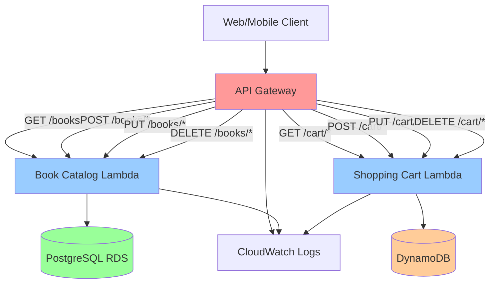

# 🌐 API Gateway Setup

> Implementation guide for API Gateway RESTful services following ADR-005 architecture strategy

This guide provides setup instructions for AWS API Gateway, implementing the API management decisions documented in [ADR-005: API Gateway Architecture Strategy](../cloudshelf-architecture-decisions.md#adr-005-api-gateway-architecture-strategy).

---

## 🔒 API Security Configuration

### **🛡️ API Gateway Security Features**

**Built-in Security Capabilities**:

- **HTTPS Only** - All API endpoints use SSL/TLS encryption
- **CORS Configuration** - Cross-origin resource sharing control
- **Rate Limiting** - Throttling to prevent abuse
- **Resource Policies** - Control access to API endpoints
- **Integration Security** - Secure Lambda function invocation

**Security Best Practices**:

- [ ] Enable HTTPS only (no HTTP endpoints)
- [ ] Configure CORS properly for web applications
- [ ] Set up throttling limits to prevent abuse
- [ ] Use resource policies for additional access control
- [ ] Monitor API usage and errors

---

## 🏛️ Architecture Overview

Based on **ADR-005**, API Gateway provides the unified API layer for CloudShelf with:

- **📚 Book Catalog Service** - RESTful endpoints for book inventory and search operations
- **🛒 Shopping Cart Service** - API endpoints for cart management operations
- **🔒 Security Integration** - Authentication and authorization layer
- **🚀 Performance Management** - Throttling, caching, and monitoring

**Architecture Decision Reference**: See [ADR-005](../cloudshelf-architecture-decisions.md#adr-005) for the complete rationale behind this API strategy.

### **🌐 API Gateway Architecture Design**


_RESTful API architecture showing endpoints, Lambda integrations, and security configurations_

---

## 🚀 Implementation Guide

### Step 1: Create REST API

1. **Open API Gateway Console**

   - Sign in to AWS Management Console
   - Navigate to API Gateway service
   - Choose "Create API"

   

2. **Configure API**

   - Select **REST API** (not HTTP API for full feature support)
   - Choose **New API**
   - API Name: `cloudshelf-api`
   - Description: `CloudShelf Online Bookstore API`
   - Endpoint Type: **Regional**

   

### Step 2: Create Resources and Methods

---

## 📊 Architecture Configuration

### **API Design Strategy**

Following ADR-005 RESTful architecture approach:

| API Resource      | HTTP Methods      | Lambda Integration         | Purpose                    |
| ----------------- | ----------------- | -------------------------- | -------------------------- |
| **`/books`**      | GET, POST         | `cloudshelf-book-catalog`  | Book inventory operations  |
| **`/books/{id}`** | GET, PUT, DELETE  | `cloudshelf-book-catalog`  | Individual book operations |
| **`/cart`**       | GET, POST, DELETE | `cloudshelf-shopping-cart` | Shopping cart operations   |
| **`/cart/items`** | POST, PUT, DELETE | `cloudshelf-shopping-cart` | Cart item management       |

### **Integration Patterns**

| Pattern                     | Configuration           | Rationale                            |
| --------------------------- | ----------------------- | ------------------------------------ |
| **Lambda Proxy**            | Enabled for all methods | Simplified integration, full control |
| **CORS**                    | Enabled for web clients | Browser-based frontend support       |
| **Request Validation**      | JSON schema validation  | Input validation at API layer        |
| **Response Transformation** | Standard error format   | Consistent error handling            |

---

## 🚀 Implementation Guide

### **Step 1: Create REST API**

Create the main API Gateway instance.

**Configuration:**

- **API Type**: REST API (full feature support)
- **API Name**: `cloudshelf-api`
- **Description**: `CloudShelf Online Bookstore API`
- **Endpoint Type**: Regional


---

### **Step 2: Create Book Catalog Resources**

Set up the books API endpoints and methods.

**Resource Configuration:**

- **Resource Name**: `books`
- **Resource Path**: `/books`
- **Enable CORS**: Yes
- **Methods**: GET, POST


---

### **Step 3: Configure Lambda Integration**

Connect API methods to Lambda functions.

**Integration Configuration:**

- **Integration Type**: Lambda Function
- **Lambda Region**: Your AWS region
- **Lambda Function**: `cloudshelf-book-catalog`
- **Use Lambda Proxy**: Enabled


---

### **Step 4: Create Shopping Cart Resources**

Set up the cart API endpoints and methods.

**Resource Configuration:**

- **Resource Name**: `cart`
- **Resource Path**: `/cart`
- **Enable CORS**: Yes
- **Methods**: GET, POST, DELETE


---

### **Step 5: Deploy API**

Create a deployment stage for the API.

**Deployment Configuration:**

- **Stage Name**: `dev`, `staging`, or `prod`
- **Description**: Environment-specific deployment
- **Enable CloudWatch Logs**: Yes
- **Enable X-Ray Tracing**: Yes (optional)


2. **Create User Path Parameter**

   - Select `/cart` resource
   - Actions → Create Resource
   - Resource Path: `{userId}`
   - Create GET, POST, DELETE methods
   - Integration: `cloudshelf-shopping-cart` Lambda

   

3. **Create Items Sub-resource**

   - Select `/cart/{userId}` resource
   - Actions → Create Resource
   - Resource Name: `items`
   - Create POST method for adding items

   

### Step 3: Configure CORS

1. **Enable CORS for Each Resource**

   - Select resource
   - Actions → Enable CORS
   - Access-Control-Allow-Origin: `*`
   - Access-Control-Allow-Headers: `Content-Type,X-Amz-Date,Authorization,X-Api-Key,X-Amz-Security-Token`
   - Access-Control-Allow-Methods: Select all needed methods

   

### Step 4: Deploy API

1. **Create Deployment**

   - Actions → Deploy API
   - Deployment stage: `dev` (create new stage)
   - Stage description: `Development environment`

   

2. **Get Invoke URL**

   - Note the Invoke URL from the stage (e.g., `https://abc123.execute-api.us-east-1.amazonaws.com/dev`)

   

### Step 5: Test API Endpoints

1. **Test Book Catalog**

   ```bash
   # List books
   curl https://your-api-id.execute-api.region.amazonaws.com/dev/books

   # Get specific book
   curl https://your-api-id.execute-api.region.amazonaws.com/dev/books/123
   ```

2. **Test Shopping Cart**

   ```bash
   # Get user cart
   curl https://your-api-id.execute-api.region.amazonaws.com/dev/cart/user123

   # Add item to cart
   curl -X POST https://your-api-id.execute-api.region.amazonaws.com/dev/cart/user123/items \
        -H "Content-Type: application/json" \
        -d '{"bookId":"123","quantity":1}'
   ```

   

---

## Complete API Structure Overview


---

## Diagram



### API Gateway Endpoints

#### Book Catalog Service (`/books`)

- `GET /books` - List all books with pagination
- `GET /books/{id}` - Get specific book details
- `GET /books/search?q={query}` - Search books
- `GET /books/category/{category}` - Get books by category
- `POST /books` - Create new book (admin)
- `PUT /books/{id}` - Update book (admin)
- `DELETE /books/{id}` - Delete book (admin)

#### Shopping Cart Service (`/cart`)

- `GET /cart/{userId}` - Get user's shopping cart
- `POST /cart/{userId}/items` - Add item to cart
- `PUT /cart/{userId}/items/{itemId}` - Update item quantity
- `DELETE /cart/{userId}/items/{itemId}` - Remove item
- `DELETE /cart/{userId}` - Clear cart

---

## � API Endpoints Reference

### **📚 Book Catalog API**

**Base URL**: `https://{api-id}.execute-api.{region}.amazonaws.com/prod`

#### **Books Endpoints**

```
GET    /books              - List all books
GET    /books/{id}         - Get book by ID
GET    /books/search?q={}  - Search books by title/author
POST   /books              - Add new book (admin)
PUT    /books/{id}         - Update book (admin)
DELETE /books/{id}         - Delete book (admin)
```

**Example Request:**

```bash
curl -X GET "https://your-api-id.execute-api.us-east-1.amazonaws.com/prod/books" \
  -H "Content-Type: application/json"
```

**Example Response:**

```json
{
  "books": [
    {
      "id": 1,
      "title": "The Great Gatsby",
      "author": "F. Scott Fitzgerald",
      "price": 12.99,
      "stock": 50,
      "category": "Fiction"
    }
  ],
  "totalCount": 1
}
```

### **🛒 Shopping Cart API**

#### **Cart Endpoints**

```
GET    /cart/{userId}           - Get user's cart
POST   /cart/{userId}/items     - Add item to cart
PUT    /cart/{userId}/items/{itemId} - Update item quantity
DELETE /cart/{userId}/items/{itemId} - Remove item from cart
DELETE /cart/{userId}           - Clear entire cart
```

**Example Add to Cart:**

```bash
curl -X POST "https://your-api-id.execute-api.us-east-1.amazonaws.com/prod/cart/user123/items" \
  -H "Content-Type: application/json" \
  -d '{
    "bookId": 1,
    "quantity": 2
  }'
```

### **🔒 Authentication**

For this tutorial, APIs are public. In production, implement:

- **API Keys** for partner access
- **AWS Cognito** for user authentication
- **IAM roles** for service-to-service calls

---

## �🔧 Best Practices & Optimization

<details>
<summary><strong>📋 API Gateway Configuration Best Practices</strong></summary>

### Performance Optimization

- **Enable Caching**: Configure response caching for read-heavy endpoints
- **Request Validation**: Implement model-based request validation to reduce Lambda invocations
- **Throttling**: Set appropriate throttling limits per endpoint to prevent abuse
- **Binary Media Types**: Configure binary media types for file uploads/downloads

### Security Best Practices

- **CORS Configuration**: Properly configure CORS for web applications
- **API Keys**: Implement API key authentication for partner integrations
- **Usage Plans**: Create usage plans with quotas and throttling
- **Request Signing**: Consider AWS SigV4 for server-to-server communication

### Monitoring & Observability

- **CloudWatch Metrics**: Monitor request count, latency, and error rates
- **X-Ray Tracing**: Enable distributed tracing for request flow analysis
- **Custom Metrics**: Implement business-specific metrics tracking
- **Alarm Configuration**: Set up CloudWatch alarms for critical thresholds

</details>

<details>
<summary><strong>🚀 Deployment & Environment Management</strong></summary>

### Deployment Strategies

- **Stage-based Deployment**: Use dev, staging, and production stages
- **Canary Deployments**: Implement gradual traffic shifting for updates
- **Blue-Green Deployment**: Use stage variables for zero-downtime deployments
- **API Versioning**: Implement versioning strategy for backward compatibility

### Environment Configuration

- **Stage Variables**: Use stage variables for environment-specific configurations
- **Lambda Aliases**: Connect to specific Lambda function versions/aliases
- **Parameter Store**: Store environment-specific configurations in Systems Manager
- **Secrets Manager**: Secure storage for API keys and database credentials

</details>

<details>
<summary><strong>💡 Troubleshooting & Maintenance</strong></summary>

### Common Issues & Solutions

- **Cold Start Latency**: Implement connection pooling and provisioned concurrency
- **Timeout Issues**: Optimize Lambda execution time and API Gateway timeout settings
- **CORS Errors**: Verify CORS configuration for cross-origin requests
- **Authorization Failures**: Check IAM roles and resource-based policies

### Maintenance Tasks

- **Log Monitoring**: Regularly review CloudWatch logs for error patterns
- **Performance Review**: Analyze latency and throughput metrics monthly
- **Security Audits**: Review access patterns and update security configurations
- **Cost Optimization**: Monitor usage patterns and optimize pricing tiers

</details>

---

## 📚 Additional Resources

- [📖 CloudShelf Architecture Decisions](../cloudshelf-architecture-decisions.md) - Complete ADR documentation
- [🔧 Lambda Setup Guide](../lambda/cloudshelf-lambda-setup.md) - Lambda function configuration
- [🗄️ DynamoDB Setup Guide](../dynamodb/cloudshelf-dynamodb-setup.md) - Cart data store setup
- � [**IAM Security Setup**](../security/cloudshelf-iam-security-setup.md) - Security roles and policies
- 📊 [**CloudWatch Setup**](../monitoring/cloudshelf-cloudwatch-setup.md) - API monitoring and observability

---

_📋 **Documentation Status**: Complete | ✅ **Client Ready**: Yes | 🔄 **Last Updated**: Implementation Phase_  
_🏗️ **Architecture Phase**: Core Services | 👥 **Team**: Solutions Architecture | 📋 **Next**: CloudFront Distribution_
