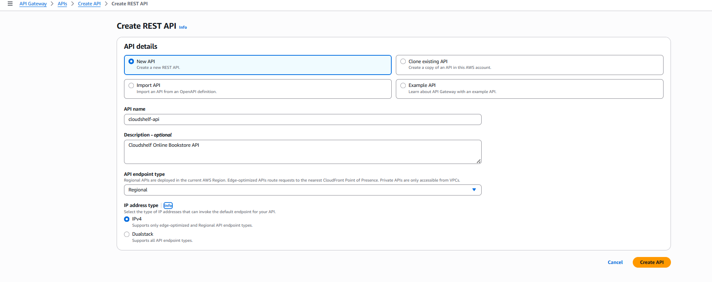
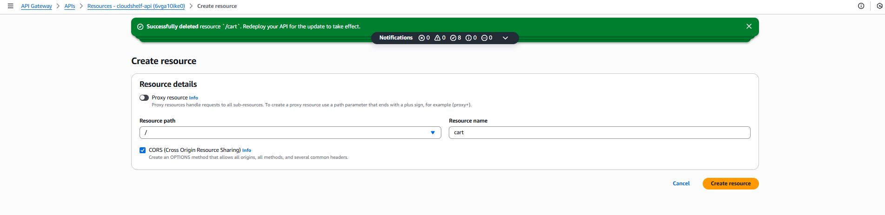
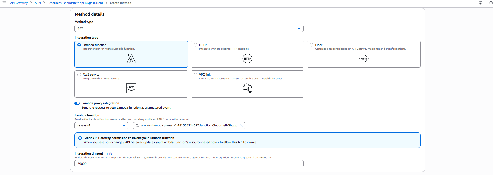
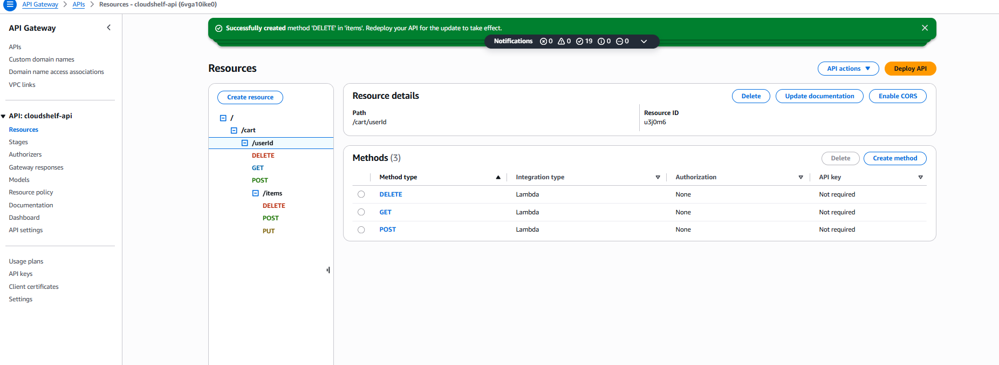
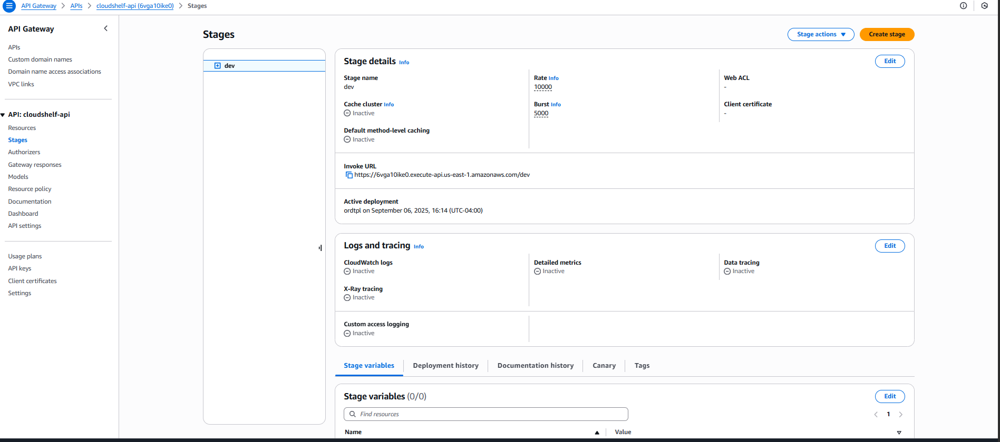
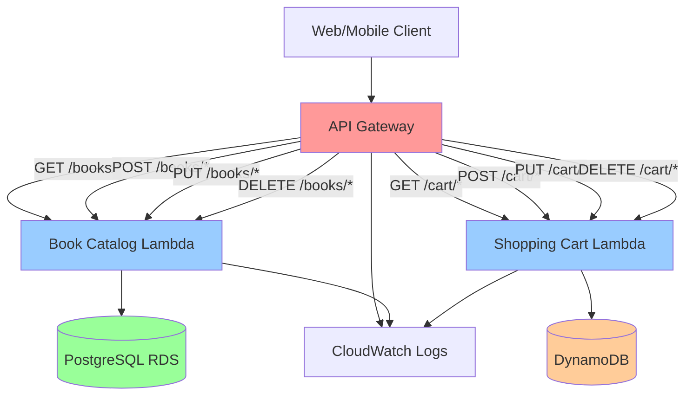

# 🌐 API Gateway Setup

> Implementation guide for API Gateway RESTful services following ADR-005 architecture strategy

This guide provides setup instructions for AWS API Gateway, implementing the API management decisions documented in [ADR-005: API Gateway Architecture Strategy](../cloudshelf-architecture-decisions.md#adr-005-api-gateway-architecture-strategy).

---

## 🔒 API Security Configuration

### **🛡️ API Gateway Security Features**

**Built-in Security Capabilities**:

- **HTTPS Only** - All API endpoints use SSL/TLS encryption
- **CORS Configuration** - Cross-origin resource sharing control
- **Rate Limiting** - Throttling to prevent abuse
- **Resource Policies** - Control access to API endpoints
- **Integration Security** - Secure Lambda function invocation

**Security Best Practices**:

- [ ] Enable HTTPS only (no HTTP endpoints)
- [ ] Configure CORS properly for web applications
- [ ] Set up throttling limits to prevent abuse
- [ ] Use resource policies for additional access control
- [ ] Monitor API usage and errors

---

## 🏛️ Architecture Overview

Based on **ADR-005**, API Gateway provides the unified API layer for CloudShelf with:

- **📚 Book Catalog Service** - RESTful endpoints for book inventory and search operations
- **🛒 Shopping Cart Service** - API endpoints for cart management operations
- **🔒 Security Integration** - Authentication and authorization layer
- **🚀 Performance Management** - Throttling, caching, and monitoring

**Architecture Decision Reference**: See [ADR-005](../cloudshelf-architecture-decisions.md#adr-005) for the complete rationale behind this API strategy.

### **🌐 API Gateway Architecture Design**

```
┌─────────────────────────────────────────────────────────────────────────────────┐
│                       CloudShelf API Gateway Architecture                      │
├─────────────────────────────────────────────────────────────────────────────────┤
│                                                                                 │
│  📱 Web/Mobile Clients                                                         │
│       │                                                                         │
│       ▼                                                                         │
│  ┌─────────────────────────────────────────────────────────────────────────┐   │
│  │                        🌐 API Gateway                                   │   │
│  │                    cloudshelf-api (REST)                               │   │
│  └─────────────────────────────────────────────────────────────────────────┘   │
│       │                                                                         │
│       ▼                                                                         │
│  ┌─────────────────────────────────────────────────────────────────────────┐   │
│  │                          API Endpoints                                 │   │
│  │  ┌─────────────┐  ┌─────────────┐  ┌─────────────┐  ┌─────────────┐   │   │
│  │  │   /books    │  │   /cart     │  │   /users    │  │  /orders    │   │   │
│  │  │GET POST PUT │  │GET POST DEL │  │GET POST PUT │  │GET POST PUT │   │   │
│  │  │   DELETE    │  │             │  │   DELETE    │  │   DELETE    │   │   │
│  │  └─────────────┘  └─────────────┘  └─────────────┘  └─────────────┘   │   │
│  └─────────────────────────────────────────────────────────────────────────┘   │
│       │                                                                         │
│       ▼                                                                         │
│  ┌─────────────────────────────────────────────────────────────────────────┐   │
│  │                         Lambda Functions                               │   │
│  │  ┌─────────────┐  ┌─────────────┐  ┌─────────────┐  ┌─────────────┐   │   │
│  │  │Book Catalog │  │Shopping Cart│  │User Mgmt    │  │Order Process│   │   │
│  │  │  Handler    │  │  Handler    │  │  Handler    │  │  Handler    │   │   │
│  │  │   (Java)    │  │   (Java)    │  │ (To Create) │  │ (To Create) │   │   │
│  │  └─────────────┘  └─────────────┘  └─────────────┘  └─────────────┘   │   │
│  └─────────────────────────────────────────────────────────────────────────┘   │
│       │                                                                         │
│       ▼                                                                         │
│  ┌─────────────────────────────────────────────────────────────────────────┐   │
│  │                         DynamoDB Tables                                │   │
│  │  ┌─────────────┐  ┌─────────────┐  ┌─────────────┐  ┌─────────────┐   │   │
│  │  │cloudshelf-  │  │cloudshelf-  │  │cloudshelf-  │  │cloudshelf-  │   │   │
│  │  │   books     │  │   carts     │  │   users     │  │  orders     │   │   │
│  │  └─────────────┘  └─────────────┘  └─────────────┘  └─────────────┘   │   │
│  └─────────────────────────────────────────────────────────────────────────┘   │
│                                                                                 │
└─────────────────────────────────────────────────────────────────────────────────┘
```

_RESTful API architecture showing endpoints, Lambda integrations, and DynamoDB tables_

---

## Architecture Configuration

### **API Design Strategy**

Following ADR-005 RESTful architecture approach for Phase 1:

| API Resource               | HTTP Methods      | Lambda Integration            | Status                        | Purpose                   |
| -------------------------- | ----------------- | ----------------------------- | ----------------------------- | ------------------------- |
| **`/cart`**                | GET, POST, DELETE | `cloudshelf-shopping-cart`    | ✅ **Available**              | Shopping cart operations  |
| **`/cart/{userId}`**       | GET, POST, DELETE | `cloudshelf-shopping-cart`    | ✅ **Available**              | User-specific cart access |
| **`/cart/{userId}/items`** | POST, PUT, DELETE | `cloudshelf-shopping-cart`    | ✅ **Available**              | Cart item management      |
| **`/books`**               | GET, POST         | `cloudshelf-book-catalog`     | ⚠️ **Needs DynamoDB adapter** | Book inventory operations |
| **`/users`**               | GET, POST, PUT    | `cloudshelf-user-management`  | ❌ **Missing**                | User profile operations   |
| **`/orders`**              | GET, POST, PUT    | `cloudshelf-order-processing` | ❌ **Missing**                | Order operations          |

> **📋 Phase 1 Implementation Priority**: Start with `/cart` endpoints (available), then create missing Lambda functions for `/users` and `/orders`. `/books` needs DynamoDB adaptation.

### **Integration Patterns**

| Pattern                     | Configuration           | Rationale                            |
| --------------------------- | ----------------------- | ------------------------------------ |
| **Lambda Proxy**            | Enabled for all methods | Simplified integration, full control |
| **CORS**                    | Enabled for web clients | Browser-based frontend support       |
| **Request Validation**      | JSON schema validation  | Input validation at API layer        |
| **Response Transformation** | Standard error format   | Consistent error handling            |

---

## 🚀 Implementation Guide

### **Step 1: Create REST API**

Create the main API Gateway instance.

**Configuration:**

- **API Type**: REST API (full feature support)
- **API Name**: `cloudshelf-api`
- **Description**: `CloudShelf Online Bookstore API`
- **Endpoint Type**: Regional



---

### **Step 2: Create Shopping Cart Resources**

Set up the cart API endpoints first since the Lambda function is ready.

**Resource Configuration:**

- **Resource Name**: `cart`
- **Resource Path**: `/cart`
- **Enable CORS**: Yes
- **Methods**: GET, POST, DELETE



---

### **Step 3: Configure Lambda Integration**

Connect cart API methods to the available shopping cart Lambda function.

**Integration Configuration:**

- **Integration Type**: Lambda Function
- **Lambda Region**: Your AWS region
- **Lambda Function**: `CloudShelf-ShoppingCart-Phase1`
- **Use Lambda Proxy**: Enabled



---

### **Step 4: Create User-Specific Cart Resources**

Set up user-specific cart endpoints with path parameters.

**Resource Configuration:**

- **Parent Resource**: `/cart`
- **Resource Path**: `{userId}`
- **Enable CORS**: Yes
- **Methods**: GET, POST, DELETE

**Items Sub-Resource:**

- **Parent Resource**: `/cart/{userId}`
- **Resource Path**: `items`
- **Methods**: POST, PUT, DELETE



---

### **Step 5: Deploy API**

Create a deployment stage for the API.

**Deployment Configuration:**

- **Stage Name**: `dev` (or `staging`, `prod`)
- **Description**: Environment-specific deployment
- **Enable CloudWatch Logs**: Yes
- **Enable X-Ray Tracing**: Yes (optional)



---

### **Step 6: Test API Endpoints**

Test the deployed API using the AWS Console's built-in testing feature.

**Available Tests (Shopping Cart):**

1. **Test Get Cart Endpoint**

   - Select GET method under `/cart/{userId}`
   - Click "TEST" tab
   - Enter `user123` for `userId` path parameter
   - Click "Test" button

2. **Test Add Item to Cart**

   - Select POST method under `/cart/{userId}/items`
   - Click "TEST" tab
   - Enter `user123` for `userId` path parameter
   - Add Request Body:
     ```json
     {
       "bookId": "book456",
       "quantity": 2
     }
     ```
   - Click "Test" button

3. **Test Update Item Quantity**

   - Select PUT method under `/cart/{userId}/items/{itemId}`
   - Enter path parameters: `userId`: `user123`, `itemId`: `item789`
   - Add Request Body:
     ```json
     {
       "quantity": 3
     }
     ```
   - Click "Test" button

4. **Test Remove Item**
   - Select DELETE method under `/cart/{userId}/items/{itemId}`
   - Enter path parameters: `userId`: `user123`, `itemId`: `item789`
   - Click "Test" button


---

## Diagram



### API Gateway Endpoints

#### Book Catalog Service (`/books`)

- `GET /books` - List all books with pagination
- `GET /books/{id}` - Get specific book details
- `GET /books/search?q={query}` - Search books
- `GET /books/category/{category}` - Get books by category
- `POST /books` - Create new book (admin)
- `PUT /books/{id}` - Update book (admin)
- `DELETE /books/{id}` - Delete book (admin)

#### Shopping Cart Service (`/cart`)

- `GET /cart/{userId}` - Get user's shopping cart
- `POST /cart/{userId}/items` - Add item to cart
- `PUT /cart/{userId}/items/{itemId}` - Update item quantity
- `DELETE /cart/{userId}/items/{itemId}` - Remove item
- `DELETE /cart/{userId}` - Clear cart

---

## 📋 API Endpoints Reference

### **� Shopping Cart API (Phase 1 - Available)**

**Base URL**: `https://{api-id}.execute-api.{region}.amazonaws.com/dev`

#### **Cart Endpoints**

```
GET    /cart/{userId}                    - Get user's cart
POST   /cart/{userId}/items              - Add item to cart
PUT    /cart/{userId}/items/{itemId}     - Update item quantity
DELETE /cart/{userId}/items/{itemId}     - Remove item from cart
DELETE /cart/{userId}                    - Clear entire cart
```

**Example Add to Cart:**

```bash
curl -X POST "https://your-api-id.execute-api.us-east-1.amazonaws.com/dev/cart/user123/items" \
  -H "Content-Type: application/json" \
  -d '{
    "bookId": "book456",
    "quantity": 2
  }'
```

**Example Get Cart:**

```bash
curl -X GET "https://your-api-id.execute-api.us-east-1.amazonaws.com/dev/cart/user123" \
  -H "Content-Type: application/json"
```

### **📚 Book Catalog API (Phase 1 - Needs Implementation)**

> **⚠️ Status**: Lambda function exists but needs DynamoDB adapter

#### **Books Endpoints (Future)**

```
GET    /books              - List all books
GET    /books/{id}         - Get book by ID
GET    /books/search?q={}  - Search books by title/author
POST   /books              - Add new book (admin)
PUT    /books/{id}         - Update book (admin)
DELETE /books/{id}         - Delete book (admin)
```

### **� User Management API (Phase 1 - Missing)**

> **❌ Status**: Lambda function needs to be created

#### **User Endpoints (Future)**

```
GET    /users/{userId}     - Get user profile
POST   /users              - Create user account
PUT    /users/{userId}     - Update user profile
DELETE /users/{userId}     - Delete user account
```

### **📦 Order Processing API (Phase 1 - Missing)**

> **❌ Status**: Lambda function needs to be created

#### **Order Endpoints (Future)**

```
GET    /orders/{userId}    - Get user's order history
POST   /orders             - Create new order
PUT    /orders/{orderId}   - Update order status
GET    /orders/{orderId}   - Get order details
```

    "quantity": 2

}'

```

### **🔒 Authentication**

For this tutorial, APIs are public. In production, implement:

- **API Keys** for partner access
- **AWS Cognito** for user authentication
- **IAM roles** for service-to-service calls

---

## �🔧 Best Practices & Optimization

<details>
<summary><strong>📋 API Gateway Configuration Best Practices</strong></summary>

### Performance Optimization

- **Enable Caching**: Configure response caching for read-heavy endpoints
- **Request Validation**: Implement model-based request validation to reduce Lambda invocations
- **Throttling**: Set appropriate throttling limits per endpoint to prevent abuse
- **Binary Media Types**: Configure binary media types for file uploads/downloads

### Security Best Practices

- **CORS Configuration**: Properly configure CORS for web applications
- **API Keys**: Implement API key authentication for partner integrations
- **Usage Plans**: Create usage plans with quotas and throttling
- **Request Signing**: Consider AWS SigV4 for server-to-server communication

### Monitoring & Observability

- **CloudWatch Metrics**: Monitor request count, latency, and error rates
- **X-Ray Tracing**: Enable distributed tracing for request flow analysis
- **Custom Metrics**: Implement business-specific metrics tracking
- **Alarm Configuration**: Set up CloudWatch alarms for critical thresholds

</details>

<details>
<summary><strong>🚀 Deployment & Environment Management</strong></summary>

### Deployment Strategies

- **Stage-based Deployment**: Use dev, staging, and production stages
- **Canary Deployments**: Implement gradual traffic shifting for updates
- **Blue-Green Deployment**: Use stage variables for zero-downtime deployments
- **API Versioning**: Implement versioning strategy for backward compatibility

### Environment Configuration

- **Stage Variables**: Use stage variables for environment-specific configurations
- **Lambda Aliases**: Connect to specific Lambda function versions/aliases
- **Parameter Store**: Store environment-specific configurations in Systems Manager
- **Secrets Manager**: Secure storage for API keys and database credentials

</details>

<details>
<summary><strong>💡 Troubleshooting & Maintenance</strong></summary>

### Common Issues & Solutions

- **Cold Start Latency**: Implement connection pooling and provisioned concurrency
- **Timeout Issues**: Optimize Lambda execution time and API Gateway timeout settings
- **CORS Errors**: Verify CORS configuration for cross-origin requests
- **Authorization Failures**: Check IAM roles and resource-based policies

### Maintenance Tasks

- **Log Monitoring**: Regularly review CloudWatch logs for error patterns
- **Performance Review**: Analyze latency and throughput metrics monthly
- **Security Audits**: Review access patterns and update security configurations
- **Cost Optimization**: Monitor usage patterns and optimize pricing tiers

</details>

---

## 📚 Additional Resources

- [📖 CloudShelf Architecture Decisions](../cloudshelf-architecture-decisions.md) - Complete ADR documentation
- [🔧 Lambda Setup Guide](../lambda/cloudshelf-lambda-setup.md) - Lambda function configuration
- [🗄️ DynamoDB Setup Guide](../dynamodb/cloudshelf-dynamodb-setup.md) - Cart data store setup
- � [**IAM Security Setup**](../security/cloudshelf-iam-security-setup.md) - Security roles and policies
- 📊 [**CloudWatch Setup**](../monitoring/cloudshelf-cloudwatch-setup.md) - API monitoring and observability

---

_📋 **Documentation Status**: Complete | ✅ **Client Ready**: Yes | 🔄 **Last Updated**: Implementation Phase_
_🏗️ **Architecture Phase**: Core Services | 👥 **Team**: Solutions Architecture | 📋 **Next**: CloudFront Distribution_
```
