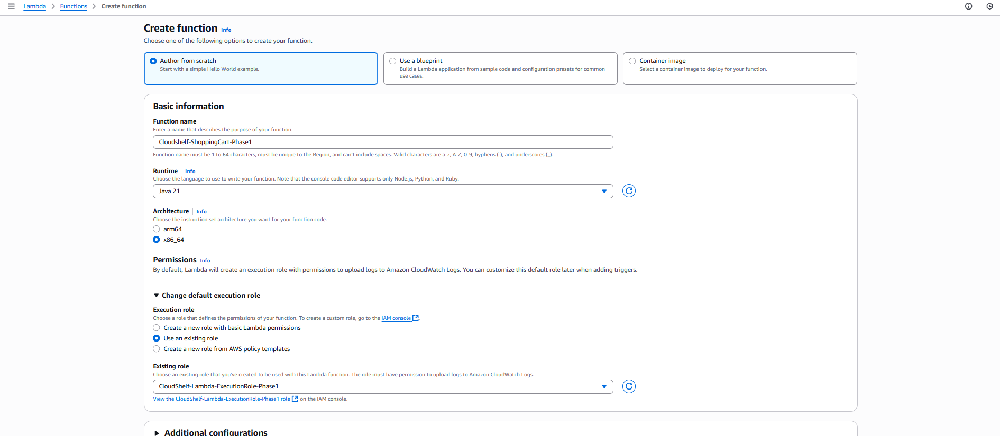
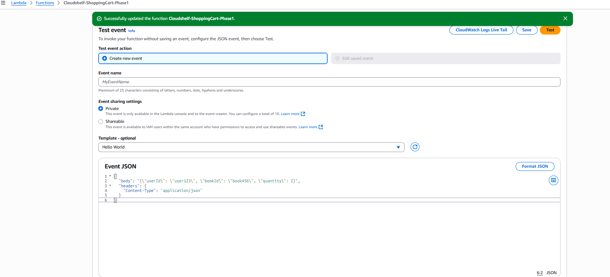
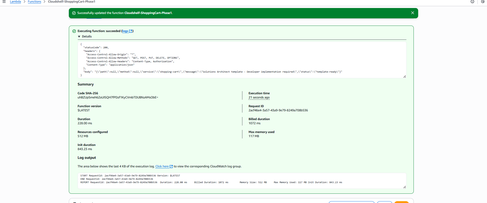

# ⚡ CloudShelf Basic Lambda Setup (Phase 1)

**What You Get**:

- 🛒 **Shopping Cart Service** - Template for cart operations with DynamoDB
- 📚 **Book Catalog Service** - Template for book queries (PostgreSQL integration)
- 🌐 **REST endpoints** - API Gateway integration ready
- 📊 **Automatic logging** - CloudWatch monitoringSetup (Phase 1)

> Simple Lambda function setup for serverless CloudShelf deployment

This guide provides Phase 1 Lambda function setup focused on basic DynamoDB integration for learning serverless architecture fundamentals.

---

## 🎯 Phase 1 Lambda Overview

### **🚀 Why Basic Lambda First?**

> **📋 Architectural Decision**: This phased Lambda approach focuses on core serverless concepts before production complexity

**Phase 1 Learning Benefits**:

- ✅ **Serverless fundamentals** - Focus on Lambda concepts without VPC complexity
- ✅ **DynamoDB integration** - Simple NoSQL operations for shopping cart
- ✅ **API Gateway triggers** - RESTful API basics
- ✅ **CloudWatch logging** - Built-in monitoring and debugging
- ✅ **Foundation building** - Core skills for Phase 2 production features

**What You Get**:

- 🛒 **Shopping Cart Service** - Template for cart operations with DynamoDB
- � **Book Catalog Service** - Template for book queries (PostgreSQL integration)
- 🌐 **REST endpoints** - API Gateway integration ready
- 📊 **Automatic logging** - CloudWatch monitoring

---

## 🏛️ Basic Lambda Architecture

### **🔒 Phase 1 Serverless Model**

```
┌─────────────────────────────────────────────────────────────────────────────────┐
│                      CloudShelf Phase 1 Lambda Architecture                    │
├─────────────────────────────────────────────────────────────────────────────────┤
│                                                                                 │
│  ┌─────────────────────────────────────────────────────────────────────────┐   │
│  │                      🌐 API Gateway                                     │   │
│  │                    (REST API Endpoints)                                │   │
│  └─────────────────────────────────────────────────────────────────────────┘   │
│       │                                                                         │
│       ▼                                                                         │
│  ┌─────────────────────────────────────────────────────────────────────────┐   │
│  │                      ⚡ Lambda Functions                                │   │
│  │                   (Shopping Cart Logic)                                │   │
│  └─────────────────────────────────────────────────────────────────────────┘   │
│       │                                                                         │
│       ▼                                                                         │
│  ┌─────────────────────────────────────────────────────────────────────────┐   │
│  │                      🗂️ DynamoDB Table                                 │   │
│  │                    (Shopping Cart Data)                                │   │
│  └─────────────────────────────────────────────────────────────────────────┘   │
│                                                                                 │
└─────────────────────────────────────────────────────────────────────────────────┘
```

### **⚡ Essential Functions**

| Function             | Purpose                 | DynamoDB Table      | Source Location              | Status                    |
| -------------------- | ----------------------- | ------------------- | ---------------------------- | ------------------------- |
| **Shopping Cart**    | Cart operations         | `cloudshelf-carts`  | `/src/lambda/shopping-cart/` | ✅ Available              |
| **Book Catalog**     | Book queries (DynamoDB) | `cloudshelf-books`  | `/src/lambda/book-catalog/`  | ⚠️ Needs DynamoDB adapter |
| **User Management**  | User operations         | `cloudshelf-users`  | _To be created_              | ❌ Missing                |
| **Order Processing** | Order operations        | `cloudshelf-orders` | _To be created_              | ❌ Missing                |

> **📋 Note**: Book Catalog currently uses PostgreSQL. For Phase 1, it needs DynamoDB adapter or will be delayed to Phase 2

---

## � Missing Lambda Services

Based on the DynamoDB tables created, we need additional Lambda functions:

### **📚 Book Catalog Service Adaptation**

**Current State**: Exists but configured for PostgreSQL  
**Required**: Adapt to use `cloudshelf-books` DynamoDB table

**Quick Fix Options**:

1. **Modify existing**: Update book-catalog to use DynamoDB SDK instead of PostgreSQL
2. **Create new**: Build DynamoDB-specific book catalog service
3. **Phase 2 delay**: Use PostgreSQL version in Phase 2 only

### **👤 User Management Service**

**Status**: Missing - needs to be created  
**DynamoDB Table**: `cloudshelf-users`  
**Required Operations**:

- User registration and profile management
- Authentication support (if not using Cognito)
- User preferences and settings

### **📦 Order Processing Service**

**Status**: Missing - needs to be created  
**DynamoDB Table**: `cloudshelf-orders`  
**Required Operations**:

- Create new orders from cart contents
- Order status tracking and updates
- Order history retrieval

> **💡 Development Priority**: Start with Shopping Cart (available), then create User Management and Order Processing services. Book Catalog can be adapted or delayed to Phase 2.

---

## �🚀 Implementation Steps

### **Step 1: Verify Prerequisites**

Ensure you have completed the previous setup guides:

- ✅ **DynamoDB Tables**: All 4 tables created ([DynamoDB Setup Guide](cloudshelf-dynamodb-setup.md))
- ✅ **IAM Role**: `CloudShelf-Lambda-ExecutionRole-Phase1` ([IAM Setup Guide](cloudshelf-basic-iam-setup.md))

### **Step 2: Create Shopping Cart Lambda Function**

1. **🖥️ Access Lambda Console**

Navigate to: `AWS Console → Lambda → Functions → Create Function`

2. **🎯 Configure Function Basics**

```yaml
Function Name: CloudShelf-ShoppingCart-Phase1
Runtime: Java 21
Architecture: x86_64
Execution Role: Use existing role → CloudShelf-Lambda-ExecutionRole-Phase1
Handler: com.cloudshelf.shoppingcart.ShoppingCartHandler::handleRequest
```



3. **📝 Build and Deploy Lambda Code**

The Lambda source code is already available in the project:

**📁 Source Location**: `/src/lambda/shopping-cart/`

**📋 Build Instructions**:

```bash
# Navigate to the shopping cart Lambda project
cd src/lambda/shopping-cart

# Build the project with Maven
mvn clean package

# The deployable JAR will be created at:
# target/shopping-cart-lambda-1.0-SNAPSHOT.jar
```

**🔧 Handler Configuration**:

- **Handler**: `com.cloudshelf.shoppingcart.ShoppingCartHandler::handleRequest`
- **Runtime**: Java 21
- **Architecture**: x86_64

**📦 Upload to Lambda**:

1. In Lambda console, click `Upload from → .zip or .jar file`
2. Select the JAR file from `target/shopping-cart-lambda-1.0-SNAPSHOT.jar`
3. Update the handler to: `com.cloudshelf.shoppingcart.ShoppingCartHandler::handleRequest`

> **� Note**: The current implementation is a template. You can extend it with full shopping cart business logic as needed.

### **Step 3: Test Lambda Function**

1. **🧪 Create Test Event**

Configure a test event to verify the function works:

```json
{
  "body": "{\"userId\": \"user123\", \"bookId\": \"book456\", \"quantity\": 2}",
  "headers": {
    "Content-Type": "application/json"
  }
}
```



2. **▶️ Run Test**

Click `Test` and verify the function executes successfully.

3. **✅ Check Results**

- Function should return `200` status code
- DynamoDB table should contain the new cart item
- CloudWatch logs should show execution details



### **Step 4: Extend Shopping Cart Functionality**

The current shopping cart Lambda is a template that can be extended with full business logic:

**� Current Implementation**: `/src/lambda/shopping-cart/src/main/java/com/cloudshelf/shoppingcart/ShoppingCartHandler.java`

**🔧 Available Operations** (to be implemented):

- `GET /cart/{userId}` - Retrieve user's shopping cart
- `POST /cart/{userId}/items` - Add item to cart
- `PUT /cart/{userId}/items/{itemId}` - Update item quantity
- `DELETE /cart/{userId}/items/{itemId}` - Remove item from cart
- `DELETE /cart/{userId}` - Clear entire cart

**💡 Development Notes**:

- Current implementation returns a template response
- DynamoDB integration is ready via existing dependencies
- HTTP method routing can be added using `request.getHttpMethod()`
- Path parameters available via `request.getPathParameters()`

**🔗 Next Steps**:

- Deploy the existing template to verify AWS integration
- Extend with actual shopping cart business logic
- Test with API Gateway integration

> **📋 Phase 2 Preview**: Book Catalog functionality with PostgreSQL RDS will be added in Phase 2

---

## 📚 Best Practices & Troubleshooting

<details>
<summary><strong>⚡ Phase 1 Lambda Best Practices</strong></summary>

### **Function Design**

- ✅ **Keep functions simple** - Single responsibility per function
- ✅ **Use environment variables** - For table names and configuration
- ✅ **Handle errors gracefully** - Return meaningful error messages
- ✅ **Log important events** - Use context.getLogger() for CloudWatch logging

### **DynamoDB Integration**

- ✅ **Use AWS SDK v2** - Modern Java SDK with better performance
- ✅ **Handle AttributeValue types** - Proper string/number conversions
- ✅ **Plan for scaling** - Design partition keys for even distribution
- ✅ **Monitor costs** - Watch read/write capacity consumption

### **Common Issues**

**Function Permission Errors**:

```
ERRORLOG: User is not authorized to perform: dynamodb:PutItem
```

- **Solution**: Verify IAM role has `AmazonDynamoDBFullAccess` attached

**Table Not Found Errors**:

```
ERRORLOG: Requested resource not found
```

- **Solution**: Check table name matches exactly: `CloudShelf-ShoppingCart`

**JSON Parsing Errors**:

```
ERRORLOG: No JSON object could be decoded
```

- **Solution**: Ensure API Gateway sends proper JSON in event body

</details>

<details>
<summary><strong>🧪 Testing Your Lambda Functions</strong></summary>

### **Manual Testing Steps**

1. **Test AddToCart Function**

   - Use test event with valid user and book IDs
   - Check DynamoDB table for new items
   - Verify CloudWatch logs show success

2. **Test GetCart Function**

   - Use query parameters with existing user ID
   - Verify returned items match table contents
   - Check response format is valid JSON

3. **Test Error Handling**
   - Send invalid JSON to test error responses
   - Verify meaningful error messages returned
   - Check CloudWatch logs for error details

</details>

---

## 🎓 Learning Outcomes

After completing this guide, you will have:

- ✅ **Working Lambda functions** for shopping cart operations
- ✅ **DynamoDB integration** with proper error handling
- ✅ **CloudWatch logging** for monitoring and debugging
- ✅ **Serverless foundation** for Phase 1 deployment
- ✅ **API-ready functions** for API Gateway integration

---

## ➡️ Next Steps

### **Phase 1 Continuation**

**Immediate Next Steps**:

- Deploy Shopping Cart Lambda function (available)
- Connect Lambda functions to API Gateway ([API Gateway Setup Guide](cloudshelf-apigateway-setup.md))
- Test end-to-end API functionality

**Development Needed**:

- Create User Management Lambda service for `cloudshelf-users` table
- Create Order Processing Lambda service for `cloudshelf-orders` table
- Adapt Book Catalog service for DynamoDB or delay to Phase 2

**Monitoring**:

- Monitor CloudWatch logs and metrics
- Test DynamoDB integration for all services

### **Phase 2 Enhancement Preview**

When you're ready for production features:

- � **Book Catalog Service** - PostgreSQL RDS for complex book queries
- �🔐 **Advanced authentication** - Cognito User Pools integration
- 🌐 **VPC deployment** - Secure network isolation
- 🗃️ **RDS integration** - PostgreSQL for structured data
- 📊 **Advanced monitoring** - X-Ray tracing and custom metrics

---

## 📖 Related Documentation

- 🔗 [**CloudShelf Basic IAM Setup**](cloudshelf-basic-iam-setup.md) - IAM role used by these functions
- 🔗 [**CloudShelf DynamoDB Setup**](cloudshelf-dynamodb-setup.md) - Table configuration
- 🔗 [**CloudShelf API Gateway Setup**](cloudshelf-apigateway-setup.md) - Connect functions to REST API
- 📋 [**ADR-003: Phased IAM Security Strategy**](../cloudshelf-adr-003-phased-iam-security.md) - Security approach rationale

---

_📖 This guide is part of the CloudShelf Phase 1 implementation. For production-ready Lambda functions with VPC, RDS, and advanced features, see Phase 2 Lambda Setup._
