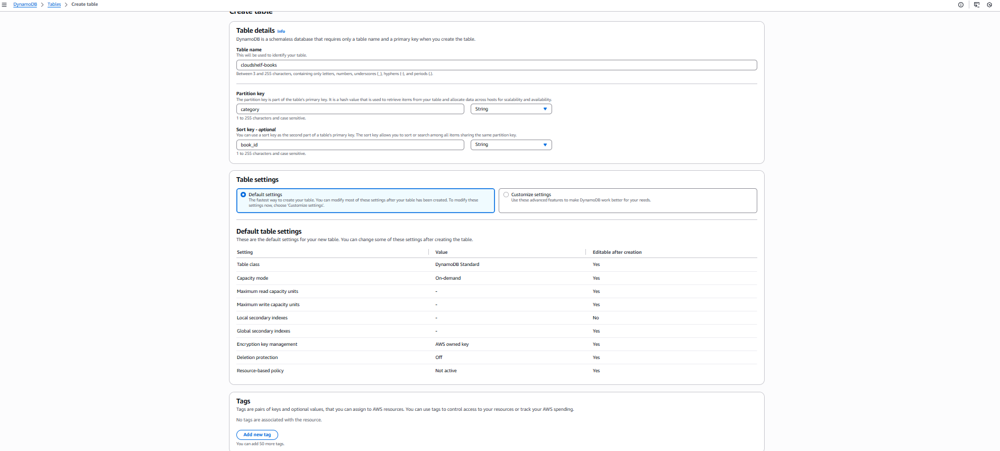
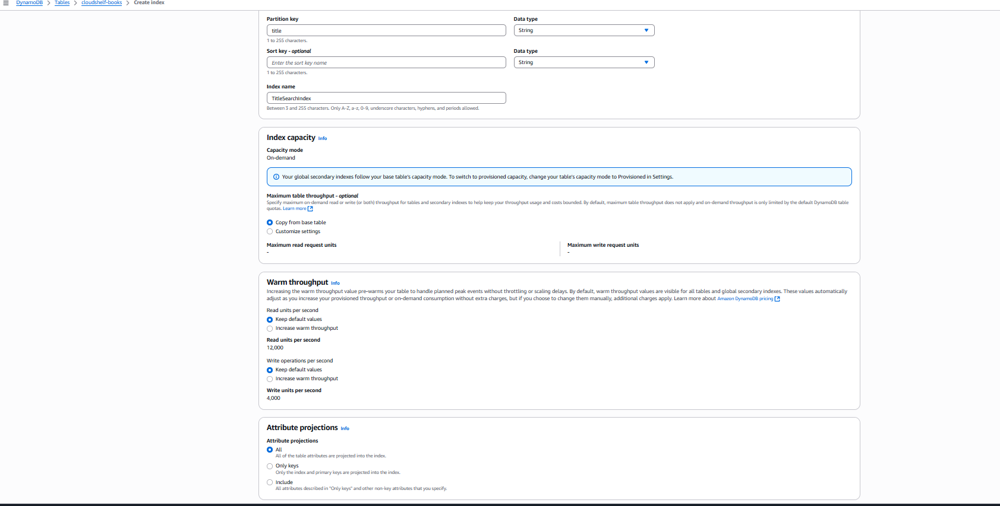
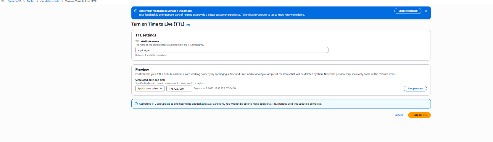
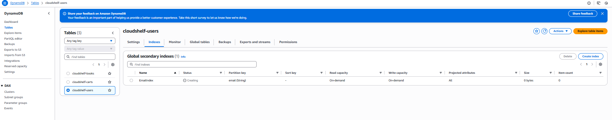
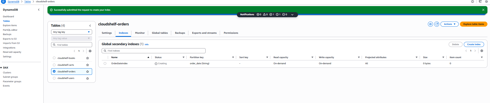
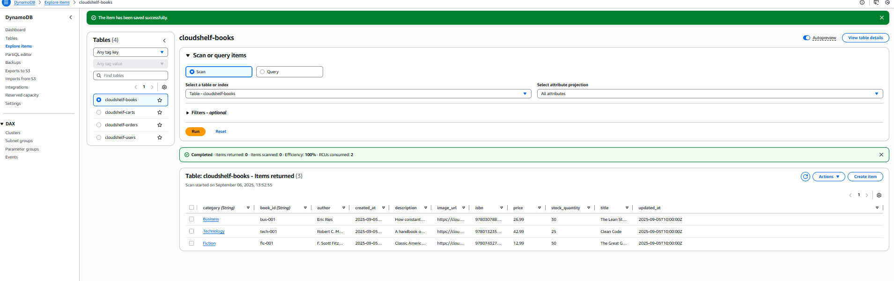

# 🗂️ CloudShelf DynamoDB Setup (Phase 1)

> Simple, serverless data storage implementation for learning and MVP deployment

This guide provides setup instructions for DynamoDB-only data storage, implementing the Phase 1 strategy from [ADR-002-Revised: Phased Data Storage Strategy](../cloudshelf-adr-002-revised-phased-data-storage.md).

---

## 🎯 Phase 1 Overview

### **🚀 Why Start with DynamoDB-Only?**

**Learning Benefits**:

- ✅ **No VPC complexity** - Fully managed, serverless
- ✅ **Faster setup** - Get working app in hours, not days
- ✅ \*\*Co## 📚 Related Documentation

- 🔒 [**Basic IAM Setup**](cloudshelf-basic-iam-setup.md) - Set up security roles (next step)
- ⚡ [**Lambda Setup Guide**](cloudshelf-lambda-setup.md) - Connect functions to DynamoDB
- 📋 [**Phase 1 Overview**](README.md) - Complete Phase 1 implementation guidefective\*\* - Pay per request, no idle database costs
- ✅ **AWS best practices** - Learn serverless-first patterns
- ✅ **Real application** - Full CloudShelf functionality

**What You Get**:

- 📚 **Book catalog browsing** and search
- 🛒 **Shopping cart** functionality
- 👤 **User accounts** and authentication
- 📦 **Order processing** and history
- 🌐 **Public API** endpoints

---

## 🏛️ Architecture Overview

### **🗂️ Phase 1 DynamoDB Architecture**

```
┌─────────────────────────────────────────────────────────────────────────────────┐
│                        CloudShelf Phase 1 Architecture                         │
├─────────────────────────────────────────────────────────────────────────────────┤
│                                                                                 │
│  Internet Users                                                                │
│       │                                                                         │
│       ▼                                                                         │
│  ┌─────────────────────────────────────────────────────────────────────────┐   │
│  │                        🌍 CloudFront CDN                                │   │
│  │                    (Global Content Delivery)                           │   │
│  └─────────────────────────────────────────────────────────────────────────┘   │
│       │                                                                         │
│       ▼                                                                         │
│  ┌─────────────────────────────────────────────────────────────────────────┐   │
│  │                      🌐 API Gateway (Public)                           │   │
│  │                   RESTful APIs - No VPC Required                       │   │
│  └─────────────────────────────────────────────────────────────────────────┘   │
│       │                                                                         │
│       ▼                                                                         │
│  ┌─────────────────────────────────────────────────────────────────────────┐   │
│  │                    ⚡ Lambda Functions (Public)                        │   │
│  │                                                                         │   │
│  │  ┌─────────────┐  ┌─────────────┐  ┌─────────────┐  ┌─────────────┐   │   │
│  │  │Book Catalog │  │Shopping Cart│  │User Accounts│  │Order Process│   │   │
│  │  │   Lambda    │  │   Lambda    │  │   Lambda    │  │   Lambda    │   │   │
│  │  └─────────────┘  └─────────────┘  └─────────────┘  └─────────────┘   │   │
│  └─────────────────────────────────────────────────────────────────────────┘   │
│       │                                                                         │
│       ▼                                                                         │
│  ┌─────────────────────────────────────────────────────────────────────────┐   │
│  │                      🗂️ DynamoDB Tables (Managed)                      │   │
│  │                                                                         │   │
│  │  ┌─────────────┐  ┌─────────────┐  ┌─────────────┐  ┌─────────────┐   │   │
│  │  │cloudshelf-  │  │cloudshelf-  │  │cloudshelf-  │  │cloudshelf-  │   │   │
│  │  │books        │  │carts        │  │users        │  │orders       │   │   │
│  │  │             │  │             │  │             │  │             │   │   │
│  │  │• Category   │  │• User ID    │  │• User ID    │  │• User ID    │   │   │
│  │  │• Book ID    │  │• Cart ID    │  │• Profile    │  │• Order ID   │   │   │
│  │  │• Title      │  │• Items      │  │• Email      │  │• Items      │   │   │
│  │  │• Author     │  │• TTL        │  │• Created    │  │• Total      │   │   │
│  │  │• Price      │  │             │  │             │  │• Status     │   │   │
│  │  └─────────────┘  └─────────────┘  └─────────────┘  └─────────────┘   │   │
│  └─────────────────────────────────────────────────────────────────────────┘   │
│                                                                                 │
│  External Services (Also No VPC Required):                                     │
│  • 📦 S3 Bucket (Book images, static assets)                                   │
│  • 🔐 Cognito (User authentication - optional)                                 │
│  • 📧 SES (Email notifications - optional)                                     │
└─────────────────────────────────────────────────────────────────────────────────┘
```

**Key Benefits**:

- 🚫 **No VPC Required** - All services are AWS-managed and public
- ⚡ **Serverless Scale** - Auto-scaling based on demand
- 💰 **Cost Efficient** - Pay only for what you use
- 🔧 **Easy Maintenance** - No infrastructure management

---

## 📊 DynamoDB Table Design

### **Table 1: Books Catalog (`cloudshelf-books`)**

**Purpose**: Store all book information for browsing and purchasing

```json
{
  "TableName": "cloudshelf-books",
  "BillingMode": "PAY_PER_REQUEST",
  "KeySchema": [
    { "AttributeName": "category", "KeyType": "HASH" },
    { "AttributeName": "book_id", "KeyType": "RANGE" }
  ],
  "AttributeDefinitions": [
    { "AttributeName": "category", "AttributeType": "S" },
    { "AttributeName": "book_id", "AttributeType": "S" },
    { "AttributeName": "title", "AttributeType": "S" }
  ],
  "GlobalSecondaryIndexes": [
    {
      "IndexName": "TitleSearchIndex",
      "KeySchema": [{ "AttributeName": "title", "KeyType": "HASH" }],
      "Projection": { "ProjectionType": "ALL" }
    }
  ]
}
```

**Sample Book Item**:

```json
{
  "category": "Technology",
  "book_id": "tech-001",
  "title": "Clean Code",
  "author": "Robert C. Martin",
  "isbn": "9780132350884",
  "price": 42.99,
  "stock_quantity": 25,
  "description": "A handbook of agile software craftsmanship",
  "image_url": "https://cloudshelf-images.s3.amazonaws.com/clean-code.jpg",
  "created_at": "2025-09-05T10:00:00Z",
  "updated_at": "2025-09-05T10:00:00Z"
}
```

### **Table 2: Shopping Carts (`cloudshelf-carts`)**

**Purpose**: Store user shopping cart sessions with automatic cleanup

```json
{
  "TableName": "cloudshelf-carts",
  "BillingMode": "PAY_PER_REQUEST",
  "KeySchema": [
    { "AttributeName": "user_id", "KeyType": "HASH" },
    { "AttributeName": "cart_id", "KeyType": "RANGE" }
  ],
  "AttributeDefinitions": [
    { "AttributeName": "user_id", "AttributeType": "S" },
    { "AttributeName": "cart_id", "AttributeType": "S" }
  ],
  "TimeToLiveSpecification": {
    "AttributeName": "expires_at",
    "Enabled": true
  }
}
```

**Sample Cart Item**:

```json
{
  "user_id": "user-12345",
  "cart_id": "cart-2025-09-05",
  "items": [
    {
      "book_id": "tech-001",
      "category": "Technology",
      "title": "Clean Code",
      "price": 42.99,
      "quantity": 1
    }
  ],
  "total_amount": 42.99,
  "item_count": 1,
  "created_at": "2025-09-05T10:00:00Z",
  "updated_at": "2025-09-05T10:30:00Z",
  "expires_at": 1725811200
}
```

### **Table 3: User Accounts (`cloudshelf-users`)**

**Purpose**: Store customer profile and account information

```json
{
  "TableName": "cloudshelf-users",
  "BillingMode": "PAY_PER_REQUEST",
  "KeySchema": [{ "AttributeName": "user_id", "KeyType": "HASH" }],
  "AttributeDefinitions": [
    { "AttributeName": "user_id", "AttributeType": "S" },
    { "AttributeName": "email", "AttributeType": "S" }
  ],
  "GlobalSecondaryIndexes": [
    {
      "IndexName": "EmailIndex",
      "KeySchema": [{ "AttributeName": "email", "KeyType": "HASH" }],
      "Projection": { "ProjectionType": "ALL" }
    }
  ]
}
```

**Sample User Item**:

```json
{
  "user_id": "user-12345",
  "email": "customer@example.com",
  "first_name": "John",
  "last_name": "Doe",
  "phone": "+1-555-0123",
  "address": {
    "street": "123 Main St",
    "city": "Anytown",
    "state": "ST",
    "postal_code": "12345",
    "country": "US"
  },
  "created_at": "2025-09-05T10:00:00Z",
  "last_login": "2025-09-05T10:00:00Z",
  "account_status": "active"
}
```

### **Table 4: Orders (`cloudshelf-orders`)**

**Purpose**: Store order history and transaction records

```json
{
  "TableName": "cloudshelf-orders",
  "BillingMode": "PAY_PER_REQUEST",
  "KeySchema": [
    { "AttributeName": "user_id", "KeyType": "HASH" },
    { "AttributeName": "order_id", "KeyType": "RANGE" }
  ],
  "AttributeDefinitions": [
    { "AttributeName": "user_id", "AttributeType": "S" },
    { "AttributeName": "order_id", "AttributeType": "S" },
    { "AttributeName": "order_date", "AttributeType": "S" }
  ],
  "GlobalSecondaryIndexes": [
    {
      "IndexName": "OrderDateIndex",
      "KeySchema": [
        { "AttributeName": "order_date", "KeyType": "HASH" },
        { "AttributeName": "order_id", "KeyType": "RANGE" }
      ],
      "Projection": { "ProjectionType": "ALL" }
    }
  ]
}
```

**Sample Order Item**:

```json
{
  "user_id": "user-12345",
  "order_id": "order-2025-09-05-001",
  "order_date": "2025-09-05",
  "items": [
    {
      "book_id": "tech-001",
      "title": "Clean Code",
      "price": 42.99,
      "quantity": 1
    }
  ],
  "subtotal": 42.99,
  "tax": 3.44,
  "shipping": 5.99,
  "total": 52.42,
  "status": "confirmed",
  "shipping_address": {
    "street": "123 Main St",
    "city": "Anytown",
    "state": "ST",
    "postal_code": "12345"
  },
  "created_at": "2025-09-05T10:00:00Z",
  "updated_at": "2025-09-05T10:00:00Z"
}
```

---

## 🚀 Implementation Guide

### **Step 1: Create DynamoDB Tables**

Navigate to the DynamoDB console and create each table:

#### **Create Books Table**

1. **Go to DynamoDB Console** → **Tables** → **Create table**
2. **Configure table**:
   - **Table name**: `cloudshelf-books`
   - **Partition key**: `category` (String)
   - **Sort key**: `book_id` (String)
   - **Billing mode**: On-demand


_Configure the books table with category and book_id as keys_

3. **Add Global Secondary Index**:
   - **Index name**: `TitleSearchIndex`
   - **Partition key**: `title` (String)
   - **Projection**: All attributes


_Add title search index for book lookup functionality_

#### **Create Shopping Carts Table**

1. **Create table**:

   - **Table name**: `cloudshelf-carts`
   - **Partition key**: `user_id` (String)
   - **Sort key**: `cart_id` (String)
   - **Billing mode**: On-demand

2. **Enable TTL**:
   - **TTL attribute**: `expires_at`
   - **Status**: Enabled


_Shopping carts table with TTL for automatic cleanup_

#### **Create Users Table**

1. **Create table**:

   - **Table name**: `cloudshelf-users`
   - **Partition key**: `user_id` (String)
   - **Billing mode**: On-demand

2. **Add Global Secondary Index**:
   - **Index name**: `EmailIndex`
   - **Partition key**: `email` (String)
   - **Projection**: All attributes


_Users table with email lookup capability_

#### **Create Orders Table**

1. **Create table**:

   - **Table name**: `cloudshelf-orders`
   - **Partition key**: `user_id` (String)
   - **Sort key**: `order_id` (String)
   - **Billing mode**: On-demand

2. **Add Global Secondary Index**:
   - **Index name**: `OrderDateIndex`
   - **Partition key**: `order_date` (String)
   - **Sort key**: `order_id` (String)
   - **Projection**: All attributes


_Orders table with date-based querying capability_

---

### **Step 2: Populate Sample Data**

#### **Add Sample Books**

**Method 1: Using DynamoDB Console (Recommended for beginners)**

1. **Navigate to DynamoDB Console**

   - Go to AWS Console → DynamoDB → Tables
   - Click on `cloudshelf-books` table

2. **Access Item Creation**

   - Click **"Explore table items"** tab
   - Click **"Create item"** button

3. **Add Sample Book Data**

   **Book 1: The Great Gatsby**

   ```
   Attributes to add:
   - category (String): "Fiction"
   - book_id (String): "fic-001"
   - title (String): "The Great Gatsby"
   - author (String): "F. Scott Fitzgerald"
   - isbn (String): "9780743273565"
   - price (Number): 12.99
   - stock_quantity (Number): 50
   - description (String): "Classic American novel about the Jazz Age"
   - image_url (String): "https://cloudshelf-images.s3.amazonaws.com/great-gatsby.jpg"
   - created_at (String): "2025-09-05T10:00:00Z"
   - updated_at (String): "2025-09-05T10:00:00Z"
   ```

   **Book 2: Clean Code**

   ```
   Attributes to add:
   - category (String): "Technology"
   - book_id (String): "tech-001"
   - title (String): "Clean Code"
   - author (String): "Robert C. Martin"
   - isbn (String): "9780132350884"
   - price (Number): 42.99
   - stock_quantity (Number): 25
   - description (String): "A handbook of agile software craftsmanship"
   - image_url (String): "https://cloudshelf-images.s3.amazonaws.com/clean-code.jpg"
   - created_at (String): "2025-09-05T10:00:00Z"
   - updated_at (String): "2025-09-05T10:00:00Z"
   ```

   **Book 3: The Lean Startup**

   ```
   Attributes to add:
   - category (String): "Business"
   - book_id (String): "bus-001"
   - title (String): "The Lean Startup"
   - author (String): "Eric Ries"
   - isbn (String): "9780307887894"
   - price (Number): 26.99
   - stock_quantity (Number): 30
   - description (String): "How constant innovation creates successful businesses"
   - image_url (String): "https://cloudshelf-images.s3.amazonaws.com/lean-startup.jpg"
   - created_at (String): "2025-09-05T10:00:00Z"
   - updated_at (String): "2025-09-05T10:00:00Z"
   ```

4. **Create Item Steps**

   - For each book, click **"Create item"**
   - Switch to **"JSON view"** for easier data entry
   - Copy the JSON format below for each book
   - Paste into the JSON editor and click **"Create item"** to save

5. **JSON Format for Each Book**

   **Book 1: The Great Gatsby (JSON format)**

6. **JSON Format for Each Book**

   **Book 1: The Great Gatsby (JSON format)**

   ```json
   {
     "category": { "S": "Fiction" },
     "book_id": { "S": "fic-001" },
     "title": { "S": "The Great Gatsby" },
     "author": { "S": "F. Scott Fitzgerald" },
     "isbn": { "S": "9780743273565" },
     "price": { "N": "12.99" },
     "stock_quantity": { "N": "50" },
     "description": { "S": "Classic American novel about the Jazz Age" },
     "image_url": {
       "S": "https://cloudshelf-images.s3.amazonaws.com/great-gatsby.jpg"
     },
     "created_at": { "S": "2025-09-05T10:00:00Z" },
     "updated_at": { "S": "2025-09-05T10:00:00Z" }
   }
   ```

   **Book 2: Clean Code (JSON format)**

   ```json
   {
     "category": { "S": "Technology" },
     "book_id": { "S": "tech-001" },
     "title": { "S": "Clean Code" },
     "author": { "S": "Robert C. Martin" },
     "isbn": { "S": "9780132350884" },
     "price": { "N": "42.99" },
     "stock_quantity": { "N": "25" },
     "description": { "S": "A handbook of agile software craftsmanship" },
     "image_url": {
       "S": "https://cloudshelf-images.s3.amazonaws.com/clean-code.jpg"
     },
     "created_at": { "S": "2025-09-05T10:00:00Z" },
     "updated_at": { "S": "2025-09-05T10:00:00Z" }
   }
   ```

   **Book 3: The Lean Startup (JSON format)**

   ```json
   {
     "category": { "S": "Business" },
     "book_id": { "S": "bus-001" },
     "title": { "S": "The Lean Startup" },
     "author": { "S": "Eric Ries" },
     "isbn": { "S": "9780307887894" },
     "price": { "N": "26.99" },
     "stock_quantity": { "N": "30" },
     "description": {
       "S": "How constant innovation creates successful businesses"
     },
     "image_url": {
       "S": "https://cloudshelf-images.s3.amazonaws.com/lean-startup.jpg"
     },
     "created_at": { "S": "2025-09-05T10:00:00Z" },
     "updated_at": { "S": "2025-09-05T10:00:00Z" }
   }
   ```


_Adding sample books to the books table using DynamoDB console_

---

### **Step 3: Validation and Testing**

#### **Verify Table Creation**

**Tables Checklist**:

- ✅ `cloudshelf-books` with category/book_id keys and TitleSearchIndex
- ✅ `cloudshelf-carts` with user_id/cart_id keys and TTL enabled
- ✅ `cloudshelf-users` with user_id key and EmailIndex
- ✅ `cloudshelf-orders` with user_id/order_id keys and OrderDateIndex

#### **Test Data Operations**

**Using DynamoDB Console**:

1. **Query Books by Category**:

   - Go to `cloudshelf-books` table → **"Explore table items"**
   - Use **"Query"** option with condition: `category = Technology`
   - Verify you see the "Clean Code" book

2. **Search by Title**:

   - Use the **"TitleSearchIndex"** Global Secondary Index
   - Query with condition: `title = Clean Code`
   - Verify the book appears in results

3. **Browse All Tables**:
   - Verify each table shows the correct structure
   - Check that indexes are created properly
   - Confirm sample data appears as expected


_Testing table queries in DynamoDB console_

---

## 🎯 Next Steps

Once your DynamoDB tables are created and populated:

1. ✅ **DynamoDB Setup Complete** - You've finished this guide
2. 🔒 **Next**: [Basic IAM Setup](cloudshelf-basic-iam-setup.md) - Set up security roles for Lambda functions
3. ⚡ **Then**: [Lambda Setup Guide](cloudshelf-lambda-setup.md) - Connect Lambda functions to your tables

---

## 📚 Related Documentation

- ⚡ [**Lambda Setup Guide**](cloudshelf-lambda-setup.md) - Connect functions to DynamoDB
- 🌐 [**API Gateway Setup**](../apigateway/cloudshelf-apigateway-setup.md) - Create REST endpoints
- � [**Phase 1 Overview**](README.md) - Complete Phase 1 implementation guide

---

## 📋 Quick Reference

### **Table Names**

- Books: `cloudshelf-books`
- Carts: `cloudshelf-carts`
- Users: `cloudshelf-users`
- Orders: `cloudshelf-orders`

---

_📋 **Documentation Status**: Complete | ✅ **Client Ready**: Yes | 🔄 **Last Updated**: Phase 1 Implementation_  
_🎯 **Phase**: DynamoDB Setup | 👥 **Team**: Solutions Architecture | 📋 **Next**: Lambda Integration_
