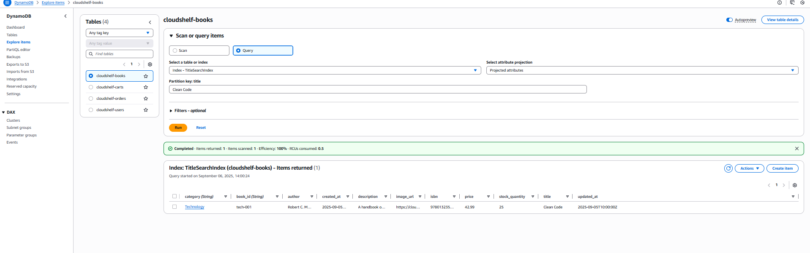

# 🗂️ CloudShelf DynamoDB Setup (Enhanced Phase 1)

> Simplified DynamoDB setup for high-performance cart operations in hybrid architecture

This guide provides setup instructions for DynamoDB in Enhanced Phase 1, focusing on shopping cart and session data while PostgreSQL handles relational data needs.

> 📋 **Architecture Decision**: This hybrid approach is documented in [ADR-004: Enhanced Phase 1 Hybrid Architecture](../cloudshelf-adr-004-enhanced-phase1-hybrid-architecture.md)

---

## 🎯 Enhanced Phase 1 Database Strategy

### \*\*🚀 Why Hybrid Dat## 📚 Enhanced Phase 1 Documentation

### **Implementation Guides**

- 🗃️ [PostgreSQL RDS Setup](../rds/cloudshelf-rds-default-vpc-setup.md) - Books, users, orders database
- ⚡ [Lambda Hybrid Functions](../lambda/cloudshelf-basic-lambda-setup.md) - DynamoDB + PostgreSQL access
- 🌐 [API Gateway Integration](../apigateway/cloudshelf-apigateway-setup.md) - Unified REST endpoints

### **Architecture Documentation**

- 📋 [Enhanced Phase 1 Plan](../../ENHANCED-PHASE1-PLAN.md) - Complete strategy overview
- 🏗️ [ADR-004: Hybrid Architecture](../cloudshelf-adr-004-enhanced-phase1-hybrid-architecture.md) - Decision rationale Approach?\*\*

**Enhanced Learning Benefits**:

- ✅ **Realistic data patterns** - Use the right database for each use case
- ✅ **PostgreSQL for complexity** - Books, users, orders with relational integrity
- ✅ **DynamoDB for performance** - Shopping carts and sessions with single-digit latency
- ✅ **Industry patterns** - Learn hybrid database strategies used in production
- ✅ **Smooth progression** - Better preparation for Phase 2 advanced features

**DynamoDB Role in Enhanced Phase 1**:

- 🛒 **Shopping cart operations** - Add/remove items with high performance
- 🔄 **User session management** - Temporary data with TTL support
- ⚡ **Simple key-value operations** - Perfect DynamoDB use cases

**PostgreSQL handles** (separate guide):

- 📚 Book catalog and search
- 👤 User profiles and authentication
- 📦 Order processing and history

---

## 🏛️ Enhanced Phase 1 Hybrid Architecture

### **🗂️ DynamoDB in Hybrid Architecture**

```
┌─────────────────────────────────────────────────────────────────────────────────┐
│                   CloudShelf Enhanced Phase 1 Architecture                     │
├─────────────────────────────────────────────────────────────────────────────────┤
│                                                                                 │
│  📱 Web/Mobile Clients                                                         │
│       │                                                                         │
│       ▼                                                                         │
│  ┌─────────────────────────────────────────────────────────────────────────┐   │
│  │                     🌐 API Gateway                                      │   │
│  │                   (Unified API Layer)                                  │   │
│  └─────────────────────────────────────────────────────────────────────────┘   │
│       │                                                                         │
│       ▼                                                                         │
│  ┌─────────────────────────────────────────────────────────────────────────┐   │
│  │                 ⚡ Lambda Functions                                     │   │
│  │  ┌─────────────┐                           ┌─────────────┐             │   │
│  │  │Shopping Cart│                           │Session Mgmt │             │   │
│  │  │  Service    │ ────── DynamoDB ────────▶ │  Service    │             │   │
│  │  │(High Perf)  │                           │(TTL Support)│             │   │
│  │  └─────────────┘                           └─────────────┘             │   │
│  └─────────────────────────────────────────────────────────────────────────┘   │
│       │                                                                         │
│       ▼                                                                         │
│  ┌─────────────────────────────────────────────────────────────────────────┐   │
│  │              🗂️ DynamoDB Tables (Simplified)                           │   │
│  │                                                                         │   │
│  │  ┌─────────────┐                    ┌─────────────┐                    │   │
│  │  │cloudshelf-  │                    │cloudshelf-  │                    │   │
│  │  │carts        │                    │sessions     │                    │   │
│  │  │             │                    │             │                    │   │
│  │  │• User ID    │                    │• Session ID │                    │   │
│  │  │• Book ID    │                    │• User Data  │                    │   │
│  │  │• Quantity   │                    │• TTL (24h)  │                    │   │
│  │  │• Added Date │                    │• Expires    │                    │   │
│  │  └─────────────┘                    └─────────────┘                    │   │
│  └─────────────────────────────────────────────────────────────────────────┘   │
│                                                                                 │
│                           📍 Default VPC                                       │
│  ┌─────────────────────────────────────────────────────────────────────────┐   │
│  │                ⚡ VPC-Connected Lambda Functions                        │   │
│  │  ┌─────────────┐  ┌─────────────┐  ┌─────────────┐                    │   │
│  │  │Book Catalog │  │User Mgmt    │  │Order Process│                    │   │
│  │  │  Service    │  │  Service    │  │  Service    │                    │   │
│  │  └─────────────┘  └─────────────┘  └─────────────┘                    │   │
│  │       │                │                │                              │   │
│  │       ▼                ▼                ▼                              │   │
│  │  ┌─────────────────────────────────────────────────────┐               │   │
│  │  │           🗃️ PostgreSQL RDS                        │               │   │
│  │  │        (books, users, orders tables)              │               │   │
│  │  └─────────────────────────────────────────────────────┘               │   │
│  └─────────────────────────────────────────────────────────────────────────┘   │
│                                                                                 │
└─────────────────────────────────────────────────────────────────────────────────┘
```

**Key Benefits of Hybrid Approach**:

- 🎯 **Right tool for the job** - DynamoDB for high-performance cart operations
- 🗃️ **PostgreSQL for complex data** - Books, users, orders with relational integrity
- ⚡ **Best performance** - Single-digit millisecond cart operations
- � **Learning value** - Industry-standard hybrid database patterns

---

## 📊 Simplified DynamoDB Table Design

### **Table 1: Shopping Carts (`cloudshelf-carts`)**

**Purpose**: High-performance shopping cart operations with user isolation

| **Field Name**   | **Type** | **Key Type** | **Description**                      |
| ---------------- | -------- | ------------ | ------------------------------------ |
| `user_id`        | String   | 🔑 PARTITION | Unique user identifier (Cognito sub) |
| `book_id`        | String   | 🗂️ SORT      | Book ID from PostgreSQL catalog      |
| `quantity`       | Number   |              | Number of books (min: 1, max: 99)    |
| `added_at`       | String   |              | ISO timestamp when item was added    |
| `updated_at`     | String   |              | ISO timestamp of last modification   |
| `book_title`     | String   |              | Cached book title (denormalized)     |
| `book_price`     | Number   |              | Cached book price (denormalized)     |
| `book_image_url` | String   |              | Cached book image URL (denormalized) |

**📚 Example Cart Item**:

```json
{
  "user_id": "123e4567-e89b-12d3-a456-426614174000",
  "book_id": "book-9781234567890",
  "quantity": 2,
  "added_at": "2024-01-15T14:30:00Z",
  "updated_at": "2024-01-15T14:30:00Z",
  "book_title": "The DevOps Handbook",
  "book_price": 29.99,
  "book_image_url": "https://cloudshelf-images.s3.amazonaws.com/books/devops-handbook.jpg"
}
```

**🔍 Access Patterns**:

- **Get User Cart**: `user_id` (retrieves all cart items for user)
- **Add/Update Item**: `user_id` + `book_id` (add or modify quantity)
- **Remove Item**: `user_id` + `book_id` (delete item from cart)

---

### **Table 2: User Sessions (`cloudshelf-sessions`)**

**Purpose**: Manage user session data with automatic TTL cleanup

| **Field Name**  | **Type** | **Key Type** | **Description**                         |
| --------------- | -------- | ------------ | --------------------------------------- |
| `session_id`    | String   | 🔑 PARTITION | Unique session identifier (UUID)        |
| `user_id`       | String   |              | Associated user ID (if authenticated)   |
| `session_data`  | Map      |              | Cached user preferences and state       |
| `cart_summary`  | Map      |              | Quick cart overview (item count, total) |
| `last_activity` | String   |              | ISO timestamp of last user action       |
| `created_at`    | String   |              | ISO timestamp when session was created  |
| `expires_at`    | Number   | ⏰ TTL       | Unix timestamp (24 hours from creation) |
| `ip_address`    | String   |              | User's IP address (for analytics)       |
| `user_agent`    | String   |              | Browser/device information              |

**🗂️ Session Data Structure**:

```json
{
  "preferences": {
    "theme": "light",
    "language": "en",
    "currency": "USD"
  },
  "browsing_history": ["book-9781234567890", "book-9780987654321"],
  "search_history": ["devops", "cloud architecture"]
}
```

**📚 Example Data**:

```json
{
  "session_id": "sess-20240115-143000-uuid",
  "user_id": "123e4567-e89b-12d3-a456-426614174000",
  "session_data": {
    "preferences": {
      "theme": "dark",
      "language": "en",
      "currency": "USD"
    },
    "browsing_history": ["book-9781234567890", "book-9780987654321"],
    "search_history": ["devops", "cloud architecture"]
  },
  "cart_summary": {
    "item_count": 3,
    "total_amount": 94.97,
    "last_updated": "2024-01-15T14:35:00Z"
  },
  "last_activity": "2024-01-15T14:35:00Z",
  "created_at": "2024-01-15T14:30:00Z",
  "expires_at": 1705345800,
  "ip_address": "192.168.1.100",
  "user_agent": "Mozilla/5.0 (Windows NT 10.0; Win64; x64) AppleWebKit/537.36"
}
```

**🔍 Access Patterns**:

- **Get Session**: `session_id` (retrieve complete session data)
- **Update Activity**: `session_id` (refresh last_activity and expires_at)
- **Store Cart Summary**: `session_id` (cache cart totals for quick access)

---

## 🚀 Enhanced Phase 1 Implementation

### **Prerequisites**

✅ **Before You Start**:

- AWS account with DynamoDB access
- Basic understanding of NoSQL concepts
- Completed [PostgreSQL RDS setup](../rds/cloudshelf-rds-default-vpc-setup.md) for relational data
- Reviewed [Enhanced Phase 1 architecture plan](../../ENHANCED-PHASE1-PLAN.md)

### **🎯 Enhanced Phase 1 Scope**

In Enhanced Phase 1, DynamoDB handles only **high-performance operations**:

| **DynamoDB Tables**   | **Purpose**         | **Why DynamoDB?**              |
| --------------------- | ------------------- | ------------------------------ |
| `cloudshelf-carts`    | Shopping cart items | Single-digit millisecond reads |
| `cloudshelf-sessions` | User session data   | TTL auto-cleanup, fast access  |

| **PostgreSQL Tables** | **Purpose**   | **Why PostgreSQL?**             |
| --------------------- | ------------- | ------------------------------- |
| `books`               | Book catalog  | Complex queries, relationships  |
| `users`               | User accounts | ACID compliance, data integrity |
| `orders`              | Order history | Transaction support, reporting  |

---

## 📋 Step-by-Step Implementation

### **Step 1: Create DynamoDB Tables**

#### **🛒 Table 1: Shopping Carts (`cloudshelf-carts`)**

1. **Open DynamoDB Console**

   - Go to AWS Console → Services → DynamoDB
   - Click **"Tables"** in left navigation
   - Click **"Create table"** button

2. **Configure Cart Table**

```

Table Settings:
┌─────────────────────────────────────────────────────────────┐
│ Table name: cloudshelf-carts │
│ │
│ Partition key: │
│ • user_id (String) │
│ │
│ Sort key: │
│ • book_id (String) │
│ │
│ Table settings: │
│ • Customize settings: ✓ │
│ • Table class: DynamoDB Standard │
│ • Capacity mode: On-demand │
│ │
│ Encryption: │
│ • Encryption at rest: Amazon DynamoDB managed key │
│ │
│ Time to Live (TTL): │
│ • Enable TTL: No (carts don't need automatic expiry) │
└─────────────────────────────────────────────────────────────┘

```

3. **Create the Table**

- Click **"Create table"** button
- Wait for table status to show **"Active"** (usually 1-2 minutes)


_Creating the shopping cart table with user_id and book_id composite key_

#### **🖥️ Table 2: User Sessions (`cloudshelf-sessions`)**

1. **Create Sessions Table**

```

Table Settings:
┌─────────────────────────────────────────────────────────────┐
│ Table name: cloudshelf-sessions │
│ │
│ Partition key: │
│ • session_id (String) │
│ │
│ Sort key: │
│ • None │
│ │
│ Table settings: │
│ • Customize settings: ✓ │
│ • Table class: DynamoDB Standard │
│ • Capacity mode: On-demand │
│ │
│ Encryption: │
│ • Encryption at rest: Amazon DynamoDB managed key │
│ │
│ Time to Live (TTL): │
│ • Enable TTL: Yes │
│ • TTL attribute: expires_at │
└─────────────────────────────────────────────────────────────┘

```

2. **Configure TTL (Time to Live)**

- After table is created, go to **"Additional settings"** tab
- Click **"Time to Live"** section
- Click **"Enable"** button
- TTL attribute name: `expires_at`
- Click **"Enable TTL"** to confirm


_Configuring TTL for automatic session cleanup after 24 hours_

---

### **Step 2: Test Tables with Sample Data**

#### **🛒 Test Cart Table**

1. **Add Sample Cart Item**

- Go to `cloudshelf-carts` table
- Click **"Explore table items"** tab
- Click **"Create item"** button
- Switch to **"JSON view"**

2. **Sample Cart Item JSON**

```json
{
  "user_id": "123e4567-e89b-12d3-a456-426614174000",
  "book_id": "book-9781234567890",
  "quantity": 2,
  "added_at": "2024-01-15T14:30:00Z",
  "updated_at": "2024-01-15T14:30:00Z",
  "book_title": "The DevOps Handbook",
  "book_price": 29.99,
  "book_image_url": "https://cloudshelf-images.s3.amazonaws.com/books/devops-handbook.jpg"
}
```

3. **Verify Cart Operations**

   - View created item in table
   - Test query by `user_id` to get all cart items
   - Test get item by `user_id` + `book_id`

#### **🖥️ Test Session Table**

1. **Add Sample Session**

   - Go to `cloudshelf-sessions` table
   - Click **"Create item"** button
   - Switch to **"JSON view"**

2. **Sample Session JSON**

   ```json
   {
     "session_id": "sess-20240115-143000-uuid",
     "user_id": "123e4567-e89b-12d3-a456-426614174000",
     "session_data": {
       "preferences": {
         "theme": "light",
         "language": "en",
         "currency": "USD"
       },
       "browsing_history": ["book-9781234567890", "book-9780987654321"],
       "search_history": ["devops", "cloud architecture"]
     },
     "cart_summary": {
       "item_count": 2,
       "total_amount": 59.98,
       "last_updated": "2024-01-15T14:35:00Z"
     },
     "last_activity": "2024-01-15T14:35:00Z",
     "created_at": "2024-01-15T14:30:00Z",
     "expires_at": 1705345800,
     "ip_address": "192.168.1.100",
     "user_agent": "Mozilla/5.0 (Windows NT 10.0; Win64; x64) AppleWebKit/537.36"
   }
   ```

3. **Verify TTL Functionality**

   - Check that `expires_at` timestamp is 24 hours in future
   - Verify TTL is enabled on table (shows TTL attribute)
   - Test session retrieval by `session_id`


_Testing both cart and session tables with sample data_

---

### **Step 3: Validation and Testing**

#### **✅ Verify Enhanced Phase 1 Setup**

**DynamoDB Tables Checklist**:

- ✅ `cloudshelf-carts` with user_id/book_id composite key
- ✅ `cloudshelf-sessions` with session_id key and TTL enabled
- ✅ Both tables set to **On-demand** billing mode
- ✅ Sample data added successfully to both tables

#### **🔧 Test Cart Operations**

**Using DynamoDB Console**:

1. **Query Cart by User**:

   - Go to `cloudshelf-carts` table → **"Explore table items"**
   - Use **"Query"** option
   - Set condition: `user_id = 123e4567-e89b-12d3-a456-426614174000`
   - Verify you see all cart items for that user

2. **Get Specific Cart Item**:

   - Use **"Get item"** option
   - Provide both keys:
     - `user_id`: `123e4567-e89b-12d3-a456-426614174000`
     - `book_id`: `book-9781234567890`
   - Verify you get the specific cart item

#### **🖥️ Test Session Operations**

1. **Get Session by ID**:

   - Go to `cloudshelf-sessions` table → **"Explore table items"**
   - Use **"Get item"** option
   - Provide key: `session_id = sess-20240115-143000-uuid`
   - Verify you get complete session data

2. **Verify TTL Configuration**:

   - Check **"Additional settings"** tab → **"Time to Live"**
   - Verify TTL is **Enabled** with attribute `expires_at`
   - Confirm sample session has future expiration timestamp

#### **🔗 Integration with PostgreSQL**

**Verify Hybrid Architecture**:

1. **Check RDS Connection**:

   - Ensure [PostgreSQL RDS setup](../rds/cloudshelf-rds-default-vpc-setup.md) is complete
   - Verify `books`, `users`, and `orders` tables exist in PostgreSQL
   - Test basic SELECT queries on PostgreSQL tables

2. **Data Consistency**:

   - Cart items reference `book_id` values that exist in PostgreSQL `books` table
   - Session `user_id` values should match PostgreSQL `users` table
   - No duplicate data between DynamoDB and PostgreSQL


_Verifying both DynamoDB and PostgreSQL are working in hybrid architecture_

---

## 🎯 Next Steps

### **Immediate Next Steps**

1. **📋 Complete Lambda Setup**:

   - Follow [Enhanced Phase 1 Lambda guide](../lambda/cloudshelf-basic-lambda-setup.md)
   - Configure cart functions (DynamoDB, no VPC)
   - Configure book catalog functions (PostgreSQL, VPC required)

2. **🌐 Connect API Gateway**:

   - Complete [API Gateway setup](../apigateway/cloudshelf-apigateway-setup.md)
   - Test cart endpoints with DynamoDB
   - Test book catalog endpoints with PostgreSQL

3. **🔒 Configure Security**:

   - Set up IAM roles for hybrid database access
   - Configure security groups for VPC Lambda functions
   - Test end-to-end authentication flow

### **Learning Path Progression**

**Enhanced Phase 1 Achievement** 🎉:

- ✅ Hybrid database architecture (PostgreSQL + DynamoDB)
- ✅ Default VPC introduction without complexity
- ✅ Industry-standard data patterns
- ✅ Realistic cost expectations ($15-25/month)

**Phase 2 Preview**:

- Custom VPC with private/public subnets
- Advanced DynamoDB patterns (GSI, streams)
- Multi-environment deployment
- Enhanced monitoring and logging

---

## 📚 Additional Resources

### **Enhanced Phase 1 Documentation**

- 📋 [Enhanced Phase 1 Plan](../../ENHANCED-PHASE1-PLAN.md) - Complete architecture strategy
- 🏗️ [ADR-004: Enhanced Phase 1 Hybrid Architecture](../cloudshelf-adr-004-enhanced-phase1-hybrid-architecture.md) - Architectural decision record
- 🗃️ [PostgreSQL RDS Setup](../rds/cloudshelf-rds-default-vpc-setup.md) - Relational database setup
- ⚡ [Lambda VPC Guide](../lambda/cloudshelf-basic-lambda-setup.md) - Hybrid function deployment

### **DynamoDB Learning Resources**

- 📖 [AWS DynamoDB Best Practices](https://docs.aws.amazon.com/amazondynamodb/latest/developerguide/best-practices.html)
- 🎯 [DynamoDB Partition Key Design](https://aws.amazon.com/blogs/database/choosing-the-right-dynamodb-partition-key/)
- ⏰ [TTL Implementation Guide](https://docs.aws.amazon.com/amazondynamodb/latest/developerguide/TTL.html)
- 🔧 [NoSQL vs SQL Decision Guide](https://aws.amazon.com/nosql/)

---

**🎉 Enhanced Phase 1 DynamoDB Setup Complete!**

Your CloudShelf application now has high-performance cart and session management with DynamoDB, while leveraging PostgreSQL for complex relational data. This hybrid approach provides the best of both database worlds and prepares you for advanced cloud architecture patterns.

Next: [Configure Lambda Functions for Hybrid Database Access](../lambda/cloudshelf-basic-lambda-setup.md)

3. **Browse All Tables**:
   - Verify each table shows the correct structure
   - Check that indexes are created properly
   - Confirm sample data appears as expected


_Testing table queries in DynamoDB console_

---

## 🎯 Enhanced Phase 1 Next Steps

### **Immediate Next Steps**

1. **📋 Complete PostgreSQL Setup**:
   - Follow [PostgreSQL RDS setup guide](../rds/cloudshelf-rds-default-vpc-setup.md) for books, users, orders
2. **⚡ Configure Lambda Functions**:
   - Set up [Enhanced Phase 1 Lambda functions](../lambda/cloudshelf-basic-lambda-setup.md) for hybrid database access
3. **🌐 Connect API Gateway**:
   - Complete [API Gateway setup](../apigateway/cloudshelf-apigateway-setup.md) for unified API endpoints

### **Enhanced Phase 1 Achievement** 🎉:

- ✅ High-performance cart operations with DynamoDB
- ✅ Session management with TTL auto-cleanup
- ✅ Hybrid database pattern preparation for Phase 2

---

## 📚 Related Documentation

- ⚡ [**Lambda Setup Guide**](cloudshelf-lambda-setup.md) - Connect functions to DynamoDB
- 🌐 [**API Gateway Setup**](../apigateway/cloudshelf-apigateway-setup.md) - Create REST endpoints
- � [**Phase 1 Overview**](README.md) - Complete Phase 1 implementation guide

---

## 📋 Quick Reference

### **Enhanced Phase 1 Table Names**

**DynamoDB Tables:**

- Shopping Carts: `cloudshelf-carts`
- User Sessions: `cloudshelf-sessions`

**PostgreSQL Tables (separate guide):**

- Books: `books`
- Users: `users`
- Orders: `orders`

---

_📋 **Documentation Status**: Complete | ✅ **Client Ready**: Yes | 🔄 **Last Updated**: Phase 1 Implementation_  
_🎯 **Phase**: DynamoDB Setup | 👥 **Team**: Solutions Architecture | 📋 **Next**: Lambda Integration_
