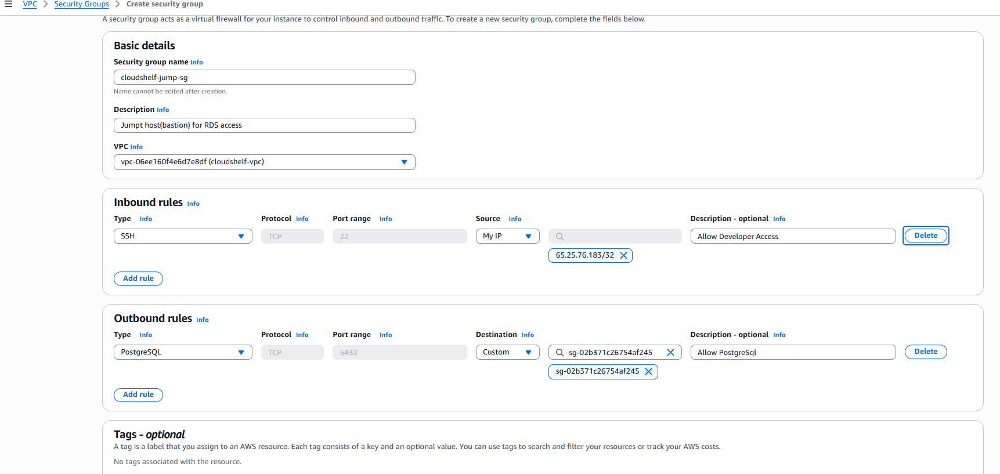
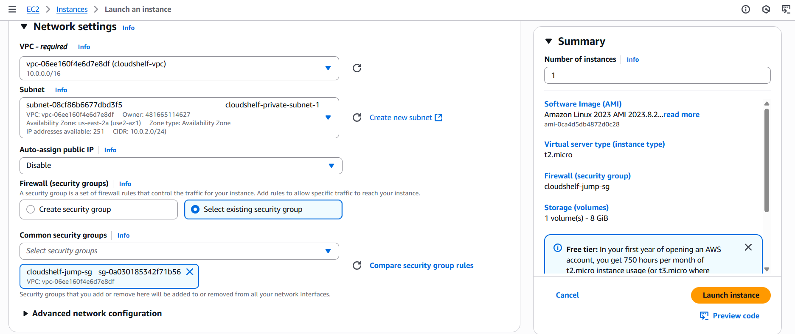

--

# 🏗️ CloudShelf EC2 Jump Host (Bastion) Setup Guide

> **Purpose:**
> This guide provides step-by-step instructions for creating and automating a secure EC2 jump host (bastion) for accessing your RDS instance in both development and production environments, following AWS best practices.
>
> **Access Method:**
> All administrative access to the jump host is via AWS SSM Session Manager (see [ADR-00X](../cloudshelf-adr-00x-ssm-session-manager.md)). No public or Elastic IP is required.

---

## 🚀 Step 1: Create Jump Host Security Group

1. **Navigate to EC2 → Security Groups → Create Security Group**

   - **Name**: `cloudshelf-jump-sg`
   - **Description**: `Jump host (bastion) for RDS access`
   - **VPC**: Select your custom VPC (e.g., `cloudshelf-vpc`)

2. **Configure Inbound Rules**

   - **No inbound rules required for SSM-only access.**
   - (If you want to allow SSH for break-glass, add SSH (22) from trusted IPs only, but this is not required for SSM.)

3. **Configure Outbound Rules**

   - **Type**: PostgreSQL (5432)
   - **Destination**: `cloudshelf-rds-sg`
   - **Description**: Allow jump host to connect to RDS

   
   _Create and configure the security group for the jump host (allow SSH from trusted IPs only)_

   
   _Configure outbound rule to allow PostgreSQL (5432) to RDS security group_

---

## 🚀 Step 2: Launch EC2 Instance as Jump Host

1. **Navigate to EC2 → Instances → Launch Instance**

   
   _Launch the EC2 instance for the jump host_

   - **Name**: `cloudshelf-jump-host`
   - **AMI**: Amazon Linux 2023 (or latest Amazon Linux)
   - **Instance Type**: t2.micro (free tier eligible)
   - **Network**: Custom VPC

2. **Configure network settings:**

   
   _Select VPC, subnet, and security group for the jump host_

   - **Subnet**: Private subnet (preferred) or public subnet
   - **Auto-assign Public IP**: Not required for SSM access
   - **Security Group**: `cloudshelf-jump-sg-phase1`

3. **Key Pair:**
   - Create or use an existing key pair for SSH access (not required for SSM, but may be useful for break-glass access)

---

## 🚀 Step 3: Automate Jump Host Setup with EC2 UserData


_Paste UserData script for automated setup_

As a Solutions Architect, you should use EC2 UserData to automate the initial configuration of your jump host. This ensures consistency, security, and reduces manual effort.

**Sample UserData Script (Amazon Linux 2):**

```bash
#!/bin/bash
# Update system and install PostgreSQL 17 client
yum update -y
amazon-linux-extras install epel -y
yum install -y postgresql17

# (Optional) Install AWS SSM Agent for Session Manager (usually preinstalled)
yum install -y amazon-ssm-agent
systemctl enable amazon-ssm-agent
systemctl start amazon-ssm-agent

# (Optional) Harden SSH: disable root login, allow only ec2-user
sed -i 's/^PermitRootLogin.*/PermitRootLogin no/' /etc/ssh/sshd_config
systemctl restart sshd

# (Optional) Install CloudWatch Agent for logging
# yum install -y amazon-cloudwatch-agent
# ...configure as needed...

echo "Jump host bootstrap complete." > /etc/motd
```

**How to use:**

- Paste this script into the "User data" field when launching your EC2 instance (see above).
- Adjust as needed for your OS, security, and monitoring requirements.

**Benefits:**

- Ensures every jump host is identically and securely configured
- Supports infrastructure-as-code and automation best practices
- Reduces manual setup errors and improves auditability

---

## 🚀 Step 4: Harden Jump Host Access


_Attach IAM role with SSM permissions to the jump host instance_

- **No SSH required**: No inbound SSH needed; all access is via SSM Session Manager
- **Enable Session Logging**: All SSM sessions are logged in CloudTrail
- **IAM Role**: Attach an IAM role with SSM permissions (e.g., AmazonSSMManagedInstanceCore)
- **Disable root login**: Use ec2-user or SSM for access

---

## 🚀 Step 5: Connect to RDS from Jump Host


_Start an SSM session to connect to the jump host (no public IP required)_

1. **Connect to the jump host using SSM Session Manager**

   - SSM: `aws ssm start-session --target <instance-id>`

2. **Install PostgreSQL Client**

   ```bash
   sudo yum install postgresql17 -y
   # or
   sudo apt-get install postgresql-client-17 -y
   ```

3. **Connect to RDS**
   ```bash
   psql -h your-rds-endpoint -U cloudshelf_admin -d cloudshelf
   ```

---

## 🚀 Step 6: Best Practices for Jump Host


_Enable CloudWatch logging for session activity (optional but recommended)_

- **Use SSM Session Manager**: No public or Elastic IP, no SSH keys; all sessions are logged in CloudTrail
- **Enable CloudWatch Logs** for session activity
- **Remove developer group from jump host SG in prod**; only allow DBAs/SREs
- **Terminate jump host when not needed in dev/test** to save costs

---

## 🚀 Step 7: Clean Up

- **Terminate jump host** when not needed
- **Delete unused security groups and key pairs**

---

_You now have a secure, auditable jump host for RDS access that mirrors real-world AWS best practices!_
