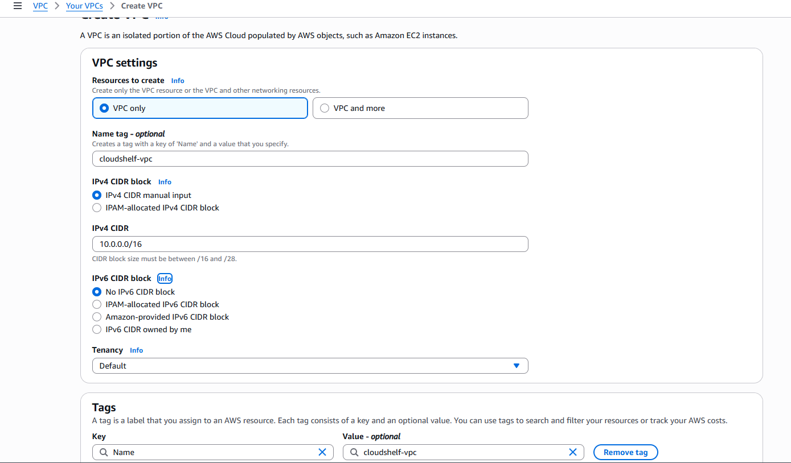
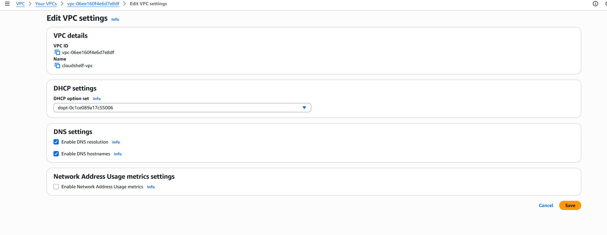
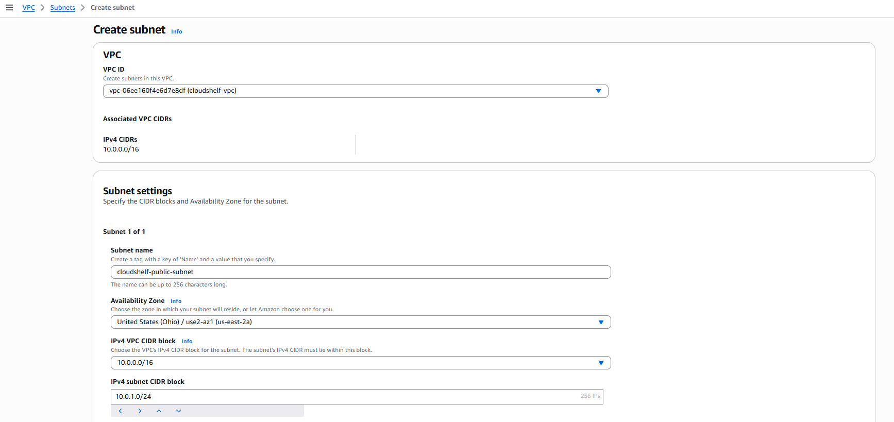
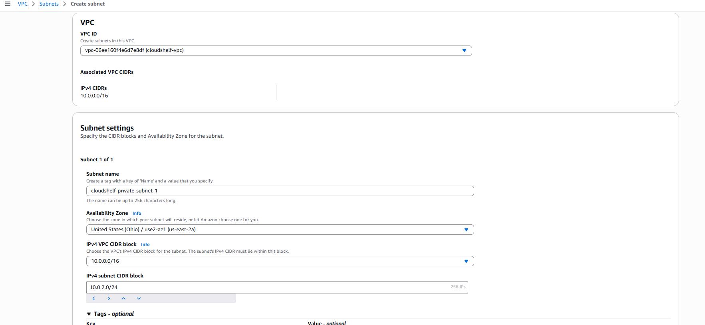
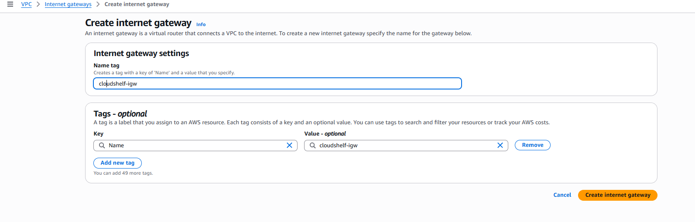
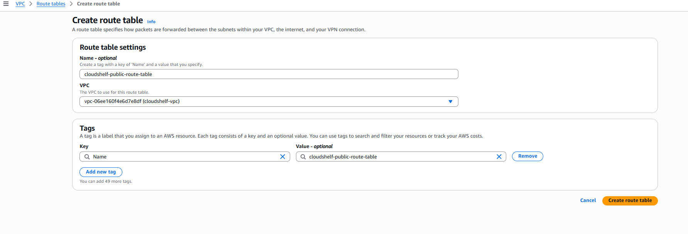
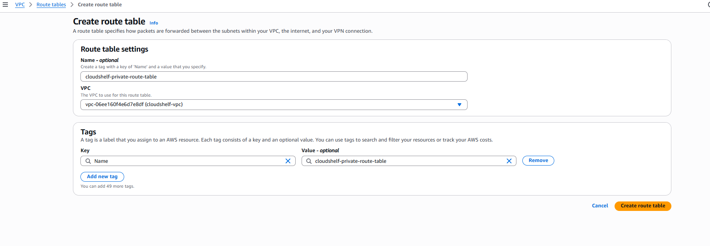
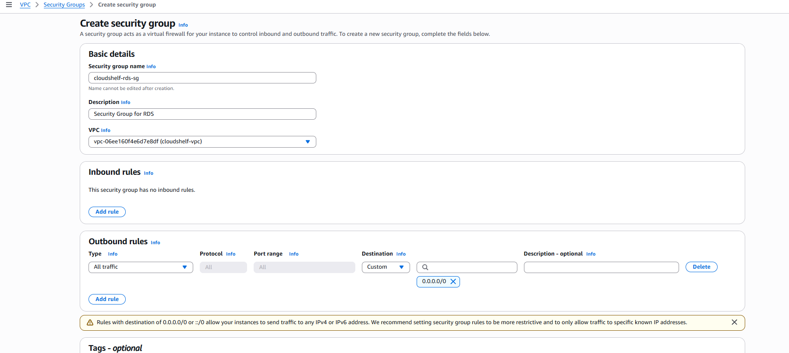
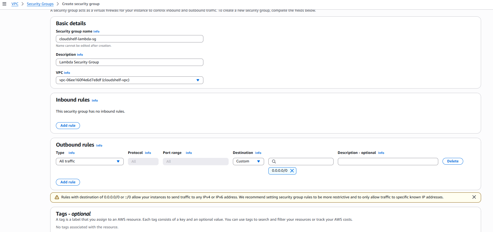
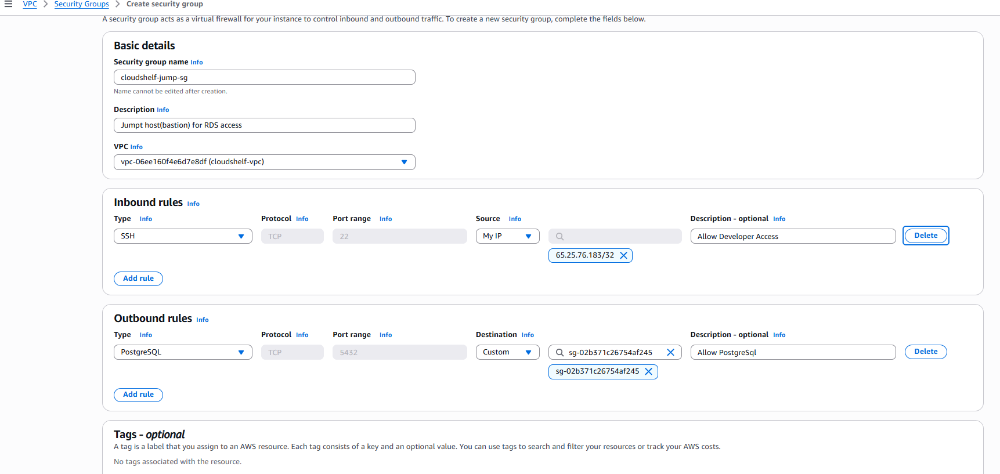

# 🌐 CloudShelf VPC Network Setup (Phase 1)

> Implementation guide for custom VPC networking foundation (Phase 1, cost-optimized)

This guide provides step-by-step instructions for setting up a minimal, production-aligned custom VPC for the CloudShelf project, following ADR-001 and AWS best practices.

---

## 🔒 Network Security Principles

- **Network Isolation**: Custom VPC for all resources
- **Least-Privilege Security Groups**: Only required access allowed
- **Private Subnets**: Databases and Lambda functions
- **No Direct Database Access**: RDS only accessible from Lambda/jump host

---

## 🏛️ Architecture Overview

- **VPC CIDR**: 10.0.0.0/16
- **Public Subnet**: 10.0.1.0/24 (for future use, NAT, or jump host)
- **Private Subnet**: 10.0.2.0/24 (for RDS, Lambda)
- **Internet Gateway**: For outbound internet access
- **No NAT Gateway (dev only)**: To minimize cost

---

## 🚀 Implementation Guide

### **Step 1: Create VPC**

- CIDR: 10.0.0.0/16
- Enable DNS support and hostnames

### **Step 2: Create Subnets**

- Public Subnet: 10.0.1.0/24 (AZ1)

  
  _Public subnet creation_

- Private Subnet: 10.0.2.0/24 (AZ2)

  
  _Private subnet creation_

### **Step 3: Create and Attach Internet Gateway**

- Attach to VPC

_Internet Gateway creation and attachment_

### **Step 4: Configure Route Tables**

- Public Route Table: 0.0.0.0/0 → IGW, associate with public subnet

  
  _Public route table configuration and association_

- Private Route Table: local only, associate with private subnet

  
  _Private route table configuration and association_

### **Step 5: Security Groups**

- Create empty security groups for RDS and Lambda (see ADR-007)

  - **RDS Security Group**: allow 5432 from Lambda SG only

    
    _RDS security group creation and inbound rule_

  - **Lambda Security Group**: allow 5432 to RDS SG, 443 to 0.0.0.0/0

    
    _Lambda security group creation and outbound rules_

### **Step 6: Jump Host EC2 Security Group**

- Create a dedicated security group for the jump host EC2 instance.

  - **Name**: `cloudshelf-jump-sg-phase1`
  - **Description**: `Jump host (bastion) for RDS access`
  - **VPC**: Select your custom VPC
  - **Inbound Rule**: Allow SSH (22) from your office IP, VPN CIDR, or trusted developer IPs (never 0.0.0.0/0 in prod)
  - **Outbound Rule**: Allow PostgreSQL (5432) to `cloudshelf-rds-sg`

  
  _Create and configure the security group for the jump host (allow SSH from trusted IPs only)_

## 💡 Cost Optimization Tips

- No NAT Gateway for dev: Use public subnet for jump host, Lambda with no outbound internet
- Use smallest subnets and free tier resources
- Document and monitor usage

---

## 📋 Next Steps

- Deploy RDS in private subnet
- Create jump host in public subnet ([Jump Host Setup Guide](cloudshelf-jump-host-setup.md))
- Configure Lambda with VPC access
- Complete IAM and security setup
