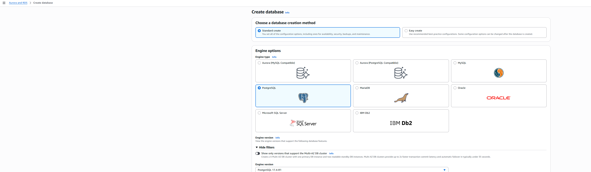
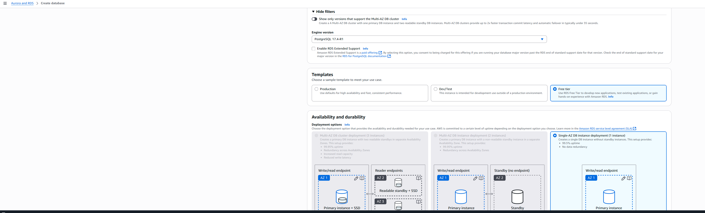
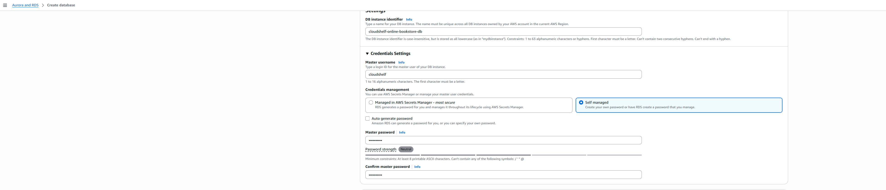
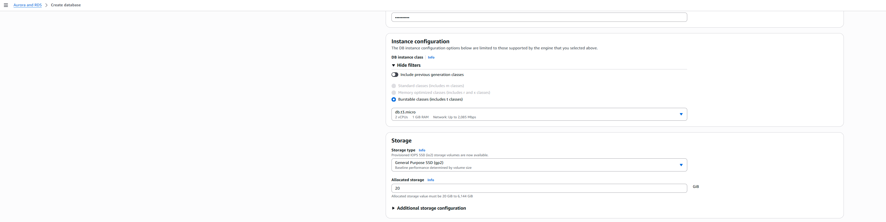
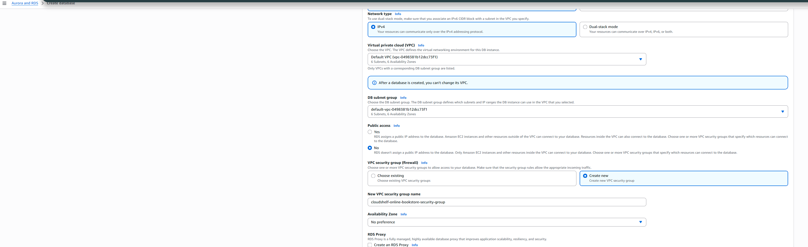

# 🗃️ RDS PostgreSQL Setup

> Implementation guide for RDS PostgreSQL database following ADR-002 architecture strategy

This guide provides setup instructions for Amazon RDS PostgreSQL, implementing the relational database decisions documented in [ADR-002: RDS Database Engine Selection](../cloudshelf-architecture-decisions.md#adr-002-rds-database-engine-selection).

---

## 🔒 Database Security Essentials

### **🛡️ RDS Security Requirements**

**Critical Security Configurations**:

- **Private Subnet Deployment** - Database never accessible from internet
- **Security Group Restrictions** - Only Lambda functions can connect
- **Encryption at Rest** - All data encrypted using AWS KMS
- **Backup Encryption** - Automated backups are also encrypted
- **SSL/TLS Connections** - Enforce encrypted connections only

**Security Checklist**:

- [ ] Deploy RDS in private subnets only
- [ ] Configure security group to allow Lambda access only
- [ ] Enable encryption at rest with KMS
- [ ] Use strong database passwords (AWS Secrets Manager)
- [ ] Enable automated backups with encryption
- [ ] Configure VPC security groups properly

---

## 🏛️ Architecture Overview

Based on **ADR-002**, PostgreSQL RDS provides the book catalog storage layer for CloudShelf with:

- **📚 Book Catalog Operations** - Complex relational queries and transactions
- **🔍 Advanced Search** - Built-in full-text search capabilities
- **📊 Analytics Support** - Complex reporting and business intelligence
- **🔒 Data Integrity** - ACID compliance for transactional operations

**Architecture Decision Reference**: See [ADR-002](../cloudshelf-architecture-decisions.md#adr-002) for the complete rationale behind PostgreSQL selection.

### **🗃️ RDS Architecture Design**


_PostgreSQL RDS integration with VPC, Lambda functions, and security configurations_

---

## 🔐 Prerequisites: VPC and Security Setup

Before creating RDS instances, ensure the network foundation is established per ADR-001.

### **📋 Required Infrastructure**

| Component           | Requirement                         | Purpose                               |
| ------------------- | ----------------------------------- | ------------------------------------- |
| **VPC**             | CloudShelf VPC with private subnets | Network isolation for database        |
| **Security Groups** | `cloudshelf-rds-sg` configured      | Database access control               |
| **Subnet Group**    | Multi-AZ private subnets            | High availability and fault tolerance |
| **Route Tables**    | Private subnet routing              | No direct internet access             |

### **🛠️ Infrastructure Validation**

⚠️ **Important**: Complete [VPC Setup Guide](../vpc/setup-vpc-reference.md) before proceeding.

- ✅ VPC and Security Group Setup completed
- ✅ Private subnets available in multiple AZs
- ✅ Database security group (`cloudshelf-rds-sg`) configured
- ✅ Lambda security group configured for database access

---

## 📊 Architecture Configuration

### **Database Strategy**

Following ADR-002 polyglot persistence approach:

| Data Pattern      | Storage Solution | Rationale                                                  |
| ----------------- | ---------------- | ---------------------------------------------------------- |
| **Book Catalog**  | PostgreSQL RDS   | Complex relationships, ACID transactions, advanced queries |
| **Shopping Cart** | DynamoDB         | High performance, flexible schema, serverless scaling      |

### **Configuration Specifications**

| Component            | Development     | Production      | Rationale                                    |
| -------------------- | --------------- | --------------- | -------------------------------------------- |
| **Engine**           | PostgreSQL 15.x | PostgreSQL 15.x | Advanced features, JSON support, reliability |
| **Instance Class**   | `db.t3.micro`   | `db.t3.small`   | Cost-effective, burstable performance        |
| **Storage**          | 20 GB gp3       | 100 GB gp3      | General Purpose SSD for balanced performance |
| **Multi-AZ**         | No              | Yes             | High availability for production             |
| **Backup Retention** | 7 days          | 30 days         | Compliance and recovery requirements         |

### **Network Architecture**

```
Internet Gateway
    ↓
Public Subnets (10.0.1.0/24)
    ↓ (No direct access)
Private Subnets (10.0.2.0/24)
    ↓
RDS Instance (cloudshelf-book-catalog-db)
```

---

## 🚀 Implementation Guide

### **Step 1: Access RDS Console**

Access AWS RDS service to begin database provisioning.

**Configuration:**

- Use AWS Management Console for initial setup
- Ensure proper IAM permissions for RDS operations



---

### **Step 2: Select PostgreSQL Engine**

Select PostgreSQL engine based on architectural requirements.

**Configuration:**

- **Database creation method**: Standard create (full architectural control)
- **Engine type**: PostgreSQL
- **Engine version**: Latest stable (15.x)
- **Template**: Dev/Test or Production based on environment



---

### **Step 3: Configure Instance and Storage**

Define instance specifications and storage configuration.

**Configuration:**

- **DB instance identifier**: `cloudshelf-book-catalog-db`
- **Master username**: `cloudshelf_admin`
- **Instance class**: Environment-appropriate sizing
- **Storage type**: General Purpose SSD (gp3)
- **Storage autoscaling**: Enabled (cost management)



---

### **Step 4: Network and Security Setup**

Configure VPC integration and security group associations.

**Network Configuration:**

- **VPC**: CloudShelf VPC (private deployment)
- **DB subnet group**: `cloudshelf-db-subnet-group`
- **Public access**: Disabled (security requirement)
- **Security groups**: `cloudshelf-rds-sg` only
- **Database port**: 5432 (PostgreSQL standard)

**Security Configuration:**

- **Encryption at rest**: Enabled
- **Backup retention**: Environment-appropriate
- **Delete protection**: Enabled for production



---

### **Step 5: Review and Deploy**

Validate architectural configuration before deployment.



**Validation Checklist:**

- ✅ VPC and subnet configuration correct
- ✅ Security group properly assigned
- ✅ Instance sizing appropriate for environment
- ✅ Backup and maintenance windows configured

---

## Post-Deployment Architecture

### Connection Architecture

| Component    | Value                                                       | Purpose                           |
| ------------ | ----------------------------------------------------------- | --------------------------------- |
| **Endpoint** | `cloudshelf-book-catalog-db.xxxxx.region.rds.amazonaws.com` | Lambda function connection target |
| **Port**     | `5432`                                                      | PostgreSQL standard port          |
| **Database** | `cloudshelf_catalog`                                        | Application database              |

### Security Validation

**Network Security:**

- ✅ RDS deployed in private subnets
- ✅ No public IP assignment
- ✅ Security group restricts access to Lambda functions only

**Access Control:**

- ✅ Master credentials managed securely
- ✅ Database-level user accounts for application access
- ✅ Encryption enabled for data at rest

---

## Database Schema Architecture

### Application Database Structure

```sql
-- High-level database architecture
CREATE DATABASE cloudshelf_catalog;
CREATE USER cloudshelf_app WITH PASSWORD 'managed-via-parameter-store';
GRANT ALL PRIVILEGES ON DATABASE cloudshelf_catalog TO cloudshelf_app;
```

### Schema References

- 📊 [**Database Schema Model**](rds-data-model.md) - Entity relationships and table design
- 📝 [**Sample Data Structure**](rds-sample-data.sql) - Reference data for development

---

## Architectural Best Practices

### **Security Architecture**

- ✅ Private subnet deployment only
- ✅ Security group-based access control
- ✅ Encryption at rest and in transit
- ✅ Parameter Store for credential management

### **High Availability Design**

- ✅ Multi-AZ deployment for production
- ✅ Automated backup configuration
- ✅ Cross-region backup replication (production)
- ✅ Database delete protection

### **Performance Architecture**

- ✅ Instance class sizing based on workload analysis
- ✅ Storage autoscaling for growth management
- ✅ Connection pooling design for Lambda integration
- ✅ Read replica strategy for scaling (future)

---

## Integration Architecture

### Lambda Function Integration

**Connection Pattern**: Lambda functions connect via VPC networking

- Lambda functions deployed in same VPC
- Security group rules allow Lambda-to-RDS communication
- Connection pooling for efficient resource usage
- Environment variables for connection configuration

### **Database Schema Strategy**

- Normalized design with JSON flexibility (PostgreSQL advantage)
- Book catalog tables with relational integrity
- User account management with proper constraints
- Order history and transaction tracking

---

## 📚 Related Architecture Documentation

- 🏛️ [**ADR-002: PostgreSQL Selection**](../cloudshelf-architecture-decisions.md#adr-002) - Complete database choice rationale
- 🏛️ [**All Architecture Decisions**](../cloudshelf-architecture-decisions.md) - Context for database architecture
- 🌐 [**VPC Setup**](../vpc/setup-vpc-reference.md) - Required network foundation
- 🗂️ [**DynamoDB Setup**](../dynamodb/setup-dynamodb.md) - Complementary NoSQL storage
- ⚡ [**Lambda Setup**](../lambda/setup-lambda.md) - Database connectivity integration

---

_Part of the CloudShelf Solutions Architecture documentation_

- Connection pooling managed at application layer

### API Gateway Integration

**Data Flow**: API Gateway → Lambda → RDS

- Stateless Lambda functions for database operations
- Connection management per Lambda invocation
- Error handling and retry logic at application layer

---

## Quick Reference

### **Key Architectural Values**

- **Instance Identifier**: `cloudshelf-book-catalog-db`
- **Engine**: PostgreSQL (latest stable)
- **Network**: Private subnet deployment
- **Security**: `cloudshelf-rds-sg` security group
- **Access**: Lambda functions only

### **Next Architectural Components**

1. ⚡ [Lambda Function Setup](../lambda/cloudshelf-lambda-setup.md)
2. 🌐 [API Gateway Configuration](../apigateway/cloudshelf-apigateway-setup.md)
3. 📊 [Database Schema Design](rds-data-model.md)

---

**External Reference**: [AWS RDS Documentation](https://docs.aws.amazon.com/rds/)

_Part of the CloudShelf Solutions Architecture documentation_  
_Last updated: September 3, 2025_
