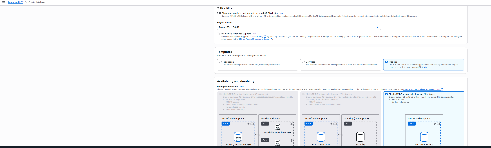

# RDS Architecture Setup Guide

This guide defines the architectural configuration for Amazon RDS PostgreSQL instance in the CloudShelf Online Bookstore project.

## Prerequisites

⚠️ **Important**: VPC infrastructure must be established before RDS deployment.

- ✅ [VPC and Security Group Setup Guide](../vpc/setup-vpc-reference.md) completed
- ✅ VPC with private subnets available
- ✅ Database security group (`cloudshelf-rds-sg`) configured

## Architecture Overview

**Database Strategy**: Single PostgreSQL RDS instance for book catalog data with high availability design.

### **Configuration Specifications**

| Component            | Development     | Production      | Rationale                                    |
| -------------------- | --------------- | --------------- | -------------------------------------------- |
| **Engine**           | PostgreSQL 15.x | PostgreSQL 15.x | Advanced features, JSON support, reliability |
| **Instance Class**   | `db.t3.micro`   | `db.t3.small`   | Cost-effective, burstable performance        |
| **Storage**          | 20 GB gp3       | 100 GB gp3      | General Purpose SSD for balanced performance |
| **Multi-AZ**         | No              | Yes             | High availability for production             |
| **Backup Retention** | 7 days          | 30 days         | Compliance and recovery requirements         |

### **Network Architecture**

```
Internet Gateway
    ↓
Public Subnets (10.0.1.0/24)
    ↓ (No direct access)
Private Subnets (10.0.2.0/24)
    ↓
RDS Instance (cloudshelf-book-catalog-db)
```

---

## Architectural Configuration Steps

### Step 1: RDS Console Access

Access AWS RDS service to begin database provisioning.


**Architectural Decision**: Use AWS Management Console for initial setup to ensure proper configuration visibility.

### Step 2: Database Engine Selection

Select PostgreSQL engine based on architectural requirements.



**Configuration Requirements:**

- **Database creation method**: Standard create (full architectural control)
- **Engine type**: PostgreSQL
- **Engine version**: Latest stable (15.x)
- **Template**: Dev/Test or Production based on environment

### Step 3: Instance and Storage Architecture

Define instance specifications and storage configuration.


**Architectural Specifications:**

- **DB instance identifier**: `cloudshelf-book-catalog-db`
- **Master username**: `cloudshelf_admin`
- **Instance class**: Environment-appropriate sizing
- **Storage type**: General Purpose SSD (gp3)
- **Storage autoscaling**: Enabled (cost management)

### Step 4: Network and Security Architecture

Configure VPC integration and security group associations.


**Network Configuration:**

- **VPC**: CloudShelf VPC (private deployment)
- **DB subnet group**: `cloudshelf-db-subnet-group`
- **Public access**: Disabled (security requirement)
- **Security groups**: `cloudshelf-rds-sg` only
- **Database port**: 5432 (PostgreSQL standard)

**Security Architecture:**

- **Encryption at rest**: Enabled
- **Backup retention**: Environment-appropriate
- **Delete protection**: Enabled for production

### Step 5: Configuration Review and Deployment

Validate architectural configuration before deployment.


**Validation Checklist:**

- ✅ VPC and subnet configuration correct
- ✅ Security group properly assigned
- ✅ Instance sizing appropriate for environment
- ✅ Backup and maintenance windows configured

---

## Post-Deployment Architecture

### Connection Architecture

| Component    | Value                                                       | Purpose                           |
| ------------ | ----------------------------------------------------------- | --------------------------------- |
| **Endpoint** | `cloudshelf-book-catalog-db.xxxxx.region.rds.amazonaws.com` | Lambda function connection target |
| **Port**     | `5432`                                                      | PostgreSQL standard port          |
| **Database** | `cloudshelf_catalog`                                        | Application database              |

### Security Validation

**Network Security:**

- ✅ RDS deployed in private subnets
- ✅ No public IP assignment
- ✅ Security group restricts access to Lambda functions only

**Access Control:**

- ✅ Master credentials managed securely
- ✅ Database-level user accounts for application access
- ✅ Encryption enabled for data at rest

---

## Database Schema Architecture

### Application Database Structure

```sql
-- High-level database architecture
CREATE DATABASE cloudshelf_catalog;
CREATE USER cloudshelf_app WITH PASSWORD 'managed-via-parameter-store';
GRANT ALL PRIVILEGES ON DATABASE cloudshelf_catalog TO cloudshelf_app;
```

### Schema References

- 📊 [**Database Schema Model**](rds-data-model.md) - Entity relationships and table design
- 📝 [**Sample Data Structure**](rds-sample-data.sql) - Reference data for development

---

## Architectural Best Practices

### **Security Architecture**

- ✅ Private subnet deployment only
- ✅ Security group-based access control
- ✅ Encryption at rest and in transit
- ✅ Parameter Store for credential management

### **High Availability Design**

- ✅ Multi-AZ deployment for production
- ✅ Automated backup configuration
- ✅ Cross-region backup replication (production)
- ✅ Database delete protection

### **Performance Architecture**

- ✅ Instance class sizing based on workload analysis
- ✅ Storage autoscaling for growth management
- ✅ Connection pooling design for Lambda integration
- ✅ Read replica strategy for scaling (future)

---

## Integration Architecture

### Lambda Function Integration

**Connection Pattern**: Lambda functions connect via VPC networking

- Lambda functions deployed in same VPC
- Security group rules allow Lambda-to-RDS communication
- Connection pooling managed at application layer

### API Gateway Integration

**Data Flow**: API Gateway → Lambda → RDS

- Stateless Lambda functions for database operations
- Connection management per Lambda invocation
- Error handling and retry logic at application layer

---

## Quick Reference

### **Key Architectural Values**

- **Instance Identifier**: `cloudshelf-book-catalog-db`
- **Engine**: PostgreSQL (latest stable)
- **Network**: Private subnet deployment
- **Security**: `cloudshelf-rds-sg` security group
- **Access**: Lambda functions only

### **Next Architectural Components**

1. 🔧 [Lambda Function Architecture](../lambda/lambda-architecture.md)
2. 🌐 [API Gateway Design](../api-gateway/api-architecture.md)
3. 📊 [Database Schema Design](rds-data-model.md)

---

**Architectural Review**: This RDS configuration provides secure, scalable, and cost-effective database services for the CloudShelf application while maintaining AWS best practices for network isolation and access control.

_Last updated: 2025-09-01_
