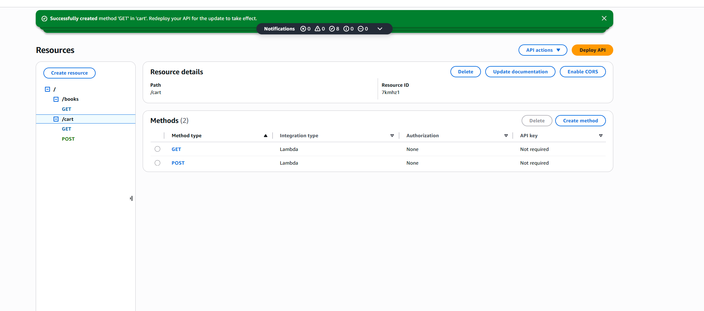
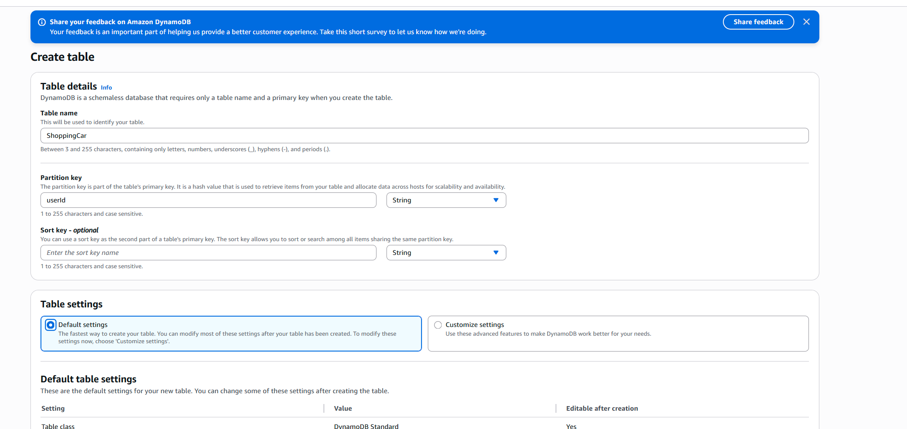
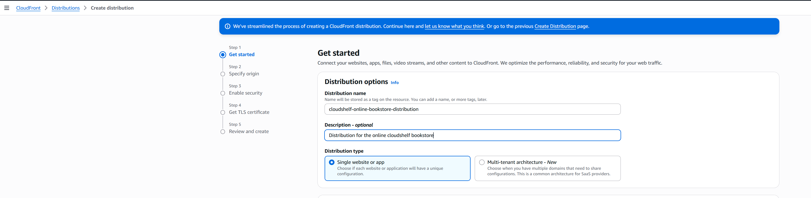
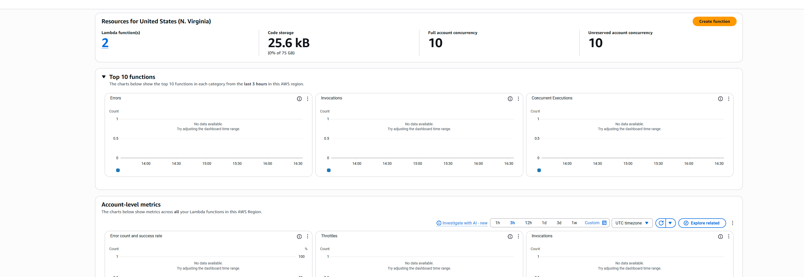
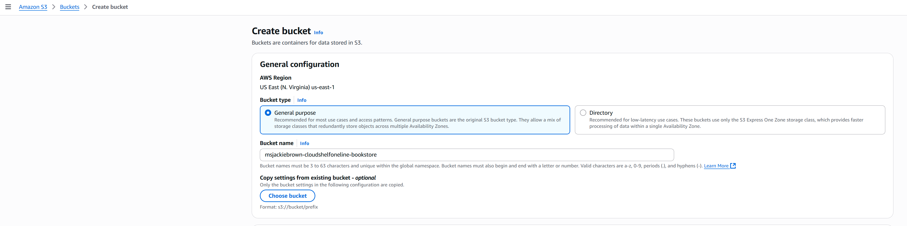

# 📸 CloudShelf Screenshots Collection

> Centralized repository of all setup screenshots for CloudShelf architecture documentation

This folder contains all screenshots used throughout the CloudShelf documentation, organized by service and component for easy reference and maintenance.

---

## 📁 Screenshot Organization

### **🗂️ Folder Structure**

```
screenshots/
├── apigateway/          ← API Gateway setup and configuration
├── cloudfront/          ← CloudFront distribution screenshots
├── dynamodb/            ← DynamoDB table creation and management
├── lambda/              ← Lambda function setup and configuration
├── s3/                  ← S3 bucket configuration and static hosting
├── vpc/                 ← VPC networking and security groups
├── rds/                 ← RDS PostgreSQL setup and configuration
├── monitoring/          ← CloudWatch, X-Ray, and monitoring setup
└── security/            ← Security configurations and IAM setup
```

### **📊 Screenshot Inventory**

#### **🌐 API Gateway** (`apigateway/`)

| Screenshot              | Description                           | Used In                 |
| ----------------------- | ------------------------------------- | ----------------------- |
| `API Gateway Setup.png` | Main API Gateway configuration screen | API Gateway setup guide |

#### **🌍 CloudFront CDN** (`cloudfront/`)

| Screenshot                                 | Description                    | Used In                |
| ------------------------------------------ | ------------------------------ | ---------------------- |
| `CloudFront Distribution Screenshot 1.png` | Distribution creation - Step 1 | CloudFront setup guide |
| `CloudFront Distribution Screenshot 2.png` | Distribution creation - Step 2 | CloudFront setup guide |
| `CloudFront Distribution Screenshot 3.png` | Distribution creation - Step 3 | CloudFront setup guide |
| `CloudFront Distribution Screenshot 4.png` | Distribution creation - Step 4 | CloudFront setup guide |
| `CloudFront Distribution Screenshot 5.png` | Distribution creation - Step 5 | CloudFront setup guide |
| `CloudFront Distribution Screenshot 6.png` | Distribution creation - Step 6 | CloudFront setup guide |
| `CloudFront Distribution Screenshot 7.png` | Distribution creation - Step 7 | CloudFront setup guide |
| `CloudFront Distribution Screenshot 8.png` | Distribution creation - Step 8 | CloudFront setup guide |

#### **🗂️ DynamoDB** (`dynamodb/`)

| Screenshot                        | Description            | Used In              |
| --------------------------------- | ---------------------- | -------------------- |
| `DynamoDB-Create-Table-Step1.png` | Table creation process | DynamoDB setup guide |

#### **⚡ Lambda Functions** (`lambda/`)

| Screenshot                                | Description                        | Used In            |
| ----------------------------------------- | ---------------------------------- | ------------------ |
| `Lambda-Console-Overview.png`             | Lambda console main interface      | Lambda setup guide |
| `Lamba-Create-Function.png`               | Function creation screen           | Lambda setup guide |
| `Lambda-Book-Function-Step1.png`          | Book function creation - Step 1    | Lambda setup guide |
| `Lambda-Function-Configuration.png`       | Function configuration options     | Lambda setup guide |
| `Lambda-IAM-Role-Setup-Step1.png`         | IAM role setup - Step 1            | Lambda setup guide |
| `Lambda-IAM-Role-Configuration-Step2.png` | IAM role configuration - Step 2    | Lambda setup guide |
| `Lambda-Add-Trigger.png`                  | Adding API Gateway trigger         | Lambda setup guide |
| `Lambda-Permissions-Tab.png`              | Function permissions configuration | Lambda setup guide |

#### **🪣 S3 Storage** (`s3/`)

| Screenshot            | Description                      | Used In        |
| --------------------- | -------------------------------- | -------------- |
| `S3 Screenshot 1.png` | S3 bucket creation - Step 1      | S3 setup guide |
| `S3 Screenshot 2.png` | S3 bucket creation - Step 2      | S3 setup guide |
| `S3 Screenshot 3.png` | S3 bucket configuration - Step 3 | S3 setup guide |
| `S3 Screenshot 4.png` | S3 bucket properties - Step 4    | S3 setup guide |
| `S3 Screenshot 5.png` | S3 static hosting - Step 5       | S3 setup guide |
| `S3 Screenshot 6.png` | S3 permissions - Step 6          | S3 setup guide |

#### **🗃️ RDS PostgreSQL** (`rds/`)

| Screenshot                             | Description                        | Used In         |
| -------------------------------------- | ---------------------------------- | --------------- |
| `RDS Database Options.png`             | Database engine selection overview | RDS setup guide |
| `RDS-Database-Creation-Step1.png`      | Database creation - Step 1         | RDS setup guide |
| `RDS-Engine-Selection-Step2.png`       | Engine selection - Step 2          | RDS setup guide |
| `RDS-Instance-Configuration-Step3.png` | Instance configuration - Step 3    | RDS setup guide |
| `RDS-Connectivity-Settings-Step4.png`  | Connectivity settings - Step 4     | RDS setup guide |
| `RDS-Final-Review-Step5.png`           | Final review - Step 5              | RDS setup guide |

#### **🌐 VPC Networking** (`vpc/`)

| Screenshot                                     | Description                   | Used In         |
| ---------------------------------------------- | ----------------------------- | --------------- |
| `cloudshelf-security-groups-configuration.png` | Security groups configuration | VPC setup guide |

#### **🔐 IAM Security** (`iam/`)

| Screenshot                        | Description                     | Used In          |
| --------------------------------- | ------------------------------- | ---------------- |
| _Ready for IAM setup screenshots_ | Placeholder for IAM screenshots | IAM setup guides |

#### **📊 Monitoring** (`monitoring/`)

| Screenshot                         | Description                            | Used In                 |
| ---------------------------------- | -------------------------------------- | ----------------------- |
| _Ready for CloudWatch screenshots_ | Placeholder for monitoring screenshots | CloudWatch setup guides |

---

## 📋 Screenshot Guidelines

### **📸 Adding New Screenshots**

#### **🎯 Naming Convention**

```
Service-Description-StepNumber.png

Examples:
- VPC-Create-Network-Step1.png
- RDS-Database-Setup-Step3.png
- IAM-Role-Configuration-Step2.png
- CloudWatch-Dashboard-Setup.png
```

#### **📁 Folder Assignment**

- **API Gateway**: `apigateway/`
- **CloudFront**: `cloudfront/`
- **DynamoDB**: `dynamodb/`
- **Lambda**: `lambda/`
- **S3**: `s3/`
- **VPC/Networking**: `vpc/`
- **RDS/Database**: `rds/`
- **Monitoring**: `monitoring/`
- **Security/IAM**: `security/`

#### **🖼️ Image Standards**

- **Format**: PNG preferred for clarity
- **Resolution**: High enough to read text clearly
- **Cropping**: Focus on relevant UI elements
- **Annotations**: Highlight important areas when needed
- **Size**: Optimize for web viewing (typically < 500KB)

### **📖 Using Screenshots in Documentation**

#### **✅ Relative Path Format**

```markdown
# From any guide in the architecture folder:


# From phase folders:


# Examples:



```

#### **📋 Best Practices**

- **Alt text**: Always include descriptive alt text
- **Context**: Provide clear explanation before/after images
- **Step numbers**: Reference step numbers in image descriptions
- **Updates**: Update screenshots when UI changes
- **Accessibility**: Describe what's shown for screen readers

---

## 🔄 Maintenance

### **🧹 Regular Maintenance Tasks**

#### **📅 Monthly Review**

- [ ] **Check for outdated screenshots** - AWS UI changes regularly
- [ ] **Verify all links** - Ensure documentation references are correct
- [ ] **Optimize file sizes** - Compress large images
- [ ] **Update naming** - Maintain consistent naming convention

#### **🔄 When AWS UI Changes**

- [ ] **Identify affected screenshots** - Note which services changed
- [ ] **Retake screenshots** - Capture new UI elements
- [ ] **Update documentation** - Revise step descriptions if needed
- [ ] **Test documentation** - Follow guides with new screenshots

### **📊 Screenshot Metrics**

#### **📈 Current Statistics**

- **Total screenshots**: 18 images
- **Services covered**: 5 services (API Gateway, CloudFront, DynamoDB, Lambda, S3)
- **Average file size**: ~200KB per image
- **Documentation coverage**: Phase 1 setup guides

#### **🎯 Expansion Plan**

- **Phase 2 screenshots**: VPC, RDS, Security configurations
- **Migration screenshots**: Data migration process visuals
- **Monitoring screenshots**: CloudWatch dashboards and alerts
- **Troubleshooting screenshots**: Common error scenarios

---

## 🔗 Related Documentation

### **📚 Setup Guides Using Screenshots**

- 📖 [**API Gateway Setup**](../apigateway/cloudshelf-apigateway-setup.md) - Uses API Gateway screenshots
- 🌍 [**CloudFront Setup**](../cloudfront/cloudshelf-cloudfront-setup.md) - Uses CloudFront distribution screenshots
- 🗂️ [**DynamoDB Setup**](../dynamodb/cloudshelf-dynamodb-setup.md) - Uses DynamoDB table screenshots
- ⚡ [**Lambda Setup**](../lambda/cloudshelf-lambda-setup.md) - Uses Lambda function screenshots
- 🪣 [**S3 Setup**](../s3/cloudshelf-s3-setup.md) - Uses S3 bucket screenshots

### **📋 Phase Documentation**

- 🎯 [**Phase 1 Overview**](../phase1-basic-setup/phase1-overview.md) - References all Phase 1 screenshots
- 🏢 [**Phase 2 Overview**](../phase2-production-setup/phase2-overview.md) - Will reference Phase 2 screenshots
- 🔄 [**Migration Guide**](../migration/migration-overview.md) - Will reference migration screenshots

---

## 🚀 Quick Reference

### **📸 Finding Screenshots**

```bash
# List all screenshots by service
ls screenshots/*/

# Find specific screenshot
find screenshots/ -name "*Gateway*"

# Check total screenshot count
find screenshots/ -name "*.png" | wc -l
```

### **🔗 Common Screenshot Paths**

```markdown
# API Gateway


# CloudFront



# DynamoDB


# Lambda



# S3


```

### **✅ Screenshot Checklist**

- [ ] **High resolution** - Text clearly readable
- [ ] **Proper naming** - Follows naming convention
- [ ] **Correct folder** - Placed in appropriate service folder
- [ ] **Documentation updated** - References updated in guides
- [ ] **Alt text added** - Accessible descriptions provided

---

**📸 Centralized screenshot management for better documentation organization!**

_📁 **Folder Status**: Centralized & Organized | ✅ **Screenshots**: 18 images | 🔄 **Last Updated**: Organization_  
_🎯 **Coverage**: Phase 1 Services | 👥 **Maintenance**: Monthly review | 📋 **Standards**: PNG, optimized_
