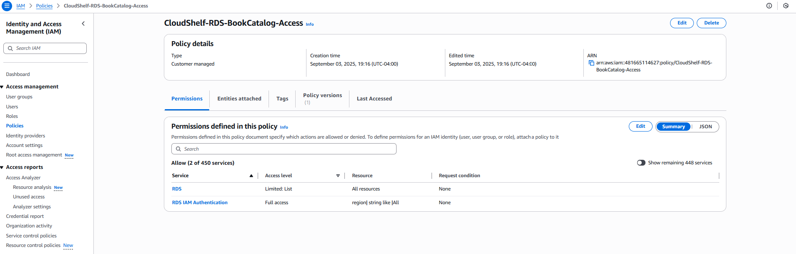
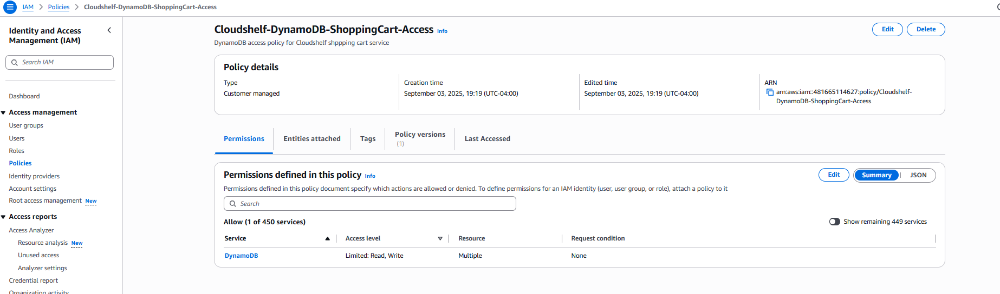
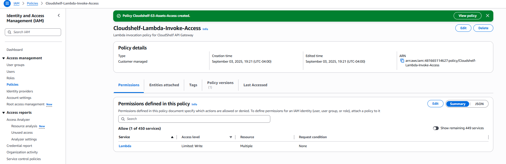
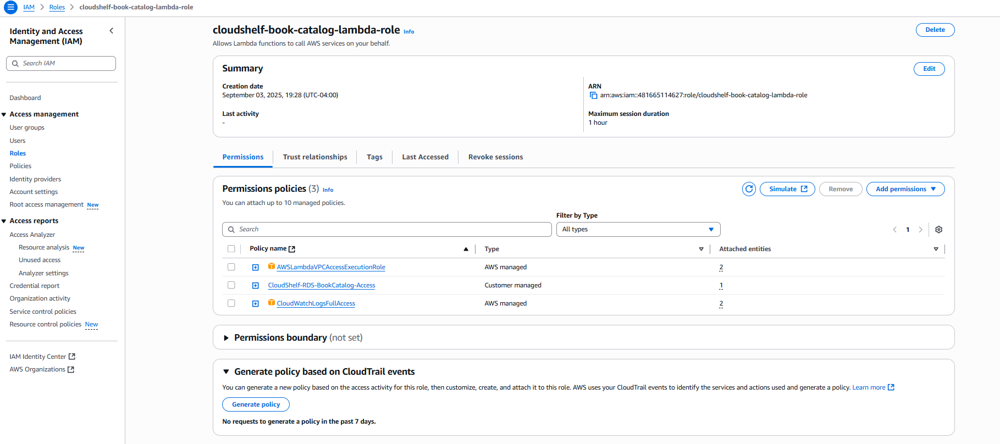
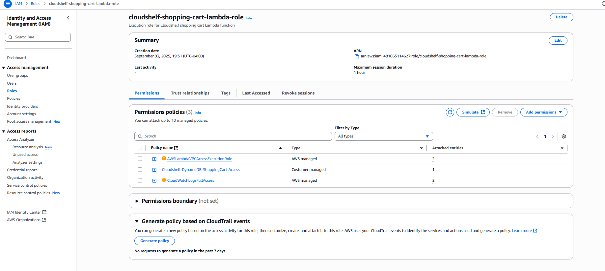

# 🔐 CloudShelf IAM Security Setup

> Implementation guide for AWS Identity and Access Management (IAM) policies, roles, and security configuration

This guide provides step-by-step instructions for setting up IAM security for the CloudShelf online bookstore serverless architecture, implementing security-first design principles with least privilege access.

---

## 🏛️ Architecture Overview

IAM security provides the foundation for all CloudShelf services with:

- **🔒 Least Privilege Access** - Minimal permissions for each service
- **🏗️ Service-Specific Roles** - Dedicated roles for Lambda, RDS, API Gateway
- **⚡ Cross-Service Access** - Secure communication between AWS services
- **📈 Scalable Security** - Role-based access that scales with architecture

**IAM Security Strategy**: CloudShelf implements a role-based security model with customer-managed policies for governance, least-privilege access principles, and network-level security groups for defense in depth. The security model follows AWS Well-Architected Framework principles with explicit trust relationships between services.


---

## 🚀 Implementation Steps

### Step 1: Create Custom IAM Policies

> **📝 Best Practice**: Create customer-managed policies first, then attach them to roles for better governance and reusability.

#### CloudShelf RDS Access Policy

**Policy Name**: `CloudShelf-RDS-BookCatalog-Access`  
**Description**: "RDS access policy for CloudShelf book catalog service"

```json
{
  "Version": "2012-10-17",
  "Statement": [
    {
      "Effect": "Allow",
      "Action": ["rds:DescribeDBInstances", "rds:DescribeDBClusters"],
      "Resource": "*"
    },
    {
      "Effect": "Allow",
      "Action": ["rds-db:connect"],
      "Resource": "arn:aws:rds-db:*:*:dbuser:cloudshelf-db/book_catalog_user"
    }
  ]
}
```



#### CloudShelf DynamoDB Access Policy

**Policy Name**: `CloudShelf-DynamoDB-ShoppingCart-Access`  
**Description**: "DynamoDB access policy for CloudShelf shopping cart service"

```json
{
  "Version": "2012-10-17",
  "Statement": [
    {
      "Effect": "Allow",
      "Action": [
        "dynamodb:GetItem",
        "dynamodb:PutItem",
        "dynamodb:UpdateItem",
        "dynamodb:DeleteItem",
        "dynamodb:Query",
        "dynamodb:Scan"
      ],
      "Resource": [
        "arn:aws:dynamodb:*:*:table/cloudshelf-shopping-cart",
        "arn:aws:dynamodb:*:*:table/cloudshelf-shopping-cart/index/*"
      ]
    }
  ]
}
```



#### CloudShelf Lambda Invoke Policy

> **📝 Note**: This policy is for future use cases where other AWS services might need to invoke Lambda functions programmatically. API Gateway uses resource-based policies instead.

**Policy Name**: `CloudShelf-Lambda-Invoke-Access`  
**Description**: "Lambda invocation policy for programmatic access (future use)"

```json
{
  "Version": "2012-10-17",
  "Statement": [
    {
      "Effect": "Allow",
      "Action": ["lambda:InvokeFunction"],
      "Resource": [
        "arn:aws:lambda:*:*:function:cloudshelf-book-catalog",
        "arn:aws:lambda:*:*:function:cloudshelf-shopping-cart"
      ]
    }
  ]
}
```



#### CloudShelf S3 Access Policy

**Policy Name**: `CloudShelf-S3-Assets-Access`  
**Description**: "S3 access policy for CloudShelf asset management"

```json
{
  "Version": "2012-10-17",
  "Statement": [
    {
      "Effect": "Allow",
      "Action": ["s3:GetObject", "s3:PutObject"],
      "Resource": [
        "arn:aws:s3:::cloudshelf-assets/*",
        "arn:aws:s3:::cloudshelf-logs/*"
      ]
    }
  ]
}
```


---

### Step 2: Create IAM Roles

Now create roles and attach the custom policies created in Step 1.

#### Book Catalog Lambda Role

**Configuration Requirements:**

- **Trusted entity**: AWS service (Lambda)
- **Role name**: `cloudshelf-book-catalog-lambda-role`
- **Description**: "Execution role for CloudShelf book catalog Lambda function"

**Attach Policies:**

- **AWS Managed**: `AWSLambdaVPCAccessExecutionRole`
- **AWS Managed**: `CloudWatchLogsFullAccess`
- **Custom**: `CloudShelf-RDS-BookCatalog-Access`



#### Shopping Cart Lambda Role

**Configuration Requirements:**

- **Trusted entity**: AWS service (Lambda)
- **Role name**: `cloudshelf-shopping-cart-lambda-role`
- **Description**: "Execution role for CloudShelf shopping cart Lambda function"

**Attach Policies:**

- **AWS Managed**: `AWSLambdaVPCAccessExecutionRole`
- **AWS Managed**: `CloudWatchLogsFullAccess`
- **Custom**: `CloudShelf-DynamoDB-ShoppingCart-Access`



---

## 🔧 Best Practices & Security

<details>
<summary><strong>🔒 IAM Security Best Practices</strong></summary>

### Principle of Least Privilege

- **Service-Specific Roles**: Each service has only required permissions
- **Resource-Level Permissions**: Policies specify exact resources when possible
- **Time-Bound Access**: Use temporary credentials where applicable

### Policy Management

- **Customer-Managed Policies**: Use for reusability and governance
- **Policy Versioning**: Implement versioning for policy changes
- **Regular Audits**: Quarterly permission reviews and cleanup

### Access Patterns

- **No Hardcoded Credentials**: All access through IAM roles
- **VPC Isolation**: Database access only from within VPC
- **API Authentication**: Future implementation of Cognito integration

</details>

<details>
<summary><strong>🛡️ Security Validation & Testing</strong></summary>

### Role Testing

**Lambda Role Validation:**

- Navigate to Lambda Console → Test tab
- Create test event with payload: `{"action":"test-db-connection"}`
- Execute test and review CloudWatch logs for connection success


**API Gateway Integration Test:**

- Use API Gateway Console → Test feature
- Test GET `/books` endpoint
- Verify successful Lambda invocation and response


### Permission Validation

**IAM Role Verification:**

- Navigate to IAM Console → Roles
- Select Lambda role and review attached policies
- Use IAM Policy Simulator to test specific actions


- Use IAM Policy Simulator to test specific actions

**Security Group Validation:**

- Navigate to VPC Console → Security Groups
- Verify Lambda security group outbound rules
- Confirm RDS security group inbound rules

</details>

<details>
<summary><strong>🚨 Security Monitoring</strong></summary>

### CloudWatch Alarms

- **Failed Authentication Attempts**: >10 failed attempts in 5 minutes
- **Unusual API Activity**: 4xx/5xx error rate spikes
- **Database Connection Monitoring**: Connection count approaching limits


### Security Metrics

- **Authentication Success Rate**: >99.5%
- **Authorization Failures**: <0.1% of requests
- **Security Group Violations**: 0 attempts
- **Credential Exposure**: 0 incidents


### Troubleshooting Common Issues

**Lambda Permission Denied:**

- Verify execution role has required policies
- Check resource ARNs in policy statements
- Confirm VPC configuration if applicable


**RDS Connection Failures:**

- Verify IAM database authentication enabled
- Check security group rules
- Confirm database user permissions


**API Gateway 403 Errors:**

- Verify Lambda resource-based policies
- Check API Gateway execution role
- Confirm CORS configuration


</details>

---

## 📚 Additional Resources

- [📖 CloudShelf Architecture Decisions](../cloudshelf-architecture-decisions.md) - Complete ADR documentation
- [🌐 VPC Setup Guide](../vpc/cloudshelf-vpc-setup.md) - Network foundation
- [⚡ Lambda Setup Guide](../lambda/cloudshelf-lambda-setup.md) - Function deployment
- [🔌 API Gateway Setup](../apigateway/cloudshelf-apigateway-setup.md) - API configuration
- [🛡️ Security Architecture](../cloudshelf-security-architecture.md) - Security strategy

---

## 📋 Security Checklist

- [ ] Custom IAM policies created with least privilege permissions
- [ ] IAM roles created and policies attached correctly
- [ ] RDS IAM authentication configured and tested
- [ ] S3 bucket policies restrict access appropriately
- [ ] DynamoDB access policies configured for cart operations
- [ ] CloudWatch logging permissions configured
- [ ] Cross-service permissions explicitly defined
- [ ] No hardcoded credentials in application code
- [ ] Security monitoring and alerting configured
- [ ] Regular security audits scheduled

---

_📋 **Documentation Status**: Complete | ✅ **Client Ready**: Yes | 🔄 **Last Updated**: Implementation Phase_  
_🏗️ **Architecture Phase**: Security Foundation | 👥 **Team**: Solutions Architecture | 📋 **Next**: Application Deployment_
