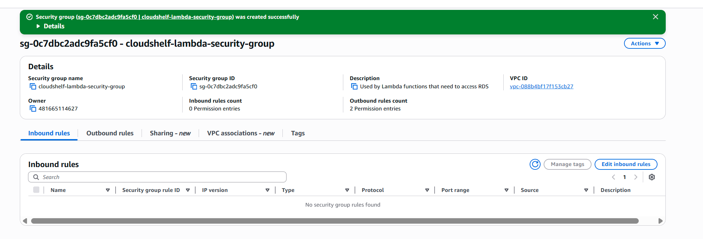

# 🌐 CloudShelf VPC Network Setup

> Implementation guide for VPC networking foundation following ADR-001 architecture strategy

This guide provides setup instructions for AWS VPC networking infrastructure, implementing the network-first infrastructure decisions documented in [ADR-001: VPC Creation Timing and Strategy](../cloudshelf-architecture-decisions.md#adr-001-vpc-creation-timing-and-strategy).

---

## 🔒 Network Security Principles

### **🛡️ Security-First VPC Design**

**Key Security Benefits**:

- **Network Isolation** - VPC creates a private cloud environment
- **Traffic Control** - Security groups act as virtual firewalls
- **Private Resources** - Databases never exposed to internet
- **Controlled Access** - Only necessary ports and protocols allowed

**Security Architecture**:

- **Public Subnets**: API Gateway endpoints only
- **Private Subnets**: Lambda functions and databases
- **No Direct Database Access**: RDS accessible only from Lambda
- **Encrypted Communication**: All traffic uses HTTPS/TLS

---

## 🏛️ Architecture Overview

Based on **ADR-001**, VPC provides the network foundation for CloudShelf with:

- **🔒 Network Isolation** - Secure, private network environment
- **🏗️ Multi-Tier Architecture** - Public and private subnet separation
- **⚡ Connectivity Foundation** - Internet gateway and routing infrastructure
- **📈 Scalable Design** - Foundation for all application resources

**Architecture Decision Reference**: See [ADR-001](../cloudshelf-architecture-decisions.md#adr-001) for the complete rationale behind VPC-first approach.

### **🏗️ VPC Architecture Design**

_Complete VPC architecture showing subnets, gateways, security groups, and routing relationships_

_Security group relationships and traffic flow patterns_

---

## 🏗️ Architecture Strategy

### **📋 Network Design Pattern**

Following ADR-001 dependency management approach:

| Layer                  | Component        | Purpose                   | CIDR          |
| ---------------------- | ---------------- | ------------------------- | ------------- |
| **Network Foundation** | VPC              | Network isolation         | `10.0.0.0/16` |
| **Public Tier**        | Public Subnets   | Internet-facing resources | `10.0.1.0/24` |
| **Private Tier**       | Private Subnets  | Backend resources         | `10.0.2.0/24` |
| **Connectivity**       | Internet Gateway | External network access   | N/A           |

### **🏗️ Dependency Order**

Per ADR-001, infrastructure creation follows this sequence:

1. **VPC and Subnets** (Network Foundation)
2. **Internet Gateway and Routing** (Connectivity)
3. **Security Configuration** (Access Control - see [IAM Security Setup](../security/cloudshelf-iam-security-setup.md))
4. **Application Resources** (RDS, Lambda, etc.)

---

## 🚀 Implementation Guide

### **Step 1: Create VPC**

Create a Virtual Private Cloud to isolate your resources.

**Configuration:**

- CIDR Block: `10.0.0.0/16` (provides 65,536 IP addresses)
- Enable DNS support and DNS hostnames

---

### **Step 2: Create Internet Gateway**

Create and attach an Internet Gateway to enable internet access for public subnets.

---

### **Step 3: Create Public Subnet**

Create a public subnet for internet-facing resources.

**Configuration:**

- CIDR Block: `10.0.1.0/24` (256 IP addresses)
- Availability Zone: Choose your preferred AZ (e.g., us-east-1a)

---

### **Step 4: Create Private Subnet**

Create a private subnet for backend resources.

**Configuration:**

- CIDR Block: `10.0.2.0/24` (256 IP addresses)
- Availability Zone: Different from public subnet for high availability

---

### **Step 5: Configure Route Tables**

Set up routing to direct traffic properly between subnets and the internet.

**Public Route Table Configuration:**

- Route `0.0.0.0/0` → Internet Gateway
- Associate with public subnet

**Private Route Table Configuration:**

- Keep default routes (no internet access)
- Associate with private subnet

---

### **Step 6: Security Groups Configuration**

Configure security groups to control network traffic at the instance level.

#### Lambda Security Group

**Configuration Requirements:**

- **Name**: `cloudshelf-lambda-sg`
- **Description**: "Security group for Lambda functions"
- **VPC**: CloudShelf VPC

**Outbound Rules:**

- **HTTPS (443)** to `0.0.0.0/0` (AWS API calls)
- **PostgreSQL (5432)** to RDS security group
- **HTTPS (443)** to DynamoDB VPC endpoint

#### RDS Security Group

**Configuration Requirements:**

- **Name**: `cloudshelf-rds-sg`
- **Description**: "Security group for RDS PostgreSQL database"
- **VPC**: CloudShelf VPC

**Inbound Rules:**

- **PostgreSQL (5432)** from Lambda security group only
- **No public access**

**Outbound Rules:**

- **All traffic** to `0.0.0.0/0` (default - for maintenance)

#### API Gateway Security Group (Optional)

> **📝 Note**: API Gateway doesn't require VPC security groups unless using VPC Links for private integration.

For standard public API Gateway deployment, no additional security groups are needed.

---

### **Step 7: VPC Endpoints (Optional)**

Configure VPC endpoints for cost-effective AWS service access without internet gateway.

#### DynamoDB VPC Endpoint

**Configuration Requirements:**

- **Service**: `com.amazonaws.region.dynamodb`
- **Type**: Gateway endpoint
- **Route Tables**: Associate with private route table

#### S3 VPC Endpoint

**Configuration Requirements:**

- **Service**: `com.amazonaws.region.s3`
- **Type**: Gateway endpoint
- **Route Tables**: Associate with private route table

---

### **Step 8: NAT Gateway (Optional)**

> ⚠️ **Cost Warning**: NAT Gateway costs approximately $45/month and is not needed for this tutorial.

**Alternatives for development:**

- ✅ **Skip NAT Gateway** - Keep private subnets truly private
- ✅ **Use public subnets** - For development/testing (not production)
- ✅ **NAT Instance** - Cheaper EC2-based alternative (more maintenance required)

---

**Next Step**: Complete the [🔐 IAM Security Setup Guide](../security/cloudshelf-iam-security-setup.md) for comprehensive security group configuration.

---

## � Best Practices & Troubleshooting

<strong>🌠VPC Networking Best Practices</strong>

### Network Design

- **Use consistent CIDR blocks** - Plan IP address ranges to avoid conflicts
- **Multi-AZ deployment** - Distribute subnets across availability zones for high availability
- **Separate public/private tiers** - Keep backend resources in private subnets
- **Logical naming conventions** - Use descriptive names with project prefix

### Cost Optimization

- **Skip NAT Gateway for development** - Use public subnets or NAT instances instead
- **Right-size subnets** - Don't over-provision IP addresses you won't use
- **Monitor data transfer** - Track inter-AZ and internet gateway costs

### Scalability Planning

- **Reserve IP space** - Use larger CIDR blocks than immediately needed
- **Plan for growth** - Consider future subnet requirements
- **Document network topology** - Maintain clear architecture diagrams

<strong>🔧 VPC Troubleshooting</strong>

### Common Networking Issues

**1. Resources can't communicate within VPC**

- ✅ Check: Resources are in the same VPC
- ✅ Check: Route tables are properly configured
- ✅ Check: NACLs allow traffic (default allows all)

**2. No internet access from public subnet**

- ✅ Check: Internet Gateway is attached to VPC
- ✅ Check: Route table has 0.0.0.0/0 → Internet Gateway route
- ✅ Check: Public IP or Elastic IP is assigned

**3. Private subnet can't reach internet (if needed)**

- ✅ Check: NAT Gateway is deployed in public subnet
- ✅ Check: Private route table routes 0.0.0.0/0 → NAT Gateway
- ✅ Check: NAT Gateway has Elastic IP assigned

### Testing VPC Connectivity

**Console-Based Testing:**

**Internet Connectivity Test:**

- Launch EC2 instance in public subnet
- Use Session Manager to connect (no SSH keys needed)
- Test internet access through instance browser/curl

**VPC DNS Resolution Test:**

- Navigate to VPC Console → DNS hostnames/resolution settings
- Verify both DNS resolution and DNS hostnames are enabled

**Route Table Verification:**

- Navigate to VPC Console → Route Tables
- Verify routes for public and private subnets
- Check association with correct subnets

---

## 📚 Related Documentation

- 🏛️ [**ADR-001: VPC Creation Strategy**](../cloudshelf-architecture-decisions.md#adr-001) - Complete VPC-first architecture rationale
- 🏛️ [**All Architecture Decisions**](../cloudshelf-architecture-decisions.md) - Context for network architecture choices
- � [**IAM Security Setup**](../security/cloudshelf-iam-security-setup.md) - Security groups and access control configuration
- �🗃️ [**RDS Setup**](../rds/cloudshelf-rds-setup.md) - Database deployment requiring VPC foundation
- 🗂️ [**DynamoDB Setup**](../dynamodb/cloudshelf-dynamodb-setup.md) - NoSQL service integration
- ⚡ [**Lambda Setup**](../lambda/cloudshelf-lambda-setup.md) - Compute layer requiring VPC connectivity

---

## 📋 Quick Reference

<strong>📊 VPC Configuration Values</strong>

### **Network Configuration**

- **VPC CIDR**: `10.0.0.0/16` (65,536 IP addresses)
- **Public Subnet CIDR**: `10.0.1.0/24` (256 IP addresses)
- **Private Subnet CIDR**: `10.0.2.0/24` (256 IP addresses)
- **Availability Zones**: Use different AZs for high availability

### **Resource Naming Convention**

- **VPC**: `cloudshelf-vpc`
- **Public Subnet**: `cloudshelf-public-subnet-1a`
- **Private Subnet**: `cloudshelf-private-subnet-1b`
- **Internet Gateway**: `cloudshelf-igw`
- **Route Tables**: `cloudshelf-public-rt`, `cloudshelf-private-rt`

### **VPC Best Practices Checklist**

- ✅ Use different Availability Zones for high availability
- ✅ Keep databases and backend resources in private subnets
- ✅ Enable DNS hostnames and DNS resolution
- ✅ Configure security groups with least privilege access
- ✅ Set up Lambda security group for AWS API and database access
- ✅ Configure RDS security group to only allow Lambda access
- ✅ Use descriptive names with project prefix
- ✅ Plan CIDR blocks to avoid future conflicts
- ✅ Document network architecture and dependencies
- ✅ Configure VPC endpoints for cost optimization (optional)
- ⚠️ Avoid NAT Gateway for cost savings in development environments

### **Next Steps After VPC Setup**

1. **Security Configuration**: Complete [IAM Security Setup](../security/cloudshelf-iam-security-setup.md) for security groups
2. **Database Setup**: Deploy [RDS PostgreSQL](../rds/cloudshelf-rds-setup.md) in private subnet
3. **Application Layer**: Configure [Lambda functions](../lambda/cloudshelf-lambda-setup.md) with VPC access
4. **Storage Layer**: Set up [DynamoDB](../dynamodb/cloudshelf-dynamodb-setup.md) integration

---

_📋 **Documentation Status**: Complete | ✅ **Client Ready**: Yes | 🔄 **Last Updated**: Implementation Phase_  
_🏗️ **Architecture Phase**: Network Foundation | 👥 **Team**: Solutions Architecture | 📋 **Next**: IAM Security Setup_
