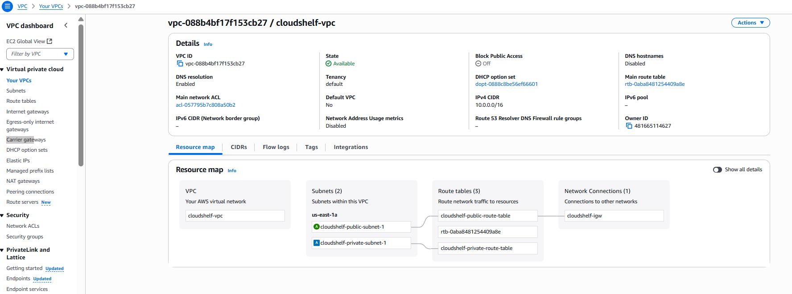

# 🌐 VPC and Security Groups Setup

> Implementation guide for VPC networking foundation following ADR-001 architecture strategy

This guide provides setup instructions for AWS VPC and security groups, implementing the network-first infrastructure decisions documented in [ADR-001: VPC Creation Timing and Strategy](../cloudshelf-architecture-decisions.md#adr-001-vpc-creation-timing-and-strategy).

---

## 🏛️ Architecture Overview

Based on **ADR-001**, VPC provides the network foundation for CloudShelf with:

- **🔒 Network Isolation** - Secure, private network environment
- **🏗️ Multi-Tier Architecture** - Public and private subnet separation
- **⚡ Security Foundation** - Security groups for access control
- **📈 Scalable Design** - Foundation for all application resources

**Architecture Decision Reference**: See [ADR-001](../cloudshelf-architecture-decisions.md#adr-001) for the complete rationale behind VPC-first approach.

### **🏗️ VPC Architecture Design**


_Complete VPC architecture showing subnets, gateways, and security group relationships_

---

## 🔐 Architecture Strategy

### **📋 Network Design Pattern**

Following ADR-001 dependency management approach:

| Layer                  | Component       | Purpose                   | CIDR          |
| ---------------------- | --------------- | ------------------------- | ------------- |
| **Network Foundation** | VPC             | Network isolation         | `10.0.0.0/16` |
| **Public Tier**        | Public Subnets  | Internet-facing resources | `10.0.1.0/24` |
| **Private Tier**       | Private Subnets | Backend resources         | `10.0.2.0/24` |
| **Security**           | Security Groups | Access control rules      | N/A           |

### **🏗️ Dependency Order**

Per ADR-001, infrastructure creation follows this sequence:

1. **VPC and Subnets** (Network Foundation)
2. **Internet Gateway and Routing** (Connectivity)
3. **Security Groups** (Access Control)
4. **Application Resources** (RDS, Lambda, etc.)

---

## 🚀 Implementation Guide

### **Step 1: Create VPC**

Create a Virtual Private Cloud to isolate your resources.

**Configuration:**

- CIDR Block: `10.0.0.0/16` (provides 65,536 IP addresses)
- Enable DNS support and DNS hostnames


---

### **Step 2: Create Internet Gateway**

Create and attach an Internet Gateway to enable internet access for public subnets.


---

### **Step 3: Create Public Subnet**

Create a public subnet for internet-facing resources.

**Configuration:**

- CIDR Block: `10.0.1.0/24` (256 IP addresses)
- Availability Zone: Choose your preferred AZ (e.g., us-east-1a)


---

### **Step 4: Create Private Subnet**

Create a private subnet for backend resources.

**Configuration:**

- CIDR Block: `10.0.2.0/24` (256 IP addresses)
- Availability Zone: Different from public subnet for high availability


---

### **Step 5: Configure Route Tables**

Set up routing to direct traffic properly between subnets and the internet.

**Public Route Table:**

- Route `0.0.0.0/0` → Internet Gateway
- Associate with public subnet

**Private Route Table:**

- Keep default routes (no internet access)
- Associate with private subnet


---

### **Step 6: NAT Gateway (Optional)**

> ⚠️ **Cost Warning**: NAT Gateway costs approximately $45/month and is not needed for this tutorial.

**Alternatives for development:**

- ✅ **Skip NAT Gateway** - Keep private subnets truly private
- ✅ **Use public subnets** - For development/testing (not production)
- ✅ **NAT Instance** - Cheaper EC2-based alternative (more maintenance required)

---

## 🔒 Security Groups Configuration

Security groups act as virtual firewalls to control inbound and outbound traffic for your AWS resources. Think of them as instance-level firewalls that control traffic at the network interface level.


---

### **Step 7: Lambda Security Group**

**Purpose**: Controls network access for Lambda functions

**Configuration:**

1. Navigate to **EC2 Console** → **Security Groups**
2. Click **Create Security Group**
3. **Name**: `cloudshelf-lambda-sg`
4. **Description**: `Security group for CloudShelf Lambda functions`
5. **VPC**: Select your CloudShelf VPC

**Rules:**

| Direction | Type        | Protocol | Port Range | Source/Destination | Description                  |
| --------- | ----------- | -------- | ---------- | ------------------ | ---------------------------- |
| Outbound  | All Traffic | All      | All        | 0.0.0.0/0          | Allow all outbound (default) |
| Inbound   | -           | -        | -          | -                  | No inbound rules needed      |

> 💡 **Why no inbound rules?** Lambda functions are invoked by AWS services (API Gateway, S3, etc.) through AWS's internal network, not through your VPC.

---

### **Step 8: RDS Security Group**

**Purpose**: Controls database access for PostgreSQL RDS instance

**Configuration:**

1. Click **Create Security Group**
2. **Name**: `cloudshelf-rds-sg`
3. **Description**: `Security group for CloudShelf PostgreSQL database`
4. **VPC**: Select your CloudShelf VPC

**Rules:**

| Direction | Type        | Protocol | Port Range | Source/Destination   | Description                  |
| --------- | ----------- | -------- | ---------- | -------------------- | ---------------------------- |
| Inbound   | PostgreSQL  | TCP      | 5432       | cloudshelf-lambda-sg | Database access from Lambda  |
| Outbound  | All Traffic | All      | All        | 0.0.0.0/0            | Allow all outbound (default) |

> 🔒 **Security Best Practice**: This configuration allows access only from the Lambda security group, not from all IPs. This ensures only Lambda functions can access the database.

---

### **Step 9: ALB Security Group (Optional)**

**Purpose**: Controls traffic for Application Load Balancer (if using one later)

**Configuration:**

1. Click **Create Security Group**
2. **Name**: `cloudshelf-alb-sg`
3. **Description**: `Security group for CloudShelf Application Load Balancer`
4. **VPC**: Select your CloudShelf VPC

**Rules:**

| Direction | Type        | Protocol | Port Range | Source/Destination | Description               |
| --------- | ----------- | -------- | ---------- | ------------------ | ------------------------- |
| Inbound   | HTTP        | TCP      | 80         | 0.0.0.0/0          | Allow HTTP from internet  |
| Inbound   | HTTPS       | TCP      | 443        | 0.0.0.0/0          | Allow HTTPS from internet |
| Outbound  | All Traffic | All      | All        | 0.0.0.0/0          | Allow all outbound        |

---

## 📚 Best Practices & Troubleshooting

<details>
<summary><strong>🔒 Security Group Best Practices</strong></summary>

### ✅ **Do's**

- **Use descriptive names** - Include project name and resource type
- **Reference other security groups** - Use security group IDs as sources instead of IP ranges
- **Apply least privilege** - Only open ports that are absolutely necessary
- **Document rules** - Add meaningful descriptions to each rule
- **Use separate groups** - Create different security groups for different tiers/services

### ❌ **Don'ts**

- **Don't use 0.0.0.0/0 for SSH** - Use your specific IP address instead
- **Don't open unnecessary ports** - Each open port is a potential security risk
- **Don't mix environments** - Keep dev, staging, and prod security groups separate
- **Don't hardcode IPs** - Use security group references for internal communication

</details>

<details>
<summary><strong>🔧 Troubleshooting Common Issues</strong></summary>

### **1. Lambda can't reach RDS**

- ✅ Check: Lambda security group is allowed in RDS security group
- ✅ Check: Both resources are in the same VPC
- ✅ Check: Lambda is deployed in private subnets

### **2. Application Load Balancer not accessible**

- ✅ Check: Ports 80/443 are open to 0.0.0.0/0
- ✅ Check: ALB is in public subnets
- ✅ Check: Internet Gateway is attached

### **3. Can't SSH to EC2** (if using)

- ✅ Check: Port 22 is open to your IP address
- ✅ Check: Correct key pair is assigned
- ✅ Check: Instance is in public subnet (or accessible via bastion)

### **Testing Connectivity**

```bash
# Test database connectivity from Lambda (use Lambda console test)
# Test HTTP/HTTPS access to ALB
curl -I http://your-alb-dns-name.region.elb.amazonaws.com
```

</details>

---

## 📚 Related Documentation

- 🏛️ [**ADR-001: VPC Creation Strategy**](../cloudshelf-architecture-decisions.md#adr-001) - Complete VPC-first architecture rationale
- 🏛️ [**All Architecture Decisions**](../cloudshelf-architecture-decisions.md) - Context for network architecture choices
- 🗃️ [**RDS Setup**](../rds/cloudshelf-rds-setup.md) - Database deployment requiring VPC foundation
- 🗂️ [**DynamoDB Setup**](../dynamodb/cloudshelf-dynamodb-setup.md) - NoSQL service integration
- ⚡ [**Lambda Setup**](../lambda/cloudshelf-lambda-setup.md) - Compute layer requiring VPC connectivity

---

## 📋 Quick Reference

<details>
<summary><strong>📊 Configuration Values</strong></summary>

### **Network Configuration**

- **VPC CIDR**: `10.0.0.0/16`
- **Public Subnet CIDR**: `10.0.1.0/24`
- **Private Subnet CIDR**: `10.0.2.0/24`
- **Database Port**: `5432` (PostgreSQL)

### **Security Group Names**

- **Lambda SG**: `cloudshelf-lambda-sg`
- **RDS SG**: `cloudshelf-rds-sg`
- **ALB SG**: `cloudshelf-alb-sg` (optional)

### **Port Reference**

| Service    | Port | Protocol | Purpose                   |
| ---------- | ---- | -------- | ------------------------- |
| PostgreSQL | 5432 | TCP      | Database access           |
| HTTP       | 80   | TCP      | Web traffic               |
| HTTPS      | 443  | TCP      | Secure web traffic        |
| SSH        | 22   | TCP      | Remote access (if needed) |

### **Best Practices Checklist**

- ✅ Use different Availability Zones for high availability
- ✅ Keep databases in private subnets
- ✅ Use security groups instead of NACLs for simplicity
- ✅ Follow principle of least privilege for security group rules
- ✅ Reference security groups by ID/name, not IP addresses
- ✅ Use descriptive names with project prefix
- ⚠️ Avoid NAT Gateway for cost savings in development
- 🔒 Never open SSH (port 22) to 0.0.0.0/0 in production

</details>

---

**External Reference**: [AWS VPC Documentation](https://docs.aws.amazon.com/vpc/latest/userguide/what-is-amazon-vpc.html)

_Part of the CloudShelf Solutions Architecture documentation_  
_Last updated: September 3, 2025_
