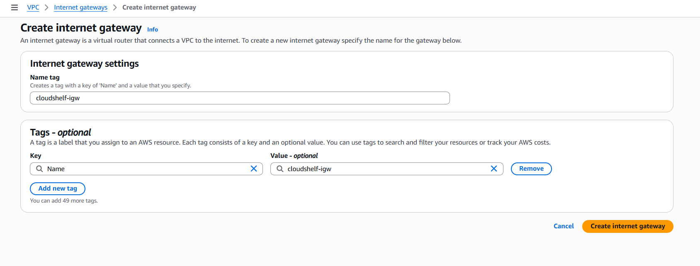

# VPC and Security Group Setup Guide

This guide provides step-by-step instructions for setting up a VPC and security groups for the CloudShelf Online Bookstore project on AWS.

## Overview

This setup creates a secure, multi-tier network architecture suitable for a web application with the following components:

- **VPC**: Virtual Private Cloud for network isolation
- **Public Subnets**: For internet-facing resources (load balancers, etc.)
- **Private Subnets**: For backend resources (RDS, Lambda functions)
- **Security Groups**: Firewall rules to control traffic between components

## Architecture Diagram


---

## Step-by-Step Setup Instructions

### Step 1: Create a VPC

Create a Virtual Private Cloud to isolate your resources.

**Configuration:**

- CIDR Block: `10.0.0.0/16` (provides 65,536 IP addresses)
- Enable DNS support and DNS hostnames


### Step 2: Create an Internet Gateway

Create and attach an Internet Gateway to enable internet access for public subnets.



### Step 3: Create a Public Subnet

Create a public subnet for internet-facing resources.

**Configuration:**

- CIDR Block: `10.0.1.0/24` (256 IP addresses)
- Availability Zone: Choose your preferred AZ (e.g., us-east-1a)


### Step 4: Create a Private Subnet

Create a private subnet for backend resources.

**Configuration:**

- CIDR Block: `10.0.2.0/24` (256 IP addresses)
- Availability Zone: Different from public subnet for high availability


### Step 5: Configure Route Tables

Set up routing to direct traffic properly between subnets and the internet.

**Public Route Table:**

- Route `0.0.0.0/0` → Internet Gateway
- Associate with public subnet

**Private Route Table:**

- Keep default routes (no internet access)
- Associate with private subnet


### Step 6: NAT Gateway (Optional - Not Recommended for Beginners)

> ⚠️ **Cost Warning**: NAT Gateway costs approximately $45/month and is not needed for this tutorial.

**Alternatives for beginners:**

- ✅ **Skip NAT Gateway** - Keep private subnets truly private
- ✅ **Use public subnets** - For development/testing (not production)
- ✅ **NAT Instance** - Cheaper EC2-based alternative (more maintenance required)

---

## Security Groups Configuration

Security groups act as virtual firewalls to control inbound and outbound traffic for your AWS resources. Think of them as instance-level firewalls that control traffic at the network interface level.


### Step 7: Create Lambda Security Group

**Purpose**: Controls network access for Lambda functions

**Configuration Steps:**

1. Navigate to **EC2 Console** → **Security Groups**
2. Click **Create Security Group**
3. **Name**: `cloudshelf-lambda-sg`
4. **Description**: `Security group for CloudShelf Lambda functions`
5. **VPC**: Select your CloudShelf VPC

**Rules Configuration:**

| Direction | Type        | Protocol | Port Range | Source/Destination | Description                  |
| --------- | ----------- | -------- | ---------- | ------------------ | ---------------------------- |
| Outbound  | All Traffic | All      | All        | 0.0.0.0/0          | Allow all outbound (default) |
| Inbound   | -           | -        | -          | -                  | No inbound rules needed      |

> 💡 **Why no inbound rules?** Lambda functions are invoked by AWS services (API Gateway, S3, etc.) through AWS's internal network, not through your VPC.

### Step 8: Create RDS Security Group

**Purpose**: Controls database access for PostgreSQL RDS instance

**Configuration Steps:**

1. Click **Create Security Group**
2. **Name**: `cloudshelf-rds-sg`
3. **Description**: `Security group for CloudShelf PostgreSQL database`
4. **VPC**: Select your CloudShelf VPC

**Rules Configuration:**

| Direction | Type        | Protocol | Port Range | Source/Destination   | Description                  |
| --------- | ----------- | -------- | ---------- | -------------------- | ---------------------------- |
| Inbound   | PostgreSQL  | TCP      | 5432       | cloudshelf-lambda-sg | Database access from Lambda  |
| Outbound  | All Traffic | All      | All        | 0.0.0.0/0            | Allow all outbound (default) |

> 🔒 **Security Best Practice**: Notice we're allowing access only from the Lambda security group, not from all IPs. This ensures only your Lambda functions can access the database.

### Step 9: Create ALB Security Group (Optional)

**Purpose**: Controls traffic for Application Load Balancer (if using one later)

**Configuration Steps:**

1. Click **Create Security Group**
2. **Name**: `cloudshelf-alb-sg`
3. **Description**: `Security group for CloudShelf Application Load Balancer`
4. **VPC**: Select your CloudShelf VPC

**Rules Configuration:**

| Direction | Type        | Protocol | Port Range | Source/Destination | Description               |
| --------- | ----------- | -------- | ---------- | ------------------ | ------------------------- |
| Inbound   | HTTP        | TCP      | 80         | 0.0.0.0/0          | Allow HTTP from internet  |
| Inbound   | HTTPS       | TCP      | 443        | 0.0.0.0/0          | Allow HTTPS from internet |
| Outbound  | All Traffic | All      | All        | 0.0.0.0/0          | Allow all outbound        |

### Security Group Best Practices

#### ✅ **Do's**

- **Use descriptive names** - Include project name and resource type
- **Reference other security groups** - Use security group IDs as sources instead of IP ranges
- **Apply least privilege** - Only open ports that are absolutely necessary
- **Document rules** - Add meaningful descriptions to each rule
- **Use separate groups** - Create different security groups for different tiers/services

#### ❌ **Don'ts**

- **Don't use 0.0.0.0/0 for SSH** - Use your specific IP address instead
- **Don't open unnecessary ports** - Each open port is a potential security risk
- **Don't mix environments** - Keep dev, staging, and prod security groups separate
- **Don't hardcode IPs** - Use security group references for internal communication

### Troubleshooting Security Groups

#### Common Issues:

1. **Lambda can't reach RDS**

   - ✅ Check: Lambda security group is allowed in RDS security group
   - ✅ Check: Both resources are in the same VPC
   - ✅ Check: Lambda is deployed in private subnets

2. **Application Load Balancer not accessible**

   - ✅ Check: Ports 80/443 are open to 0.0.0.0/0
   - ✅ Check: ALB is in public subnets
   - ✅ Check: Internet Gateway is attached

3. **Can't SSH to EC2** (if using)
   - ✅ Check: Port 22 is open to your IP address
   - ✅ Check: Correct key pair is assigned
   - ✅ Check: Instance is in public subnet (or accessible via bastion)

### Security Group Testing

After creating your security groups, test connectivity:

```bash
# Test database connectivity from Lambda (use Lambda console test)
# Test HTTP/HTTPS access to ALB
curl -I http://your-alb-dns-name.region.elb.amazonaws.com
```

---

## Quick Reference

### Key Configuration Values

- **VPC CIDR**: `10.0.0.0/16`
- **Public Subnet CIDR**: `10.0.1.0/24`
- **Private Subnet CIDR**: `10.0.2.0/24`
- **Database Port**: `5432` (PostgreSQL)

### Security Group Names

- **Lambda SG**: `cloudshelf-lambda-sg`
- **RDS SG**: `cloudshelf-rds-sg`
- **ALB SG**: `cloudshelf-alb-sg` (optional)

### Port Reference

| Service    | Port | Protocol | Purpose                   |
| ---------- | ---- | -------- | ------------------------- |
| PostgreSQL | 5432 | TCP      | Database access           |
| HTTP       | 80   | TCP      | Web traffic               |
| HTTPS      | 443  | TCP      | Secure web traffic        |
| SSH        | 22   | TCP      | Remote access (if needed) |

### Best Practices

- ✅ Use different Availability Zones for high availability
- ✅ Keep databases in private subnets
- ✅ Use security groups instead of NACLs for simplicity
- ✅ Follow principle of least privilege for security group rules
- ✅ Reference security groups by ID/name, not IP addresses
- ✅ Use descriptive names with project prefix
- ⚠️ Avoid NAT Gateway for cost savings in development
- 🔒 Never open SSH (port 22) to 0.0.0.0/0 in production

---

For more details, see the [AWS VPC documentation](https://docs.aws.amazon.com/vpc/latest/userguide/what-is-amazon-vpc.html).

_Last updated: 2025-09-01_
