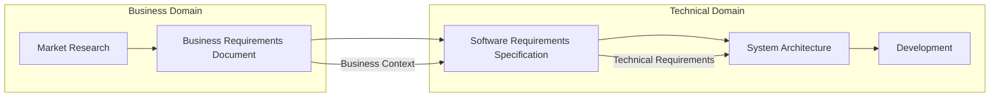

# 📊 Document Comparison: BRD vs SRS

> **Understanding the difference between Business Requirements Document and Software Requirements Specification**
> 
> *Two essential documents that serve different stakeholders and purposes*

---

## 🔍 Key Differences Overview

| **Aspect** | **Business Requirements Document (BRD)** | **Software Requirements Specification (SRS)** |
|------------|-------------------------------------------|------------------------------------------------|
| **Purpose** | WHY we're building this system | WHAT the system needs to do |
| **Audience** | Business stakeholders, executives, investors | Development team, architects, testers |
| **Focus** | Business goals, market opportunity, ROI | Technical functionality, system behavior |
| **Language** | Business language, metrics, objectives | Technical language, specifications |
| **Timeline** | Created before development starts | Created after BRD, before detailed design |
| **Owner** | Product Manager, Business Analyst | Systems Analyst, Solutions Architect |

---

## 📋 Document Comparison: CloudShelf Example

### **Business Requirements Document (BRD)**

**What it Contains:**
```markdown
✅ Business Context:
   - Market opportunity ($2.3B market)
   - Revenue targets ($2M → $46M over 3 years)
   - Competitive positioning
   - Company background and funding

✅ Business Objectives:
   - Financial goals (revenue, profit margins)
   - Customer experience goals (< 2 sec page loads)
   - Market share targets (2% in 3 years)
   - Growth metrics (10K → 85K customers)

✅ Budget & Constraints:
   - Infrastructure budget ($800 → $4,000/month)
   - Timeline constraints (6-month MVP)
   - Team limitations (3 developers, 1 DevOps)
   - Regulatory requirements (PCI DSS, GDPR)

✅ Success Criteria:
   - Business KPIs (customer acquisition cost < $15)
   - Financial metrics (LTV > $150)
   - Customer satisfaction (NPS > 50)
```

**BRD Language Example:**
> "CloudShelf aims to capture 2% of the $2.3B online book market within 3 years by providing superior customer experience. Infrastructure costs must remain below 0.5% of revenue to maintain profitability."

### **Software Requirements Specification (SRS)**

**What it Contains:**
```markdown
✅ Functional Requirements:
   - FR-1: System shall allow user registration
   - FR-2: System shall allow book catalog browsing
   - FR-3: System shall support shopping cart functionality
   - FR-4: System shall process secure payments

✅ Non-Functional Requirements:
   - NFR-1: 99.9% uptime availability
   - NFR-2: Support 10,000 concurrent users
   - NFR-3: < 2 second response times
   - NFR-4: GDPR compliance for data handling

✅ Technical Specifications:
   - System interfaces and APIs
   - Data formats and structures
   - Security requirements
   - Performance benchmarks
```

**SRS Language Example:**
> "FR-2: The system shall allow users to browse and search the book catalog. NFR-4: The system shall respond to user actions within 2 seconds."

---

## 🎯 Purpose & Audience Breakdown

### **Business Requirements Document (BRD)**

**Primary Audience:**
- 👔 **Business Stakeholders**: CEO, Product Manager, Marketing
- 💰 **Investors/Executives**: Understanding ROI and market opportunity  
- 📊 **Sales Team**: Understanding value proposition
- 💼 **Legal/Compliance**: Understanding regulatory requirements

**Key Questions BRD Answers:**
- WHY are we building this? (Market opportunity)
- WHAT business value will it create? (Revenue, market share)
- HOW MUCH will it cost and what's the ROI? (Budget, timeline)
- WHO are our customers and what do they need? (Market analysis)
- WHEN do we need to launch? (Business timeline)

**Business Language Focus:**
- Revenue and profit targets
- Market share and competitive analysis
- Customer satisfaction and retention
- Cost-benefit analysis
- Risk and opportunity assessment

### **Software Requirements Specification (SRS)**

**Primary Audience:**
- 👨‍💻 **Development Team**: Understanding what to build
- 🏗️ **Solutions Architects**: Designing system architecture
- 🧪 **QA/Testing Team**: Understanding what to test
- 🚀 **DevOps Team**: Understanding deployment requirements

**Key Questions SRS Answers:**
- WHAT functionality must the system provide? (Functional requirements)
- HOW well must it perform? (Non-functional requirements)
- WHAT are the technical constraints? (System limitations)
- HOW should components interact? (Interface specifications)
- WHAT data must be stored and processed? (Data requirements)

**Technical Language Focus:**
- System behavior and functionality
- Performance and scalability requirements
- Security and compliance specifications
- Integration and interface requirements
- Technical constraints and assumptions

---

## 🔄 Document Relationship & Flow



### **How They Work Together:**

1. **BRD Drives SRS**: Business requirements inform technical requirements
2. **SRS Translates BRD**: Converts business needs into technical specifications
3. **Both Inform Architecture**: Solutions architects use both to design systems

**Example Connection:**
- **BRD States**: "Must handle Black Friday traffic spikes (10x normal load) while maintaining < 2 second page loads"
- **SRS Translates**: "NFR-2: System shall support 50,000 concurrent users with 95th percentile response time < 2 seconds"
- **Architecture Responds**: Design auto-scaling Lambda functions with CloudFront CDN

---

## ✅ CloudShelf Document Analysis

### **Your Current SRS**

**Strengths:**
- ✅ Clear functional requirements (FR-1 through FR-7)
- ✅ Specific non-functional requirements (99.9% uptime, 10K users)
- ✅ Technical constraints identified (AWS services)
- ✅ Well-structured for development team

**Areas for Enhancement:**
- 🔄 Add more detailed performance requirements
- 🔄 Include specific API interface requirements
- 🔄 Expand security requirements (data encryption specifics)
- 🔄 Add database schema requirements

### **Your New BRD**

**Strengths:**
- ✅ Comprehensive business context
- ✅ Clear financial objectives and constraints
- ✅ Market opportunity quantified
- ✅ Success metrics defined

**How BRD Enhances Your Project:**
- Justifies architecture decisions with business context
- Provides constraints for Solutions Architect decisions
- Establishes success criteria for technical choices

---

## 🚀 Best Practices for Each Document

### **Business Requirements Document (BRD) Best Practices:**

1. **Start with Business Context**
   - Market size and opportunity
   - Competitive landscape
   - Company goals and strategy

2. **Quantify Everything**
   - Revenue targets with timelines
   - User growth projections  
   - Cost constraints and budgets
   - ROI expectations

3. **Define Success Metrics**
   - Business KPIs (revenue, customers, market share)
   - Customer satisfaction metrics
   - Operational efficiency targets

4. **Include Constraints**
   - Budget limitations
   - Timeline requirements
   - Regulatory compliance
   - Resource constraints

### **Software Requirements Specification (SRS) Best Practices:**

1. **Be Specific and Measurable**
   - "System shall support 10,000 concurrent users" (not "many users")
   - "Response time < 2 seconds for 95th percentile" (not "fast response")

2. **Use Standard Format**
   - Functional Requirements: FR-1, FR-2, etc.
   - Non-Functional Requirements: NFR-1, NFR-2, etc.
   - Clear acceptance criteria for each requirement

3. **Include Technical Details**
   - Interface specifications
   - Data format requirements
   - Security and compliance needs
   - Performance benchmarks

4. **Ensure Traceability**
   - Link each requirement to business need
   - Enable testing verification
   - Support architecture decisions

---

## 🎯 Key Takeaway

**BRD** = Business case for building the system (WHY and WHAT business value)
**SRS** = Technical specification of system behavior (WHAT the system does and HOW well)

Both are essential:
- **BRD** justifies the project and guides business decisions
- **SRS** guides development and testing efforts
- **Together** they ensure technical solutions deliver business value

Your CloudShelf project now has both documents working together effectively!
