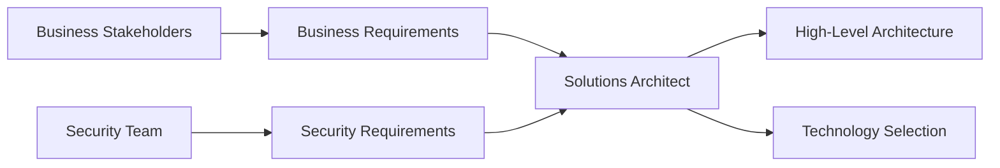
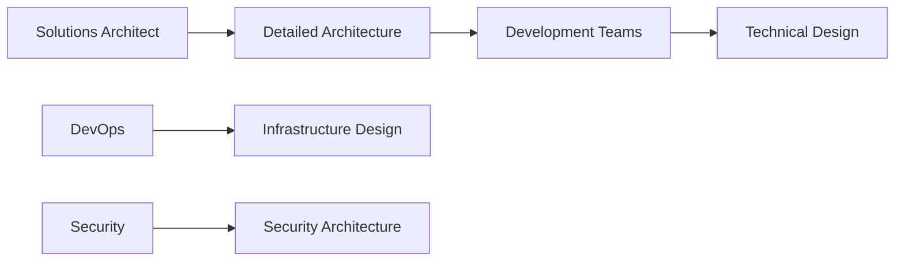
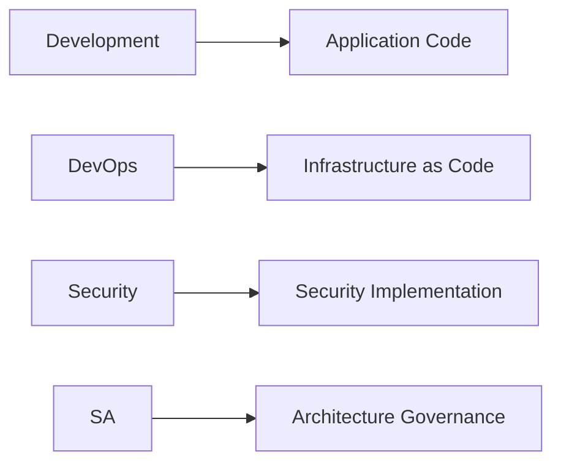

# 🏢 CloudShelf Project Roles & Deliverables

> **Multi-role architecture approach demonstrating full-stack Solutions Architect capabilities**
>
> _How one person can effectively manage architecture, development, and operations while maintaining enterprise standards_

---

## 🎯 CloudShelf Project Structure

**CloudShelf demonstrates a lean but comprehensive approach where one person fulfills multiple enterprise roles:**

### 👨‍💼 **Solo Multi-Role Approach**

| **Role**                   | **Responsibilities**                               | **Deliverables**                                        | **Demonstrates**               |
| -------------------------- | -------------------------------------------------- | ------------------------------------------------------- | ------------------------------ |
| **🏗️ Solutions Architect** | System design, technology selection, documentation | Architecture docs, ADRs, integration patterns           | Enterprise architecture skills |
| **👨‍💻 Developer**           | Implementation, code quality, testing              | Lambda functions, APIs, minimal viable implementations  | Technical execution capability |
| **🚀 DevOps Engineer**     | Infrastructure, deployment, monitoring             | Setup guides, infrastructure patterns, CI/CD approaches | Operational excellence         |

### 🎯 **Benefits of This Approach**

- **📋 Complete Ownership** - End-to-end understanding of all system components
- **🔄 Rapid Iteration** - No handoff delays between architecture and implementation
- **📚 Comprehensive Documentation** - Knowledge transfer ready for team scaling
- **💡 Practical Architecture** - Designs proven through actual implementation

---

## 🏢 Enterprise Context Reference

_The following sections describe typical enterprise role separation for context and comparison:_

## 🎯 Enterprise Executive Summary

In large enterprise projects, clear role separation is crucial for success. Here's what typically comes from **requirements** vs what **Solutions Architects** create vs what other teams deliver:

| **Phase**    | **Business/Requirements**    | **Solutions Architect**                   | **Development Teams**     | **DevOps/Platform**       | **Security Team**     |
| ------------ | ---------------------------- | ----------------------------------------- | ------------------------- | ------------------------- | --------------------- |
| **Planning** | Business goals, user stories | Architecture design, technology selection | Technical feasibility     | Infrastructure strategy   | Security requirements |
| **Design**   | Functional requirements      | System design, integration patterns       | Detailed technical design | Deployment patterns       | Security architecture |
| **Build**    | Acceptance criteria          | Architecture governance                   | Implementation            | CI/CD pipelines           | Security testing      |
| **Deploy**   | User acceptance testing      | Production readiness review               | Code deployment           | Infrastructure automation | Security validation   |
| **Operate**  | Business KPIs                | Performance optimization                  | Bug fixes, features       | Monitoring & operations   | Ongoing security      |

---

## 👥 Enterprise Role Breakdown (For Reference)

### 🏢 **Business Stakeholders / Product Owners**

**What they provide (Requirements):**

```markdown
BUSINESS REQUIREMENTS DOCUMENT (BRD)
├── Business Objectives
│ ├── Revenue targets ($2M annually)
│ ├── Market expansion goals (50,000 users Year 1)
│ └── Competitive positioning
├── Functional Requirements
│ ├── User can search for books
│ ├── User can add books to cart
│ ├── User can complete purchase
│ └── Admin can manage inventory
├── High-Level Non-Functional Requirements
│ ├── Performance: < 2 seconds page load
│ ├── Availability: 99.9% uptime
│ ├── Scalability: Support 10,000 concurrent users
│ └── Security: PCI DSS compliance required
└── Constraints
├── Budget: $500K for infrastructure (Year 1)
├── Timeline: Go-live in 6 months
└── Compliance: GDPR, SOX requirements
```

**NOT their responsibility:**

- How to achieve technical requirements
- Which AWS services to use
- Detailed security architecture
- Infrastructure design
- Deployment strategies

### 🏗️ **Solutions Architect** (Your Role!)

**What you create (Architecture Documents):**

```markdown
SOLUTIONS ARCHITECTURE DELIVERABLES
├── 🏛️ High-Level Architecture
│ ├── System context diagram
│ ├── Reference architecture
│ ├── AWS service selection & justification
│ └── Integration patterns
├── 🔧 Technical Architecture
│ ├── Infrastructure architecture (VPC, subnets, etc.)
│ ├── Application architecture (microservices, APIs)
│ ├── Data architecture (RDS, DynamoDB design)
│ └── Security architecture (IAM, encryption)
├── 📊 Cross-Cutting Concerns
│ ├── Monitoring & observability strategy
│ ├── Disaster recovery & business continuity
│ ├── Performance & scaling strategy
│ └── Cost optimization framework
├── 🚀 Implementation Strategy
│ ├── Deployment strategy (blue-green, etc.)
│ ├── Environment strategy (dev/staging/prod)
│ ├── Migration strategy (if applicable)
│ └── Risk mitigation plans
└── 📋 Governance
├── Architecture principles
├── Design standards
├── Technology stack decisions
└── Trade-off documentation
```

**Key Architect Responsibilities:**

- **Technology Selection**: "We'll use DynamoDB for cart data because..."
- **Architecture Design**: How components interact and scale
- **Trade-off Analysis**: "We chose Lambda over ECS because..."
- **Cost Modeling**: Detailed AWS cost projections and optimization
- **Risk Assessment**: Technical risks and mitigation strategies
- **Standards Definition**: Coding, security, and operational standards

### 👨‍💻 **Development Teams**

**What they create:**

```markdown
DEVELOPMENT DELIVERABLES
├── 🏗️ Detailed Technical Design
│ ├── API specifications (OpenAPI/Swagger)
│ ├── Database schemas (detailed table design)
│ ├── Code architecture patterns
│ └── Component interaction diagrams
├── 💻 Implementation
│ ├── Source code
│ ├── Unit tests
│ ├── Integration tests
│ └── Documentation (README, API docs)
├── 🧪 Testing Strategy
│ ├── Test plans
│ ├── Test automation
│ ├── Performance testing
│ └── Security testing (application level)
└── 📦 Delivery
├── Build artifacts
├── Deployment scripts
├── Configuration management
└── Runbooks
```

**NOT their responsibility (typically):**

- Infrastructure design
- AWS service selection
- Security policies
- Production deployment
- Monitoring setup

### 🚀 **DevOps / Platform Engineering**

**What they create:**

```markdown
DEVOPS/PLATFORM DELIVERABLES
├── 🏗️ Infrastructure as Code
│ ├── Terraform/CloudFormation templates
│ ├── AWS resource provisioning
│ ├── Network configuration
│ └── Security group setup
├── 🔄 CI/CD Pipelines
│ ├── Build automation
│ ├── Deployment automation
│ ├── Testing integration
│ └── Release management
├── 📊 Operations
│ ├── Monitoring setup (CloudWatch, alerts)
│ ├── Logging configuration
│ ├── Backup automation
│ └── Disaster recovery procedures
└── 🔧 Platform Services
├── Container orchestration
├── Service mesh (if applicable)
├── Secret management
└── Certificate management
```

### 🔒 **Security Team**

**What they create:**

```markdown
SECURITY DELIVERABLES
├── 📋 Security Policies
│ ├── Data classification standards
│ ├── Access control policies
│ ├── Compliance requirements
│ └── Security standards
├── 🛡️ Security Architecture
│ ├── Identity & access management (detailed IAM)
│ ├── Network security design
│ ├── Encryption strategies
│ └── Threat modeling
├── 🧪 Security Testing
│ ├── Penetration testing
│ ├── Vulnerability assessments
│ ├── Code security scanning
│ └── Compliance auditing
└── 🚨 Security Operations
├── Incident response procedures
├── Security monitoring
├── Threat detection
└── Security training
```

---

## 📊 Real-World Project Flow

### **Phase 1: Requirements & Planning**



**Typical Timeline: 2-4 weeks**

### **Phase 2: Architecture & Design**



**Typical Timeline: 4-8 weeks**

### **Phase 3: Implementation**



**Typical Timeline: 12-20 weeks**

---

## 🎯 AWS Solutions Architect Best Practices

### **What Makes a Great Solutions Architect Document:**

#### ✅ **DO Include:**

1. **Business Context**: Always start with business drivers
2. **Architectural Principles**: Your design philosophy
3. **Technology Justification**: Why you chose specific AWS services
4. **Trade-off Analysis**: What you considered and why you decided
5. **Cost Analysis**: Detailed cost modeling and optimization strategies
6. **Risk Assessment**: Technical risks and mitigation plans
7. **Scalability Design**: How the system grows with business
8. **Security by Design**: Security considerations throughout
9. **Operational Excellence**: How the system will be maintained
10. **Future Roadmap**: How architecture evolves

#### ❌ **DON'T Include (these come from other teams):**

1. **Detailed Implementation Code**: That's for developers
2. **Specific Infrastructure Scripts**: That's for DevOps
3. **Detailed Security Policies**: That's for Security team
4. **Business Process Details**: That's for Business Analysts
5. **Specific Test Cases**: That's for QA team

### **Example: How to Frame Architect Decisions**

**❌ Poor Architect Documentation:**

```markdown
We will use DynamoDB for the shopping cart.
```

**✅ Excellent Architect Documentation:**

```markdown
### Shopping Cart Data Store Decision

**Business Context**: Cart data requires sub-second response times to support
real-time user interactions and must scale to handle Black Friday traffic spikes
(10x normal load).

**Options Considered**:

1. PostgreSQL RDS - Relational model, ACID compliance
2. DynamoDB - NoSQL, serverless scaling, single-digit millisecond latency
3. ElastiCache Redis - In-memory, fast, but requires persistence strategy

**Decision**: DynamoDB
**Rationale**:

- Meets <100ms latency requirement consistently
- Auto-scales to handle traffic spikes without pre-provisioning
- Reduces operational overhead (serverless)
- Cost-effective for variable workloads ($200/month estimated vs $800/month for RDS)
- TTL feature automatically cleans up abandoned carts

**Trade-offs Accepted**:

- No complex queries (acceptable - cart operations are simple key-value)
- Eventual consistency (acceptable - cart updates aren't mission-critical)

**Implementation Considerations for Dev Teams**:

- Use composite keys (userId + cartId) for data organization
- Implement client-side retry logic for throttling
- Consider DynamoDB Accelerator (DAX) if latency becomes critical

**Cost Impact**: ~$200/month baseline, scales with usage
**Risk Mitigation**: Point-in-time recovery enabled, cross-region replication for DR
```

---

## 📁 Recommended Documentation Structure

Based on industry best practices, here's how to organize your CloudShelf documentation:

```
cloudshelf-online-bookstore/
├── docs/
│   ├── requirements/                    # ← Business provides these
│   │   ├── business-requirements.md
│   │   ├── functional-requirements.md
│   │   ├── non-functional-requirements.md
│   │   └── compliance-requirements.md
│   │
│   ├── architecture/                    # ← YOU (Solutions Architect) create these
│   │   ├── 00-architecture-overview.md
│   │   ├── 01-system-context.md
│   │   ├── 02-reference-architecture.md
│   │   ├── 03-technology-decisions.md
│   │   ├── 04-security-architecture.md
│   │   ├── 05-data-architecture.md
│   │   ├── 06-integration-architecture.md
│   │   ├── 07-deployment-strategy.md
│   │   ├── 08-monitoring-strategy.md
│   │   ├── 09-cost-optimization.md
│   │   └── 10-disaster-recovery.md
│   │
│   ├── technical-design/                # ← Development teams create these
│   │   ├── api-specifications/
│   │   ├── database-design/
│   │   ├── component-design/
│   │   └── testing-strategy/
│   │
│   ├── infrastructure/                  # ← DevOps team creates these
│   │   ├── terraform/
│   │   ├── cloudformation/
│   │   ├── ci-cd/
│   │   └── monitoring/
│   │
│   └── security/                        # ← Security team creates these
│       ├── policies/
│       ├── procedures/
│       ├── testing/
│       └── compliance/
```

---

## 🚀 Action Plan for Your CloudShelf Project

### **Phase 1: Restructure Existing Documentation (1-2 days)**

1. **Move detailed implementation** from architecture docs to technical-design folder
2. **Focus architecture docs** on high-level design and decisions
3. **Add business context** to each architectural decision
4. **Include trade-off analysis** for major technology choices

### **Phase 2: Create Missing Business Context (1 day)**

1. **Create mock business requirements** to show realistic business input
2. **Document assumptions** where business requirements would normally exist
3. **Show how architecture responds** to business requirements

### **Phase 3: Add Professional Polish (1 day)**

1. **Include cost justifications** for all major AWS services
2. **Add risk assessments** and mitigation strategies
3. **Create executive summary** for each architecture document
4. **Add future roadmap** considerations

---

**Your current documentation is actually excellent technical architecture content!** It just needs to be repositioned to clearly show:

- What business problem each decision solves
- Why you chose specific approaches
- What alternatives you considered
- What the cost/risk implications are

This will demonstrate the strategic thinking that separates Solutions Architects from other technical roles.

Would you like me to help restructure one of your existing documents to show this best practice approach?
