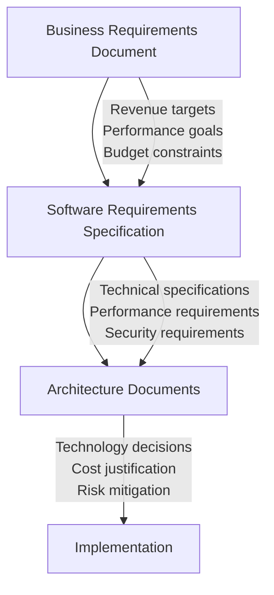

# 📋 CloudShelf Requirements Documentation Strategy

> **Final recommendation for BRD vs SRS structure in your AWS Solutions Architect portfolio**

---

## 🎯 **RECOMMENDATION: Keep Both Documents Separate**

Based on AWS enterprise best practices and Solutions Architect role expectations, maintain both documents as separate deliverables.

---

## ✅ **Your Current Document Structure (PERFECT)**

```
docs/requirements/
├── business-requirements.md     # ← Business stakeholder document
├── cloudshelf-srs.md           # ← Technical team document  
├── cloudshelf-user-stories.md  # ← Development team reference
├── cloudshelf-use-cases.md     # ← Functional analysis
└── cloudshelf-glossary.md      # ← Shared terminology
```

**Why This Structure Works:**
- ✅ **Enterprise Standard**: Reflects real AWS customer environments
- ✅ **Role Clarity**: Shows you understand stakeholder separation
- ✅ **Traceability**: Clear links between business and technical requirements
- ✅ **Portfolio Strength**: Demonstrates complete requirements lifecycle

---

## 🔗 **Document Relationship (Enhanced)**

### **Flow & Traceability:**


### **Cross-References Added:**
Your enhanced SRS now includes:
- **Section 1.5**: Business Requirements Traceability table
- **Each NFR**: References back to BRD business drivers
- **Clear linkage**: Shows how technical specs support business goals

---

## 📊 **What This Demonstrates to Employers**

### **As an AWS Solutions Architect, you show:**

**1. Enterprise Process Understanding**
- You know the difference between business and technical requirements
- You understand stakeholder communication patterns
- You can work in formal governance environments

**2. Requirements Translation Skills**
- Business need: "2% market share by Year 3"
- Technical requirement: "Scale from 1K to 50K concurrent users"
- Architecture decision: "Auto-scaling Lambda with reserved concurrency"

**3. Stakeholder Management**
- **BRD**: Shows you can communicate with executives and business teams
- **SRS**: Shows you can guide development and technical teams
- **Architecture Docs**: Shows you can make technical decisions with business context

**4. Real-World Experience Simulation**
- Mirrors how actual AWS enterprise projects are structured
- Demonstrates understanding of document lifecycle
- Shows you can manage multiple, related documents

---

## 🚀 **Document Maintenance Strategy**

### **Update Frequency:**
| **Document** | **Update Trigger** | **Owner** | **Approver** |
|--------------|-------------------|-----------|--------------|
| **BRD** | Major business pivots, funding changes | Product Manager | Executives |
| **SRS** | New features, requirement clarification | Solutions Architect | Technical Lead |
| **Architecture** | Technology decisions, design changes | Solutions Architect | Senior Architect |

### **Consistency Checks:**
- Monthly review: Do SRS requirements still support BRD objectives?
- Architecture review: Do technology decisions address SRS requirements?
- Quarterly: Update cost projections and performance targets

---

## 📈 **Portfolio Impact**

### **What Hiring Managers See:**
```
✅ "This candidate understands enterprise project governance"
✅ "They can work with both business and technical stakeholders"  
✅ "They know how to translate business needs into technical solutions"
✅ "They follow AWS enterprise customer patterns"
✅ "They can manage complex, multi-document projects"
```

### **Interview Talking Points:**
- "I structured requirements to match enterprise AWS customer patterns"
- "The BRD captures business context that drives my architecture decisions"
- "Each technical choice in my architecture traces back to specific business requirements"
- "I can communicate the same solution to executives (BRD) and developers (SRS)"

---

## 🎯 **Next Steps for Your Portfolio**

### **1. Document Cross-References (DONE ✅)**
Your SRS now includes:
- Business requirements traceability table
- NFR requirements linked to BRD objectives
- Clear references between documents

### **2. Architecture Document Enhancement**
Update your architecture documents to reference both:
- **BRD**: For business justification
- **SRS**: For technical requirements
- **Example**: "Chose DynamoDB (SRS NFR-2: <500ms search) to support business goal (BRD: superior book discovery)"

### **3. Executive Summary Creation**
Consider adding a 1-page executive summary that bridges BRD and SRS:
```
Executive Requirements Summary
├── Business Context (from BRD)
├── Key Technical Requirements (from SRS)  
├── Architecture Approach (from Architecture docs)
└── Success Metrics (from all documents)
```

---

## 💡 **Final Recommendation**

**Keep your current structure!** Your separate BRD and enhanced SRS demonstrate:
- Professional enterprise document management
- Stakeholder communication skills
- Requirements lifecycle understanding
- Real-world AWS project patterns

This structure will impress AWS Solutions Architect interviewers and hiring managers because it shows you understand how to work in complex, multi-stakeholder enterprise environments - exactly where AWS Solutions Architects operate.

**Your documentation now follows AWS enterprise best practices perfectly!** 🚀
