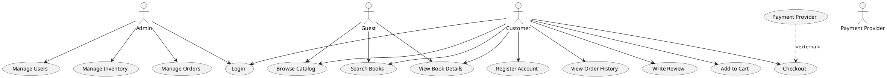

# Use Cases for Cloudshelf Online Bookstore

## Actors

- Customer
- Admin
- Guest
- Payment Provider (external)

## Use Cases

### 1. Register Account

**Actor:** Customer
**Description:** A user creates a new account by providing required information.
**Precondition:** User is not registered.
**Postcondition:** User account is created and user can log in.

### 2. Login

**Actor:** Customer, Admin
**Description:** User logs in with valid credentials.
**Precondition:** User is registered.
**Postcondition:** User is authenticated and redirected to dashboard.

### 3. Browse Catalog

**Actor:** Guest, Customer
**Description:** User browses the list of available books.
**Precondition:** Books are available in the catalog.
**Postcondition:** User views book listings.

### 4. Search Books

**Actor:** Guest, Customer
**Description:** User searches for books by title, author, or category.
**Precondition:** Books are available in the catalog.
**Postcondition:** User sees search results.

### 5. View Book Details

**Actor:** Guest, Customer
**Description:** User views detailed information about a selected book.
**Precondition:** Book exists in the catalog.
**Postcondition:** User sees book details and reviews.

### 6. Add to Cart

**Actor:** Customer
**Description:** Customer adds a book to their shopping cart.
**Precondition:** Customer is logged in.
**Postcondition:** Book is added to the cart.

### 7. Checkout

**Actor:** Customer
**Description:** Customer completes the purchase of books in the cart.
**Precondition:** Cart contains at least one book.
**Postcondition:** Order is placed and payment is processed.

### 8. View Order History

**Actor:** Customer
**Description:** Customer views their past orders.
**Precondition:** Customer has placed at least one order.
**Postcondition:** Order history is displayed.

### 9. Write Review

**Actor:** Customer
**Description:** Customer writes a review for a purchased book.
**Precondition:** Customer has purchased the book.
**Postcondition:** Review is submitted and visible to others.

### 10. Manage Inventory

**Actor:** Admin
**Description:** Admin adds, updates, or removes books from the catalog.
**Precondition:** Admin is logged in.
**Postcondition:** Catalog is updated.

### 11. Manage Orders

**Actor:** Admin
**Description:** Admin views and manages customer orders.
**Precondition:** Orders exist in the system.
**Postcondition:** Orders are updated as needed.

### 12. Manage Users

**Actor:** Admin
**Description:** Admin manages user accounts (activate, deactivate, update roles).
**Precondition:** Users exist in the system.
**Postcondition:** User accounts are updated.

---

# Use Case Diagram (PlantUML)

---

To render the use case diagram, use a PlantUML tool or plugin.
